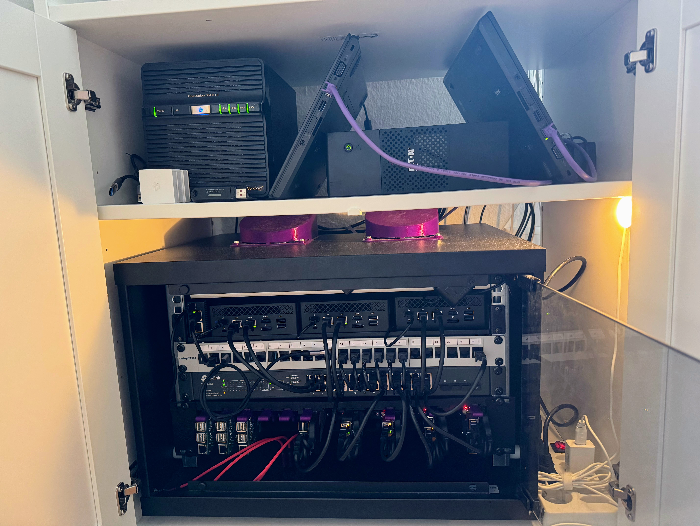

<div align="center">

# Home Ops

### Kubernetes Home Lab powered by Talos Linux and managed with ArgoCD

[](https://www.talos.dev/)
[](https://kubernetes.io/)
[](https://cilium.io/)
[](https://argoproj.github.io/cd/)

[](https://github.com/swibrow/home-ops/actions/workflows/lint.yaml)
[](https://github.com/swibrow/home-ops/actions/workflows/build-docker-images.yaml)
[](https://github.com/swibrow/home-ops/actions/workflows/deploy-docs.yml)

[](https://github.com/swibrow/home-ops/blob/main/LICENSE)
[](https://github.com/swibrow/home-ops/commits/main)
[](https://github.com/swibrow/home-ops/issues?q=is%3Aissue+label%3Arenovate)

</div>

---

## Overview

This repository is the single source of truth for my Kubernetes home lab. Everything from the operating system to application deployments is declared in code and managed through GitOps.

| | |
|:--|:--|
| **OS** | [Talos Linux](https://www.talos.dev/) — immutable, API-driven, secure-by-default |
| **CNI** | [Cilium](https://cilium.io/) — eBPF networking with L2 announcements, DSR, Maglev |
| **GitOps** | [ArgoCD](https://argoproj.github.io/cd/) — ApplicationSets with Git directory generator |
| **Ingress** | [Envoy Gateway](https://gateway.envoyproxy.io/) — two gateways (external + internal) |
| **Storage** | [Rook Ceph](https://rook.io/) (distributed) + [OpenEBS](https://openebs.io/) (local PV) |
| **Secrets** | [External Secrets](https://external-secrets.io/) (1Password + Infisical) + [SOPS](https://github.com/getsops/sops) |
| **Auth** | [Authelia](https://www.authelia.com/) SSO + [LLDAP](https://github.com/lldap/lldap) |
| **Certs** | [cert-manager](https://cert-manager.io/) with Let's Encrypt DNS-01 |
| **DNS** | [external-dns](https://github.com/kubernetes-sigs/external-dns) + Cloudflare |
| **Monitoring** | Prometheus + Grafana + Loki + Fluent Bit |

> [!TIP]
> **Full documentation**: [swibrow.github.io/home-ops](https://swibrow.github.io/home-ops)

## Cluster

### Nodes

| Node | Role | Hardware | CPU | RAM | Storage |
|:-----|:-----|:---------|:----|:----|:--------|
| worker-01 | Control Plane | Lenovo ThinkPad 440p | Intel i5-4300M | 8 GB | 128 GB SSD |
| worker-02 | Control Plane | Lenovo ThinkPad 440p | Intel i5-4300M | 8 GB | 128 GB SSD |
| worker-03 | Control Plane | Raspberry Pi 4 | Cortex-A72 | 8 GB | 128 GB SSD |
| worker-04 | Worker (Intel) | Acemagician AM06 | Intel N100 | 16 GB | 128 GB SSD + 512 GB NVMe |
| worker-05 | Worker (Intel) | Acemagician AM06 | Intel N100 | 16 GB | 128 GB SSD + 512 GB NVMe |
| worker-06 | Worker (Intel) | Acemagician AM06 | Intel N100 | 16 GB | 128 GB SSD + 512 GB NVMe |
| worker-pi-01 | Worker (RPi) | Raspberry Pi 4 | Cortex-A72 | 4 GB | 128 GB SSD |
| worker-pi-02 | Worker (RPi) | Raspberry Pi 4 | Cortex-A72 | 4 GB | 128 GB SSD |
| worker-pi-03 | Worker (RPi) | Raspberry Pi 4 | Cortex-A72 | 4 GB | 128 GB SSD |

### Network

| Device | Purpose |
|:-------|:--------|
| TP-Link 24-port PoE Switch | Core switching + PoE for Raspberry Pis |
| NanoPi R5C | Router |
| Ubiquiti U7-Pro & U6-Lite | Wireless APs |

### Storage

| Device | Purpose |
|:-------|:--------|
| Synology 4-Bay NAS (8 TB) | Media, backups, bulk data (NFS) |
| 512 GB NVMe x 3 | Rook Ceph distributed block storage |
| 128 GB SSD x 9 | Talos OS boot drives |

### Power

| Device | Purpose |
|:-------|:--------|
| Eaton 500VA UPS | Battery backup for cluster |



## Repository Structure

```
home-ops/
├── .github/workflows/       # CI/CD pipelines
├── .justfiles/              # Just task runner recipes
├── docs/                    # MkDocs documentation site
├── images/                  # Repo images
├── pitower/
│   ├── kubernetes/
│   │   ├── apps/            # Application manifests (14 categories)
│   │   ├── argocd/          # ApplicationSets
│   │   └── bootstrap/       # ArgoCD bootstrap
│   └── talos/               # Talos Linux configuration
│       ├── extensions/      # System extensions per node type
│       ├── patches/         # Machine config patches
│       └── justfile         # Talos management recipes
├── mkdocs.yml               # Documentation site config
└── renovate.json5           # Dependency management
```

## GitOps

All cluster state is managed through ArgoCD ApplicationSets. Each category directory is automatically discovered and deployed:

```
pitower/kubernetes/apps/
├── ai/                  # AI/ML workloads
├── banking/             # Financial tools
├── cert-manager/        # TLS certificate automation
├── cloudnative-pg/      # PostgreSQL operator + clusters
├── home-automation/     # Home Assistant, Zigbee2MQTT, Mosquitto
├── kube-system/         # Cilium, CoreDNS, kubelet-csr-approver
├── media/               # Jellyfin, Sonarr, Radarr, qBittorrent
├── monitoring/          # Prometheus, Grafana, Loki, Fluent Bit
├── networking/          # Envoy Gateway, external-dns, Cloudflare tunnel
├── openebs/             # Local PV provisioner
├── rook-ceph/           # Distributed storage
├── security/            # Authelia, LLDAP, External Secrets
├── selfhosted/          # Miniflux, Tandoor, Glance, n8n, and more
└── system/              # System utilities (VolSync, Snapshot Controller)
```

Adding a new application is as simple as creating a directory — ArgoCD discovers and deploys it automatically.

## Acknowledgements

Shout out to the [Home Operations](https://discord.com/invite/home-operations) community and [Uptime Lab](https://uplab.pro/).
