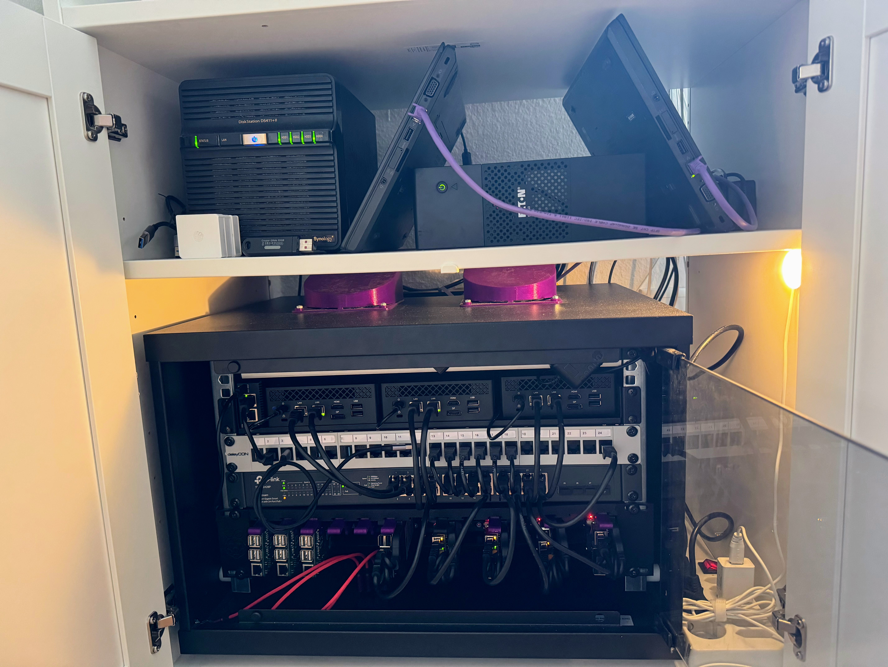

<div align="center">

# Home Ops

### Kubernetes Home Lab powered by Talos Linux and managed with ArgoCD

[](https://www.talos.dev/)
[](https://kubernetes.io/)
[](https://cilium.io/)
[](https://argoproj.github.io/cd/)

[](https://github.com/swibrow/home-ops/actions/workflows/lint.yaml)
[](https://github.com/swibrow/home-ops/issues?q=is%3Aissue+label%3Arenovate)

[](https://github.com/swibrow/home-ops/blob/main/LICENSE)
[](https://github.com/swibrow/home-ops/commits/main)

</div>

---

## Overview

This repository is the single source of truth for my Kubernetes home lab. Everything from the operating system to application deployments is declared in code and reconciled through GitOps.

| | |
|:--|:--|
| **OS** | [Talos Linux](https://www.talos.dev/) — immutable, API-driven, secure-by-default (lifecycle managed with [topf](https://github.com/postfinance/topf)) |
| **CNI** | [Cilium](https://cilium.io/) — eBPF networking, kube-proxy replacement, L2 announcements, DSR, Maglev |
| **GitOps** | [ArgoCD](https://argoproj.github.io/cd/) — ApplicationSets with a Git directory generator |
| **Ingress** | [Envoy Gateway](https://gateway.envoyproxy.io/) — three gateways (external, internal, direct) via the Gateway API |
| **Storage** | [Rook Ceph](https://rook.io/) (distributed block) + [OpenEBS](https://openebs.io/) (local hostpath) |
| **Database** | [CloudNativePG](https://cloudnative-pg.io/) (PostgreSQL) + [Dragonfly](https://www.dragonflydb.io/) |
| **Secrets** | [External Secrets](https://external-secrets.io/) (Infisical + CNPG ClusterSecretStores) + [SOPS](https://github.com/getsops/sops) (age) |
| **Auth** | [Kanidm](https://kanidm.com/) — standalone OIDC / OAuth2 identity provider (+ LDAP) |
| **Certs** | [cert-manager](https://cert-manager.io/) with Let's Encrypt DNS-01 |
| **DNS** | [external-dns](https://github.com/kubernetes-sigs/external-dns) + Cloudflare (tunnel for public ingress) |
| **Backups** | [Volsync](https://volsync.readthedocs.io/) — PVC backups to S3 |
| **Monitoring** | kube-prometheus-stack (Prometheus / Grafana / Alertmanager) + VictoriaMetrics + VictoriaLogs + Fluent Bit + Gatus + ntfy |

> [!TIP]
> **Full documentation**: [swibrow.github.io/home-ops](https://swibrow.github.io/home-ops)
>
> **Domain**: `wibrow.dev` (managed via Cloudflare)

## Clusters

The environment is split across several clusters. The main workload cluster (`pitower`) depends on a set of single-node Raspberry Pi management clusters that host critical services, so a `pitower` outage can't take them down. All management clusters live on VLAN 20 (`10.20.0.0/16`), each in its own `/24`, with no VIP (the API endpoint is the node IP).

| Cluster | Role | Endpoint |
|:--------|:-----|:---------|
| `pitower` | Main workload cluster (6 nodes) | `https://10.20.10.0:6443` (VIP) |
| `controller` | ArgoCD GitOps hub | `10.20.30.1` |
| `auth` | Kanidm + Vaultwarden | `10.20.40.1` |
| `pistack` | Supporting services | `10.20.20.1` |

### `pitower` Nodes

| Node | Role | IP | CPU |
|:-----|:-----|:---|:----|
| worker-01 | Control Plane | 10.20.10.1 | AMD Ryzen |
| worker-02 | Control Plane | 10.20.10.2 | AMD Ryzen |
| worker-03 | Control Plane | 10.20.10.3 | AMD Ryzen |
| worker-04 | Worker | 10.20.10.4 | Intel (iGPU, `dedicated=media-home` taint) |
| worker-05 | Worker | 10.20.10.5 | Intel |
| worker-06 | Worker | 10.20.10.6 | Intel |

### Network

| Device | Purpose |
|:-------|:--------|
| Ubiquiti (UniFi) | Router + switching, VLANs, DNS interception |
| Ubiquiti U7-Pro & U6-Lite | Wireless APs |
| Cloudflare Tunnel | Public ingress (`*.wibrow.dev` → `envoy-external`) |

Cilium L2 announcements serve LoadBalancer IPs from the pool `10.20.10.128-255`. The three Envoy gateways: `envoy-external` (`10.20.10.239`, Cloudflare tunnel), `envoy-internal` (`10.20.10.238`), `envoy-direct` (`10.20.10.237`, non-proxied public).

### Storage

| Device | Purpose |
|:-------|:--------|
| Synology NAS | Media, backups, bulk data (NFS) |
| NVMe (worker-05/06) | Rook Ceph distributed block storage |
| Local SSD | Talos OS + OpenEBS local hostpath volumes |



## Repository Structure

```
home-ops/
├── .github/workflows/   # CI/CD pipelines
├── .justfiles/          # Just task runner recipes
├── ansible/             # Host provisioning
├── docker/              # Custom container images
├── docs/                # MkDocs documentation site
├── iot/                 # ESPHome, Home Assistant, Button+ configs
├── kubernetes/
│   ├── apps/            # Application manifests — {cluster}/{category}/{app}
│   ├── argocd/          # ApplicationSets (per cluster)
│   ├── bootstrap/       # ArgoCD bootstrap
│   └── components/      # Reusable kustomize components (volsync, cnpg-db)
├── talos/               # Talos configs per cluster (topf-managed, SOPS-encrypted)
├── terraform/           # AWS, Cloudflare, etc.
├── scripts/             # Helper scripts
├── mkdocs.yml           # Documentation site config
└── renovate.json5       # Dependency management
```

## GitOps

Cluster state is reconciled by ArgoCD. Each cluster has one ApplicationSet using a Git directory generator over `kubernetes/apps/{cluster}/*/*` — every `{category}/{app}` directory is discovered automatically, deployed as `{cluster}-{category}-{app}` into a namespace derived from its category.

Most apps are rendered from the [`app-template`](https://github.com/bjw-s-labs/helm) chart (bjw-s-labs) via a helm chart generator. The `pitower` cluster spans these categories:

```
kubernetes/apps/pitower/
├── ai/                  # LiteLLM, Open WebUI, ToolHive, agent-sandbox, agentmemory
├── analytics/           # Rybbit
├── arc/                 # GitHub Actions runners
├── banking/             # Financial tools
├── cert-manager/        # TLS certificate automation
├── cloudnative-pg/      # PostgreSQL operator + clusters
├── database/            # Dragonfly operator
├── dev/                 # Dev/test workloads
├── home-automation/     # Home Assistant, Zigbee2MQTT, Mosquitto
├── kube-system/         # Cilium, CoreDNS, metrics-server
├── media/               # Jellyfin, Sonarr, Radarr, Prowlarr, qBittorrent, SABnzbd
├── monitoring/          # kube-prometheus-stack, VictoriaMetrics/Logs, Grafana, Gatus
├── networking/          # Envoy Gateway, external-dns, Cloudflare tunnel, Tailscale
├── openebs/             # Local hostpath provisioner
├── renovate/            # Renovate operator
├── rook-ceph/           # Distributed storage
├── second-brain/        # Knowledge tooling
├── security/            # Kanidm, External Secrets, RBAC
├── selfhosted/          # Homepage, Glance, Miniflux, Mealie, n8n, Mattermost, and more
├── system/              # Volsync, Reloader, KEDA, Headlamp, snapshot-controller, Spegel
└── workshop/            # Experiments
```

Adding a new application is as simple as creating a directory — ArgoCD discovers and deploys it automatically.

## Acknowledgements

Shout out to the [Home Operations](https://discord.com/invite/home-operations) community and [Uptime Lab](https://uplab.pro/).
