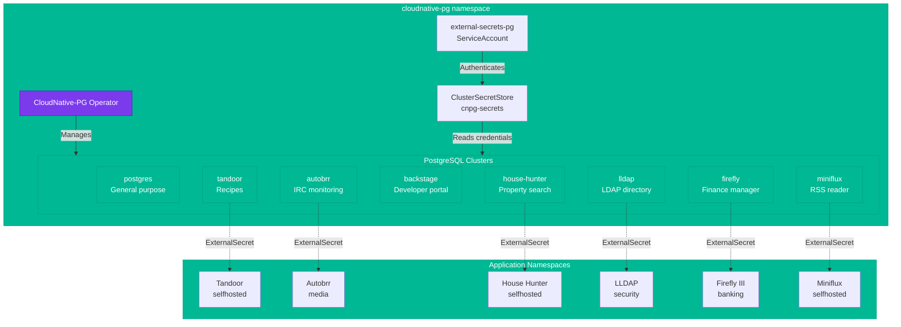
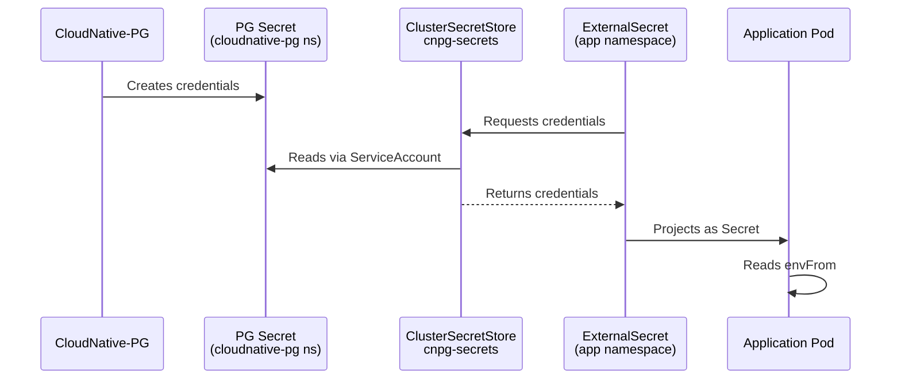

# Databases

The cluster uses [CloudNative-PG](https://cloudnative-pg.io/) to run PostgreSQL databases natively in Kubernetes. The operator manages the full lifecycle of PostgreSQL clusters -- provisioning, high availability, failover, backups, and monitoring.

## Architecture



## Operator

The CloudNative-PG operator is deployed via Helm chart in the `cloudnative-pg` namespace:

```yaml title="Operator values"
crds:
  create: true
monitoring:
  podMonitorEnabled: true
  grafanaDashboard:
    create: true
```

The operator watches for `Cluster` CRDs and manages the PostgreSQL pods, replication, and failover automatically.

## PostgreSQL Clusters

All clusters run **PostgreSQL 16** (`ghcr.io/cloudnative-pg/postgresql:16`) with 2 instances each for high availability. Storage is backed by `openebs-hostpath` for local NVMe performance.

| Cluster | Database | Owner | Storage | Consumers |
|:--------|:---------|:------|:--------|:----------|
| `postgres` | (default) | (default) | 1 Gi | General purpose, Authelia |
| `tandoor` | `tandoor` | `tandoor` | 1 Gi | Tandoor Recipes |
| `autobrr` | `tandoor`* | `tandoor`* | 1 Gi | Autobrr |
| `backstage` | (default) | (default) | 1 Gi | Backstage (superuser enabled) |
| `house-hunter` | `house_hunter` | `house_hunter` | 1 Gi | House Hunter |
| `lldap` | `lldap` | `lldap` | 100 Mi | LLDAP |
| `firefly` | `firefly` | `firefly` | 100 Mi | Firefly III |
| `miniflux` | `miniflux` | `miniflux` | 100 Mi | Miniflux |

!!! info "Cluster Configuration"
    The `postgres` cluster has custom parameters for higher connection limits (`max_connections: 600`) and larger shared buffers (`shared_buffers: 512MB`) since it serves as the general-purpose database for multiple consumers.

### Example Cluster Definition

```yaml title="cluster.yaml (miniflux example)"
apiVersion: postgresql.cnpg.io/v1
kind: Cluster
metadata:
  name: miniflux
  namespace: cloudnative-pg
spec:
  instances: 2
  imageName: ghcr.io/cloudnative-pg/postgresql:16
  enableSuperuserAccess: true
  bootstrap:
    initdb:
      database: miniflux
      owner: miniflux
  storage:
    size: 100Mi
    storageClass: openebs-hostpath
  monitoring:
    enablePodMonitor: true
```

## ClusterSecretStore

The `cnpg-secrets` ClusterSecretStore allows applications in any namespace to access PostgreSQL credentials using `ExternalSecret` resources:

```yaml title="clustersecretstore.yaml"
apiVersion: external-secrets.io/v1
kind: ClusterSecretStore
metadata:
  name: cnpg-secrets
spec:
  provider:
    kubernetes:
      remoteNamespace: cloudnative-pg
      server:
        caProvider:
          type: "ConfigMap"
          name: "kube-root-ca.crt"
          namespace: cloudnative-pg
          key: "ca.crt"
      auth:
        serviceAccount:
          name: external-secrets-pg
          namespace: cloudnative-pg
```

### How It Works

1. CloudNative-PG creates a Secret for each cluster (e.g., `miniflux-app`) containing the connection URI, username, password, and host
2. The `cnpg-secrets` ClusterSecretStore reads these Secrets via a dedicated ServiceAccount (`external-secrets-pg`)
3. Applications create `ExternalSecret` resources that reference `cnpg-secrets` and project the database credentials into their namespace
4. The application reads credentials from the projected Secret (typically via `envFrom`)



### Application ExternalSecret Pattern

Each application that needs database access creates an `ExternalSecret` like this:

```yaml title="Example ExternalSecret for miniflux"
apiVersion: external-secrets.io/v1
kind: ExternalSecret
metadata:
  name: miniflux-db-secret
  namespace: selfhosted
spec:
  secretStoreRef:
    kind: ClusterSecretStore
    name: cnpg-secrets
  target:
    name: miniflux-db-secret
  data:
    - secretKey: DATABASE_URL
      remoteRef:
        key: miniflux-app
        property: uri
```

## RBAC

A dedicated ServiceAccount and RBAC configuration grants the External Secrets Operator read access to Secrets in the `cloudnative-pg` namespace:

```yaml title="rbac.yaml"
apiVersion: v1
kind: ServiceAccount
metadata:
  name: external-secrets-pg
  namespace: cloudnative-pg
```

## Monitoring

All PostgreSQL clusters have `enablePodMonitor: true`, which creates Prometheus PodMonitor resources for metrics collection. The operator also creates a Grafana dashboard for monitoring cluster health, replication lag, and query performance.

## Storage

All clusters use `openebs-hostpath` as the storage class, which provisions local NVMe-backed volumes on the Acemagician nodes. This provides the lowest latency for database I/O while relying on PostgreSQL's built-in streaming replication (2 instances) for data durability.

!!! warning "Backup Strategy"
    With `openebs-hostpath` storage and no external backup target configured, data durability relies on PostgreSQL's 2-instance replication. Consider adding a backup schedule with an S3-compatible target for disaster recovery.
