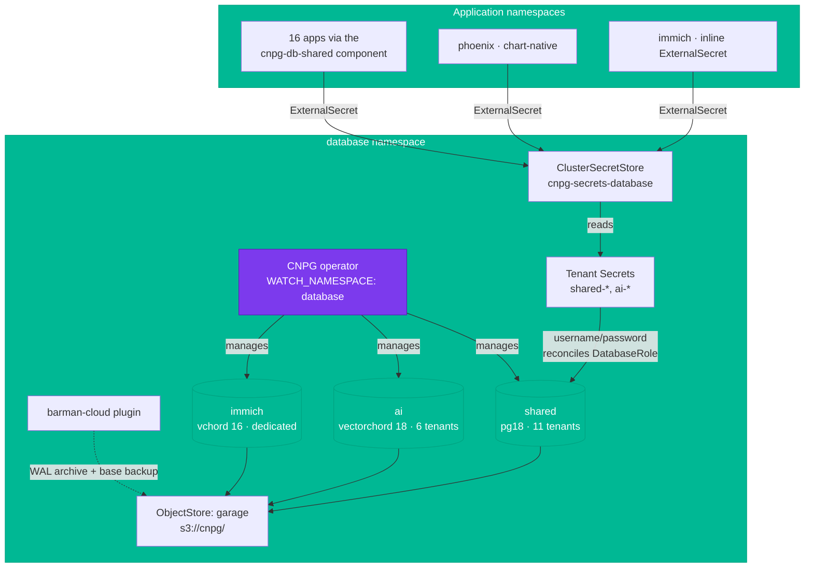

# Databases

Every PostgreSQL database in the cluster lives in the `database` namespace,
managed by a single [CloudNative-PG](https://cloudnative-pg.io/) operator. The
same namespace hosts the Dragonfly and ClickHouse operators, so all stateful
data engines are in one place.

There are **three** PostgreSQL clusters serving **18** databases. Applications
do not get a cluster of their own; they get a *tenant* — a database and a login
role on one of the two shared clusters.

!!! info "This layout is new as of 2026-07-29"
    It replaced 21 single-database clusters spread over two namespaces. The
    migration, including the per-app procedure and the traps it turned up, is
    written up in [CNPG Consolidation](../../operations/cnpg-consolidation.md).

## Architecture


```mermaid
flowchart TD
    subgraph DB["database namespace"]
        OP[CNPG operator<br/>WATCH_NAMESPACE: database]
        BARMAN[barman-cloud plugin]
        OS[ObjectStore: garage<br/>s3://cnpg/]
        CSS[ClusterSecretStore<br/>cnpg-secrets-database]

        SHARED[("shared<br/>pg18 · 11 tenants")]
        AI[("ai<br/>vectorchord 18 · 6 tenants")]
        IMMICH[("immich<br/>vchord 16 · dedicated")]

        TS[Tenant Secrets<br/>shared-*, ai-*]
    end

    subgraph Apps["Application namespaces"]
        A1[16 apps via the<br/>cnpg-db-shared component]
        A2[phoenix · chart-native]
        A3[immich · inline ExternalSecret]
    end

    OP -->|manages| SHARED
    OP -->|manages| AI
    OP -->|manages| IMMICH
    SHARED --> OS
    AI --> OS
    IMMICH --> OS
    BARMAN -.->|WAL archive + base backup| OS

    TS -->|username/password<br/>reconciles DatabaseRole| SHARED
    CSS -->|reads| TS
    A1 -->|ExternalSecret| CSS
    A2 -->|ExternalSecret| CSS
    A3 -->|ExternalSecret| CSS

    classDef operator fill:#7c3aed,stroke:#5b21b6,color:#fff
    classDef cluster fill:#00b894,stroke:#00a381,color:#fff
    class OP operator
    class SHARED,AI,IMMICH cluster
```

## Clusters

| Cluster | Image | Instances | Storage | Purpose |
|:--------|:------|:---------:|:--------|:--------|
| `shared` | `ghcr.io/cloudnative-pg/postgresql:18` | 2 | 10 Gi | General-purpose multi-tenant |
| `ai` | `ghcr.io/tensorchord/cloudnative-vectorchord:18-1.1.1` | 2 | 10 Gi | Multi-tenant, vector support |
| `immich` | `ghcr.io/tensorchord/cloudnative-vectorchord:16-1.1.1` | 2 | 10 Gi | Dedicated to Immich |

Definitions live in `kubernetes/apps/pitower/database/clusters/`.

**Why `ai` is separate from `shared`:** memini's backend runs
`CREATE EXTENSION IF NOT EXISTS vchord CASCADE` at startup and needs the
extension binaries present. `vchord` is a background-worker extension, so it
must be in `shared_preload_libraries` at postmaster start — that is cluster-wide
and not something to impose on tenants that do not need it.

**Why `immich` stays dedicated:** its migrations create `cube`,
`earthdistance` and `vchord` themselves, which needs `SUPERUSER`. That is
defensible on a single-tenant cluster and not on a shared one.

Each cluster exposes three services: `<cluster>-rw` (primary), `<cluster>-ro`
(replicas) and `<cluster>-r` (any instance). Applications use `-rw`.

### Cluster configuration notes

```yaml title="clusters/shared.yaml (excerpt)"
spec:
  instances: 2
  imageName: ghcr.io/cloudnative-pg/postgresql:18
  primaryUpdateMethod: switchover
  postgresql:
    parameters:
      max_connections: "200"
  resources:
    requests:
      cpu: 250m
      memory: 1Gi
  storage:
    size: 10Gi
    storageClass: openebs-hostpath
```

Three of those are deliberate and easy to get wrong:

- **`primaryUpdateMethod: switchover`.** On any PodSpec change CNPG defaults to
  restarting the primary in place. With `openebs-hostpath` the data is
  node-local, so a primary that cannot reschedule onto its own node leaves the
  cluster with no primary and writes down, with no automatic failover.
  Switchover promotes the replica first.
- **`requests` only, no memory `limit`.** A memory limit caps the cgroup's page
  cache, which for Postgres means the shared buffer working set gets evicted and
  reads fall through to disk.
- **`max_connections: "200"` is a cluster-wide budget**, the sum across all
  eleven tenants, not a per-app allowance. Steady state is around 40. An app
  with an unbounded connection pool can starve every other tenant — see
  [Adding a database](#5-cap-the-connection-pool-if-the-app-needs-it).

## Tenancy model

A tenant is two CRs plus a Secret, in one file under
`kubernetes/apps/pitower/database/tenants/`:

```yaml title="tenants/miniflux.yaml (abridged)"
apiVersion: external-secrets.io/v1
kind: ExternalSecret
metadata:
  name: shared-miniflux
spec:
  secretStoreRef:
    kind: ClusterSecretStore
    name: infisical
  target:
    name: shared-miniflux
    template:
      type: kubernetes.io/basic-auth      # CNPG requires exactly this type
      metadata:
        labels:
          cnpg.io/reload: "true"          # pick up password changes immediately
      data:
        username: miniflux                # must match the role name
        password: "{{ .password }}"
        host: shared-rw.database.svc.cluster.local
        port: "5432"
        dbname: miniflux
  data:
    - secretKey: password
      remoteRef:
        key: /database/tenants/MINIFLUX_PASSWORD
---
apiVersion: postgresql.cnpg.io/v1
kind: DatabaseRole
metadata:
  name: miniflux
spec:
  cluster:
    name: shared
  name: miniflux
  login: true
  databaseRoleReclaimPolicy: retain       # deleting this CR must not DROP ROLE
  passwordSecret:
    name: shared-miniflux
---
apiVersion: postgresql.cnpg.io/v1
kind: Database
metadata:
  name: shared-miniflux
spec:
  cluster:
    name: shared
  name: miniflux
  owner: miniflux
  databaseReclaimPolicy: retain           # deleting this CR must not DROP DATABASE
```

Three rules hold this together:

!!! danger "Never add tenants to `spec.managed.roles` on the Cluster"
    Declaring them as `Database` + `DatabaseRole` CRs means onboarding an app
    **never mutates the Cluster resource**, so the primary is never rolled to
    add a tenant. `tenants/` is also its own ArgoCD Application, separate from
    `clusters/`, so a tenant change can never surface as a diff against a
    Cluster.

!!! warning "Both reclaim policies must stay `retain`"
    They are what stop a deleted CR — or an ArgoCD prune — from issuing
    `DROP DATABASE` or `DROP ROLE`.

**The tenant Secret does double duty.** CNPG reads `username`/`password` from it
to reconcile the `DatabaseRole`, and the consuming application reads all five
keys out of the same object. Because it carries `host`/`port`/`dbname` too, the
consumer component needs no namespace and no service FQDN of its own — moving a
cluster or renaming a service changes the source Secret, not sixteen consumers.

Note the key is `username`, not the `user` that CNPG's own `<cluster>-app`
Secrets use.

Passwords live in Infisical at `/database/tenants/<APP>_PASSWORD`.

## Consuming a database

Sixteen apps use the `cnpg-db-shared` kustomize component. It reads the tenant
Secret through the `cnpg-secrets-database` ClusterSecretStore and emits a single
Secret in the app's namespace:

| Key | Value |
|:----|:------|
| `DB_HOST` | `shared-rw.database.svc.cluster.local` |
| `DB_PORT` | `5432` |
| `DB_USER` | tenant role |
| `DB_PASS` | tenant password |
| `DB_NAME` | database name |
| `DB_URL` | `<scheme>://user:pass@host:port/dbname?sslmode=disable` |

Wiring it up is a component reference plus four literals:

```yaml title="apps/pitower/selfhosted/miniflux/kustomization.yaml"
components:
  - ../../../../components/cnpg-db-shared
configMapGenerator:
  - name: cnpg-db-config
    literals:
      - APP_NAME=miniflux
      - SECRET_NAME=miniflux-db-secret
      - CNPG_SECRET_KEY=shared-miniflux
      - DB_SCHEME=postgresql
```

!!! tip "`DB_SCHEME` is required, and it is not cosmetic"
    Drivers disagree about the scheme for the same server. SQLAlchemy resolves a
    bare `postgresql://` to psycopg2, so anything on psycopg 3 must say
    `postgresql+psycopg` (rackrat is the one case today). Host, port, user,
    password and dbname are identical either way. Kustomize hard-errors on a
    replacement whose source field is absent, so every consumer has to name its
    driver explicitly rather than inherit a wrong default.

### Tenant map

| Tenant | Cluster | Consuming app | Namespace |
|:-------|:--------|:--------------|:----------|
| autobrr | `shared` | autobrr | `media` |
| firefly | `shared` | firefly | `banking` |
| forgejo | `shared` | forgejo | `dev` |
| gatus | `shared` | gatus | `monitoring` |
| ghostfolio | `shared` | ghostfolio | `banking` |
| house_hunter | `shared` | house-hunter | `selfhosted` |
| miniflux | `shared` | miniflux | `selfhosted` |
| paperless | `shared` | paperless | `banking` |
| propagit | `shared` | propagit | `dev` |
| rackrat | `shared` | rackrat | `rackrat` |
| rybbit | `shared` | rybbit | `analytics` |
| garrison | `ai` | garrison | `garrison` |
| goat | `ai` | goat | `goat` |
| litellm | `ai` | litellm | `ai` |
| memini | `ai` | memini | `ai` |
| open_webui | `ai` | open-webui | `ai` |
| phoenix | `ai` | phoenix | `ai` |
| immich | `immich` | immich | `media` |

### The two exceptions

Not every consumer uses the component:

- **phoenix** wires the database natively in its chart values
  (`database.postgres.host/db/user`), because the chart offers first-class
  external-database support and going through the component would mean fighting
  it.
- **immich** reads the CNPG-generated `immich-app` Secret with an inline
  `ExternalSecret` against the same `cnpg-secrets-database` store, because it is
  the one cluster that is not multi-tenant and so has no hand-authored tenant
  Secret to read.

## Adding a database

The whole recipe, for an app that needs a new database on `shared`.

### 1. Store a password

```bash
pw=$(LC_ALL=C tr -dc 'A-Za-z0-9' </dev/urandom | head -c 64)
env -u INFISICAL_TOKEN infisical secrets set "MYAPP_PASSWORD=$pw" \
  --path=/database/tenants --env=prod --silent
```

!!! note
    `env -u INFISICAL_TOKEN` matters: a stale `INFISICAL_TOKEN` in the
    environment overrides the logged-in session and fails with a confusing 404.

### 2. Add the tenant file

Copy `tenants/miniflux.yaml`, change the five occurrences of the app name and
the Infisical key, and add it to `tenants/kustomization.yaml`.

Pick the cluster: `ai` if it needs vector support, `shared` otherwise.

### 3. Wait for the CRs to apply

```bash
kubectl --context=admin@pitower -n database get database,databaserole
```

Both must report `APPLIED: true` before the app starts.

### 4. Point the app at it

Add the component and the four literals shown
[above](#consuming-a-database), then consume `DB_URL` (or the individual keys)
from `<app>-db-secret`.

Add `reloader.stakater.com/auto: "true"` to the controller so a password change
restarts it.

### 5. Cap the connection pool if the app needs it

`max_connections: "200"` is shared across every tenant. If the app's pool is
unbounded by default — Forgejo's is — set a limit as part of onboarding:

```yaml
MAX_OPEN_CONNS: 20
MAX_IDLE_CONNS: 5
```

### 6. Backups need nothing

The tenant inherits the cluster's WAL archiving and nightly base backup. There
is no per-tenant backup configuration.

## Backups

A single `ObjectStore` named `garage` serves every cluster, via the
[barman-cloud CNPG-I plugin](https://github.com/cloudnative-pg/plugin-barman-cloud)
(the in-tree `backup.barmanObjectStore` field is deprecated as of CNPG 1.26).

```yaml title="clusters/objectstore.yaml (excerpt)"
apiVersion: barmancloud.cnpg.io/v1
kind: ObjectStore
metadata:
  name: garage
spec:
  retentionPolicy: 30d
  configuration:
    destinationPath: s3://cnpg/
    endpointURL: https://s3.wibrow.dev
    wal:
      compression: gzip
    data:
      compression: gzip
```

Barman namespaces each cluster's backups under its own `serverName`, which
defaults to the cluster name, so `shared` and `ai` land in `s3://cnpg/shared/`
and `s3://cnpg/ai/` without extra configuration.

!!! danger "`spec.configuration.serverName` must stay unset"
    It exists only for API compatibility with the deprecated in-tree field.
    Setting it collapses every cluster into one backup prefix.

Each Cluster opts in with a plugin entry:

```yaml
plugins:
  - name: barman-cloud.cloudnative-pg.io
    isWALArchiver: true
    parameters:
      barmanObjectName: garage
```

WAL archiving is continuous and independent of the nightly `ScheduledBackup`;
the schedule only sets how far back a PITR has to replay from.

!!! warning "The schedule is six fields, not five"
    CNPG prepends a seconds field, so `0 0 2 * * *` is 02:00 UTC — not what the
    same string means to a Kubernetes CronJob.

Backups run `target: prefer-standby` so they do not compete with tenant traffic
on the primary. Storage is [Garage](../../storage/garage.md) on `garage-01`;
the `cnpg` bucket and its scoped key are declared in
`ansible/roles/garage/defaults`.

```bash
kubectl --context=admin@pitower -n database get backup
kubectl --context=admin@pitower -n database get scheduledbackup
```

## Storage and placement

All clusters use `openebs-hostpath`, backed by local NVMe. Because that data is
node-local, a kustomize patch pins every Cluster to `worker-05`/`worker-06` with
required pod anti-affinity so the two instances never share a node:

```yaml title="clusters/patches/affinity.yaml (excerpt)"
spec:
  affinity:
    podAntiAffinityType: required
    topologyKey: kubernetes.io/hostname
    nodeAffinity:
      requiredDuringSchedulingIgnoredDuringExecution:
        nodeSelectorTerms:
          - matchExpressions:
              - key: kubernetes.io/hostname
                operator: In
                values: [worker-05, worker-06]
```

Adding a third database node means editing this patch. The patch is applied to
every `Cluster` in the overlay by kind, so it cannot be forgotten for a new one.

!!! warning "A second kustomization once omitted this patch"
    That is how an `immich` instance ended up scheduled on `worker-07`, the
    node with a ~11 ms write-latency floor. If you add a kustomization that
    renders Clusters, it needs the affinity patch too.

## Monitoring

Every Cluster sets `monitoring.enablePodMonitor: true`, so Prometheus scrapes
each instance directly. The operator itself is scraped via
`monitoring.podMonitorEnabled: true` in its Helm values.

The operator chart's bundled Grafana dashboard is **disabled**
(`grafanaDashboard.create: false`); dashboards are vendored centrally instead —
see [Grafana](../../monitoring/grafana.md).

## Ad-hoc access

`database-toolbox` (Google genai-toolbox, in the `ai` namespace) fronts every
database in the namespace over MCP. Its init container enumerates the
credential Secrets in `database` and generates one source per *database*, so a
new tenant is picked up on the next pod restart with no configuration change.

It connects as each database's **owning role**, so its `execute_sql` tool can
write. Only the `*_list_tables` half is exposed through garrison's allowlist.

!!! tip "Restarting it after a password change"
    The init container renders passwords at pod start, so a rotated tenant
    password leaves it holding a stale credential. Restart the **StatefulSet**
    pod, not the Deployment of the same name — that one is the ToolHive proxy:

    ```bash
    kubectl --context=admin@pitower -n ai delete pod database-toolbox-0
    kubectl --context=admin@pitower -n ai logs database-toolbox-0 -c generate-tools
    ```

Direct `psql` access, for when that is not enough:

```bash
kubectl --context=admin@pitower -n database exec -it shared-1 -c postgres -- \
  psql -U postgres -d miniflux
```

## Other engines

The `database` namespace also hosts two non-Postgres operators:

| Operator | Chart | Scope | Used by |
|:---------|:------|:------|:--------|
| Dragonfly | `dragonfly-operator` v1.6.1 | all namespaces | forgejo, immich, cryptgeon, toolhive-auth |
| ClickHouse | `altinity-clickhouse-operator` v0.27.2 | all namespaces (`watchNamespaces: [".*"]`) | — |

Dragonfly instances are declared as `Dragonfly` CRs next to the app that uses
them, not here.

!!! note "The ClickHouse operator currently manages nothing"
    Rybbit's ClickHouse runs as a plain app-template StatefulSet rather than a
    `ClickHouseInstallation` CR, so there are no CRs for the operator to
    reconcile today.

## See also

- [CNPG Consolidation](../../operations/cnpg-consolidation.md) — how this layout came to be
- [Backup & Restore](../../storage/backup-restore.md)
- [Garage S3](../../storage/garage.md)
- [External Secrets](../../security/external-secrets.md)
- [OpenEBS](../../storage/openebs.md)
