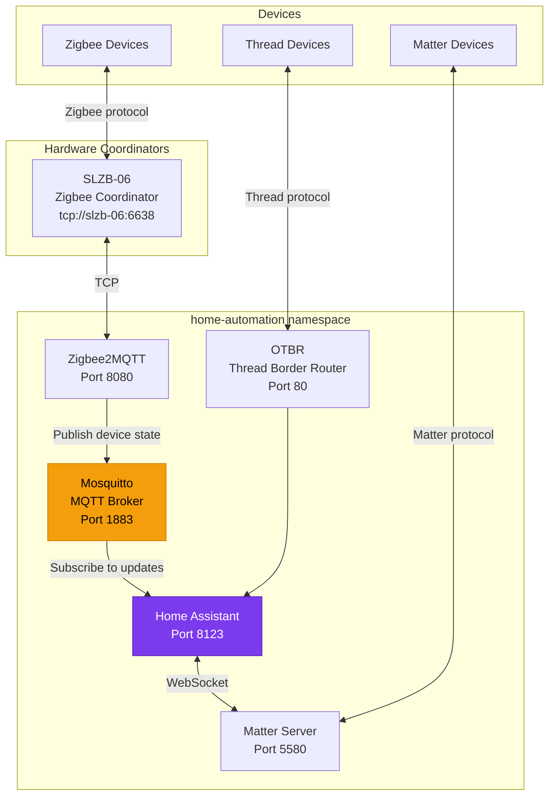

# Home Automation

The home automation stack runs in the `home-automation` namespace and provides smart home control, Zigbee device management, Matter/Thread protocol support, and MQTT messaging. All components are pinned to `worker-04`, which has the required USB hardware attached.

## Architecture



## Application Summary

| App | Purpose | Gateway | URL | LoadBalancer IP |
|:----|:--------|:--------|:----|:----------------|
| [Home Assistant](home-assistant.md) | Smart home hub | `envoy-external` | `ha.example.com` | `192.168.0.227` |
| [Zigbee2MQTT](zigbee2mqtt.md) | Zigbee device bridge | `envoy-internal` | `zigbee.example.com` | -- |
| [Mosquitto](mosquitto.md) | MQTT broker | LoadBalancer | `mosquitto.example.com` | `192.168.0.226` |
| Matter Server | Matter protocol server | `envoy-internal` | `matter.example.com` | `192.168.0.228` |
| OTBR | Thread border router | `envoy-internal` | `otbr.example.com` | `192.168.0.230` |

## Node Pinning

All home automation components are pinned to `worker-04` (an Acemagician AM06 node) using `nodeSelector`:

```yaml
nodeSelector:
  kubernetes.io/hostname: worker-04
```

This is required because:

- The SLZB-06 Zigbee coordinator is accessible via TCP from this node's network segment
- Matter Server requires `hostNetwork: true` for mDNS discovery and must be co-located with Home Assistant
- OTBR needs access to `/dev` for Thread radio hardware

## Protocol Stack

| Protocol | Coordinator | Bridge | Integration |
|:---------|:------------|:-------|:------------|
| **Zigbee** | SLZB-06 (network) | Zigbee2MQTT | MQTT discovery in Home Assistant |
| **Matter** | -- | Matter Server | WebSocket to Home Assistant |
| **Thread** | OTBR | OTBR REST API | Home Assistant Thread integration |
| **MQTT** | -- | Mosquitto | Native Home Assistant integration |

!!! info "SLZB-06 Coordinator"
    The Zigbee coordinator is an [SLZB-06](https://smlight.tech/product/slzb-06/) network-attached coordinator, accessed over TCP (`tcp://slzb-06:6638`) rather than USB serial. This removes the need for USB passthrough into the container.
