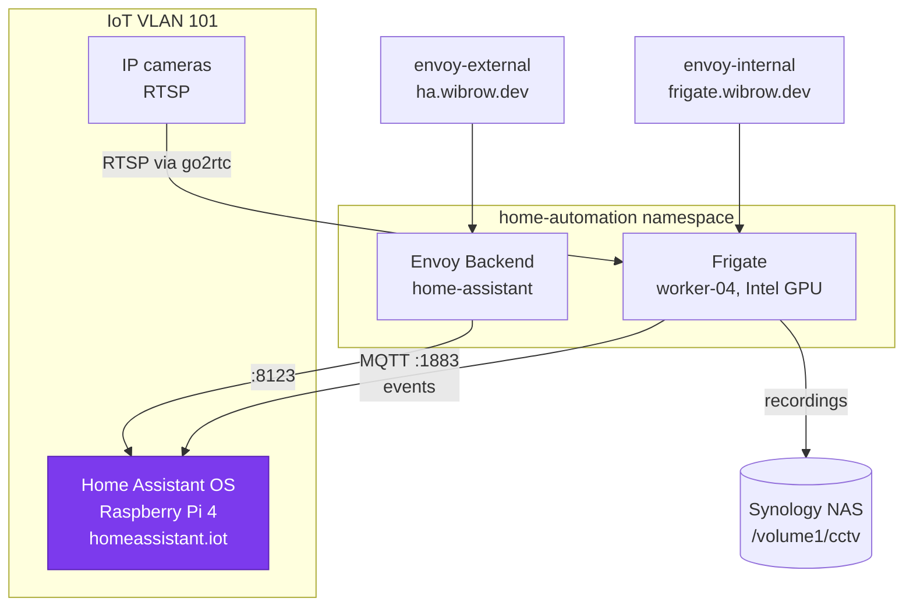

# Home Automation

The `home-automation` namespace holds two apps: **Frigate**, the camera NVR, and **home-assistant**, which is only an ingress route. Home Assistant itself runs as Home Assistant OS on a dedicated Raspberry Pi outside the cluster, and that host also answers MQTT on port 1883.

## Architecture

```mermaid
flowchart TD
    subgraph IoT["IoT VLAN 101"]
        HAOS[Home Assistant OS<br/>Raspberry Pi 4<br/>homeassistant.iot]
        CAM[IP cameras<br/>RTSP]
    end

    subgraph Cluster["home-automation namespace"]
        FR[Frigate<br/>worker-04, Intel GPU]
        BE[Envoy Backend<br/>home-assistant]
    end

    GW[envoy-external<br/>ha.wibrow.dev] --> BE
    GW2[envoy-internal<br/>frigate.wibrow.dev] --> FR
    BE -->|:8123| HAOS
    CAM -->|RTSP via go2rtc| FR
    FR -->|MQTT :1883<br/>events| HAOS
    FR -->|recordings| NAS[(Synology NAS<br/>/volume1/cctv)]

    classDef hub fill:#7c3aed,stroke:#5b21b6,color:#fff
    class HAOS hub
```

## Application Summary

| App | Purpose | Gateway | URL |
|:----|:--------|:--------|:----|
| [Home Assistant](home-assistant.md) | Smart home hub on HAOS, proxied into the gateway | `envoy-external` | `ha.wibrow.dev` |
| Frigate | NVR with object detection | `envoy-internal` | `frigate.wibrow.dev` |

## Frigate

[Frigate](https://frigate.video/) records the IP cameras and detects objects with OpenVINO on the node's Intel GPU.

| Setting | Value |
|:--------|:------|
| **Image** | `ghcr.io/blakeblackshear/frigate` |
| **Node** | `worker-04` (`nodeSelector` on hostname and `intel.feature.node.kubernetes.io/gpu`; tolerates `dedicated=media-home`) |
| **GPU** | `gpu.intel.com/i915: 1`, VA-API hardware decoding (`LIBVA_DRIVER_NAME: iHD`) |
| **Detector** | OpenVINO on `GPU` |
| **Config** | ConfigMap `frigate-config` mounted at `/config/config.yml`; camera credentials from the `frigate-secret` ExternalSecret |
| **Storage** | PVC `frigate` (5Gi) at `/config` via the `pvc` component, backed up by `kopiur` (mover runs as root to read Frigate's files); recordings on NFS `data:/volume1/cctv` |
| **WebRTC** | `LoadBalancer` Service on `10.20.10.235` for UDP 8555; RTSP 8554 and WebRTC TCP 8555 on the app Service |

Recording keeps everything for 7 days, then only footage around alerts and detections. Frigate publishes events to the MQTT broker on the HAOS host (`homeassistant.iot:1883`), which is how Home Assistant receives them.

## Configuration Outside the Cluster

Home Assistant blueprints, dashboards and packages, ESPHome device configs, and Button+ configs live in the repository's `iot/` directory. The HAOS host is managed with Ansible (`ansible/`, `just ansible deploy-homeassistant`); see `ansible/README.md`.
