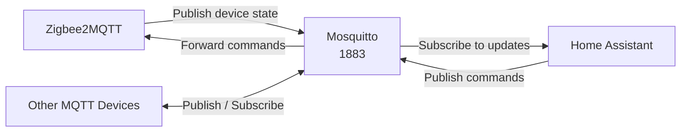

# Mosquitto

[Eclipse Mosquitto](https://mosquitto.org/) is the MQTT broker that serves as the message bus between Zigbee2MQTT and Home Assistant. It handles device state updates, command messages, and Home Assistant MQTT discovery.

## Deployment Details

| Setting | Value |
|:--------|:------|
| **Image** | `docker.io/library/eclipse-mosquitto:2.0.22` |
| **Namespace** | `home-automation` |
| **Port** | 1883 (MQTT) |
| **LoadBalancer IP** | `192.168.0.226` |
| **DNS** | `mosquitto.example.com` |

!!! note "No HTTPRoute"
    Mosquitto does not use an Envoy Gateway HTTPRoute because MQTT is a TCP protocol, not HTTP. Instead, it is exposed directly as a `LoadBalancer` service with a dedicated Cilium LBIPAM IP address.

## Service Configuration

```yaml title="LoadBalancer service"
service:
  app:
    controller: mosquitto
    type: LoadBalancer
    annotations:
      external-dns.alpha.kubernetes.io/hostname: mosquitto.example.com
      lbipam.cilium.io/ips: 192.168.0.226
    ports:
      http:
        port: 1883
```

The `external-dns` annotation creates a DNS record pointing `mosquitto.example.com` to the LoadBalancer IP, allowing external MQTT clients (such as IoT devices on the LAN) to connect.

## Mosquitto Configuration

Mosquitto is configured via a ConfigMap mounted into the container:

```yaml title="Config mount"
persistence:
  config-file:
    type: configMap
    name: mosquitto-configmap
    advancedMounts:
      mosquitto:
        app:
          - path: /mosquitto/config/mosquitto.conf
            subPath: mosquitto.conf
```

### Listener Configuration

Mosquitto listens on port 1883 for unencrypted MQTT connections. Since all communication happens within the cluster or on the LAN, TLS termination is not required at the broker level.

### Authentication

!!! info "Authentication Setup"
    Mosquitto authentication is configured through the `mosquitto.conf` file in the ConfigMap. Consult the ConfigMap resource for the current authentication settings.

## Storage

| Mount | Source | Purpose |
|:------|:-------|:--------|
| `/data` | PVC `mosquitto` | Persistent message store and retained messages |
| `/mosquitto/config/mosquitto.conf` | ConfigMap `mosquitto-configmap` | Broker configuration |

## Security Context

Mosquitto runs with a fully hardened security context:

```yaml
pod:
  securityContext:
    runAsUser: 568
    runAsGroup: 568
    runAsNonRoot: true
    fsGroup: 568
    fsGroupChangePolicy: OnRootMismatch

containers:
  app:
    securityContext:
      allowPrivilegeEscalation: false
      readOnlyRootFilesystem: true
      capabilities:
        drop: ["ALL"]
```

## Message Flow



## Connected Clients

| Client | Direction | Topics |
|:-------|:----------|:-------|
| Zigbee2MQTT | Publish + Subscribe | `zigbee2mqtt/#`, `homeassistant/#` |
| Home Assistant | Publish + Subscribe | `homeassistant/#`, `zigbee2mqtt/+/set` |
| LAN IoT devices | Publish + Subscribe | Various custom topics |
