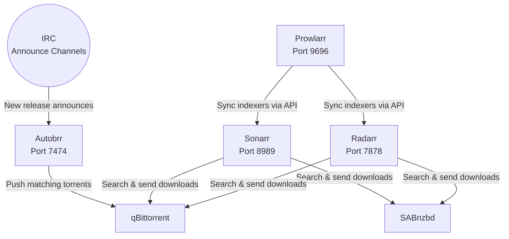

# Arr Stack

The *arr stack consists of four interconnected applications that automate media library management: **Sonarr** for TV shows, **Radarr** for movies, **Prowlarr** for indexer management, and **Autobrr** for IRC announce monitoring.

## How They Interconnect



All *arr apps are exposed through `envoy-internal`, making them accessible only from the LAN or via Tailscale VPN.

---

## Sonarr (TV Shows)

[Sonarr](https://sonarr.tv/) monitors for new TV show episodes and manages the download-to-library pipeline.

| Setting | Value |
|:--------|:------|
| **Image** | `ghcr.io/home-operations/sonarr:4.0.16.2946` |
| **Port** | 8989 |
| **URL** | `sonarr.example.com` |
| **Authentication** | External (Authelia), disabled for local addresses |

### Configuration

```yaml title="Key environment variables"
env:
  SONARR__INSTANCE_NAME: Sonarr
  SONARR__PORT: 8989
  SONARR__AUTHENTICATION_METHOD: External
  SONARR__AUTHENTICATION_REQUIRED: DisabledForLocalAddresses
  SONARR__APPLICATION_URL: "https://sonarr.example.com"
```

### Storage

| Mount | Source | Purpose |
|:------|:-------|:--------|
| `/config` | PVC `sonarr-config` | Sonarr database and settings |
| `/data/nas-media` | NFS `data:/volume1/media` | Media library (shared with downloaders) |

Sonarr runs as UID/GID 568 with `fsGroupChangePolicy: OnRootMismatch`.

---

## Radarr (Movies)

[Radarr](https://radarr.video/) is the movie equivalent of Sonarr -- it searches for, downloads, and organizes movies.

| Setting | Value |
|:--------|:------|
| **Image** | `ghcr.io/home-operations/radarr:6.1.1.10317` |
| **Port** | 7878 |
| **URL** | `radarr.example.com` |
| **Authentication** | External (Authelia), disabled for local addresses |

### Configuration

```yaml title="Key environment variables"
env:
  RADARR__INSTANCE_NAME: Radarr
  RADARR__PORT: 7878
  RADARR__AUTHENTICATION_METHOD: External
  RADARR__AUTHENTICATION_REQUIRED: DisabledForLocalAddresses
  RADARR__APPLICATION_URL: "https://radarr.example.com"
  RADARR__LOG_LEVEL: info
```

### Storage

| Mount | Source | Purpose |
|:------|:-------|:--------|
| `/config` | PVC `radarr-config` | Radarr database and settings |
| `/data/nas-media` | NFS `data:/volume1/media` | Media library (shared with downloaders) |

Radarr uses a hardened security context with `readOnlyRootFilesystem: true` and runs as UID/GID 2000.

---

## Prowlarr (Indexer Manager)

[Prowlarr](https://prowlarr.com/) centralizes indexer management and syncs configurations to Sonarr and Radarr automatically.

| Setting | Value |
|:--------|:------|
| **Image** | `ghcr.io/home-operations/prowlarr:2.3.2` |
| **Port** | 9696 |
| **URL** | `prowlarr.example.com` |
| **Authentication** | External (Authelia) |

### Configuration

```yaml title="Key environment variables"
env:
  PROWLARR__INSTANCE_NAME: Prowlarr
  PROWLARR__PORT: 9696
  PROWLARR__LOG_LEVEL: info
  PROWLARR__ANALYTICS_ENABLED: "False"
  PROWLARR__AUTHENTICATION_METHOD: External
  PROWLARR__API_KEY:
    valueFrom:
      secretKeyRef:
        name: prowlarr-secret
        key: api_key
```

!!! info "API Key"
    Prowlarr's API key is stored in an `ExternalSecret` (`prowlarr-secret`) and injected as an environment variable. This key is used by Sonarr and Radarr to authenticate with Prowlarr's API.

### Storage

Prowlarr stores its configuration in a single PVC (`prowlarr-config`). It does not need access to the NFS media share since it only manages indexer metadata.

---

## Autobrr (IRC Announce Monitoring)

[Autobrr](https://autobrr.com/) monitors IRC announce channels for new releases and automatically pushes matching content to download clients, bypassing the indexer search delay.

| Setting | Value |
|:--------|:------|
| **Image** | `ghcr.io/autobrr/autobrr:v1.72.1` |
| **Port** | 7474 |
| **URL** | `autobrr.example.com` |
| **Database** | PostgreSQL (CloudNative-PG `autobrr` cluster) |

### Configuration

Autobrr uses PostgreSQL for its database instead of SQLite, with credentials injected from the `autobrr-db-secret` ExternalSecret:

```yaml title="Secret references"
envFrom:
  - secretRef:
      name: autobrr-secret
  - secretRef:
      name: autobrr-db-secret
```

Autobrr is a stateless application (aside from the database) and does not require PVC storage. It runs as UID/GID 2000 with a hardened security context.
