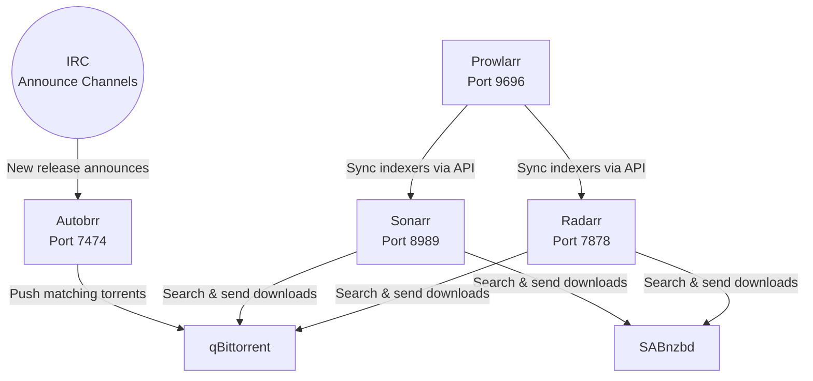

# Arr Stack

The *arr stack consists of four interconnected applications that automate media library management: **Sonarr** for TV shows, **Radarr** for movies, **Prowlarr** for indexer management, and **Autobrr** for IRC announce monitoring.

## How They Interconnect


```mermaid
flowchart TD
    PR[Prowlarr<br/>Port 9696]
    SO[Sonarr<br/>Port 8989]
    RA[Radarr<br/>Port 7878]
    AB[Autobrr<br/>Port 7474]
    QB[qBittorrent]
    SAB[SABnzbd]
    IRC((IRC<br/>Announce Channels))

    PR -->|Sync indexers via API| SO
    PR -->|Sync indexers via API| RA
    IRC -->|New release announces| AB
    AB -->|Push matching torrents| QB
    SO -->|Search & send downloads| QB
    SO -->|Search & send downloads| SAB
    RA -->|Search & send downloads| QB
    RA -->|Search & send downloads| SAB
```

All four are exposed through `envoy-internal`, so they are reachable only from the LAN or via Tailscale. They run on worker-07 (`wibrow.dev/compute: "true"`), keep their config on PVCs from the `pvc` component, and are backed up hourly by `kopiur` with the mover patched to uid/gid 2000 to match the apps. Autobrr is the exception: it has no PVC and keeps its state in PostgreSQL.

---

## Sonarr (TV Shows)

[Sonarr](https://sonarr.tv/) monitors for new TV show episodes and manages the download-to-library pipeline.

| Setting | Value |
|:--------|:------|
| **Image** | `ghcr.io/home-operations/sonarr` |
| **Port** | 8989 |
| **URL** | `sonarr.wibrow.dev` |
| **Authentication** | `External`, not required for local addresses |

### Configuration

```yaml title="Key environment variables"
env:
  SONARR__INSTANCE_NAME: Sonarr
  SONARR__PORT: 8989
  SONARR__AUTHENTICATION_METHOD: External
  SONARR__AUTHENTICATION_REQUIRED: DisabledForLocalAddresses
  SONARR__APPLICATION_URL: "https://sonarr.wibrow.dev"
```

### Storage

| Mount | Source | Purpose |
|:------|:-------|:--------|
| `/config` | PVC `sonarr-config` | Sonarr database and settings |
| `/data/nas-media` | NFS `data:/volume1/media` | Media library (shared with downloaders) |

Sonarr runs as UID/GID 2000 with `fsGroupChangePolicy: OnRootMismatch`.

---

## Radarr (Movies)

[Radarr](https://radarr.video/) is the movie equivalent of Sonarr: it searches for, downloads, and organizes movies.

| Setting | Value |
|:--------|:------|
| **Image** | `ghcr.io/home-operations/radarr` |
| **Port** | 7878 |
| **URL** | `radarr.wibrow.dev` |
| **Authentication** | `External`, not required for local addresses |

### Configuration

```yaml title="Key environment variables"
env:
  RADARR__INSTANCE_NAME: Radarr
  RADARR__PORT: 7878
  RADARR__AUTHENTICATION_METHOD: External
  RADARR__AUTHENTICATION_REQUIRED: DisabledForLocalAddresses
  RADARR__APPLICATION_URL: "https://radarr.wibrow.dev"
  RADARR__LOG_LEVEL: info
```

### Storage

| Mount | Source | Purpose |
|:------|:-------|:--------|
| `/config` | PVC `radarr-config` | Radarr database and settings |
| `/data/nas-media` | NFS `data:/volume1/media` | Media library (shared with downloaders) |

Radarr runs as UID/GID 2000 (`runAsNonRoot: true`), with `emptyDir` volumes for `/tmp` and add-ons.

---

## Prowlarr (Indexer Manager)

[Prowlarr](https://prowlarr.com/) centralizes indexer management and syncs configurations to Sonarr and Radarr automatically.

| Setting | Value |
|:--------|:------|
| **Image** | `ghcr.io/home-operations/prowlarr` |
| **Port** | 9696 |
| **URL** | `prowlarr.wibrow.dev` |
| **Authentication** | `External` |

### Configuration

```yaml title="Key environment variables"
env:
  PROWLARR__INSTANCE_NAME: Prowlarr
  PROWLARR__PORT: 9696
  PROWLARR__LOG_LEVEL: info
  PROWLARR__ANALYTICS_ENABLED: "False"
  PROWLARR__AUTHENTICATION_METHOD: External
  PROWLARR__API_KEY:
    valueFrom:
      secretKeyRef:
        name: prowlarr-secret
        key: api_key
```

> [!NOTE]
> **API Key**
>
> Prowlarr's API key is stored in an `ExternalSecret` (`prowlarr-secret`) and injected as an environment variable. This key is used by Sonarr and Radarr to authenticate with Prowlarr's API.

### Storage

Prowlarr stores its configuration in a single PVC (`prowlarr-config`). It does not mount the NFS media share since it only manages indexer metadata.

---

## Autobrr (IRC Announce Monitoring)

[Autobrr](https://autobrr.com/) monitors IRC announce channels for new releases and automatically pushes matching content to download clients, bypassing the indexer search delay.

| Setting | Value |
|:--------|:------|
| **Image** | `ghcr.io/autobrr/autobrr` |
| **Port** | 7474 |
| **URL** | `autobrr.wibrow.dev` |
| **Database** | PostgreSQL, tenant `autobrr` on the `shared` CNPG cluster |
| **Login** | OIDC via Kanidm (`idm.wibrow.dev`) |

### Configuration

Autobrr uses PostgreSQL instead of SQLite (`AUTOBRR__DATABASE_TYPE: postgres`). The `cnpg-db-shared` component creates `autobrr-db-secret`, and the individual `AUTOBRR__POSTGRES_*` variables read `DB_HOST`, `DB_PORT`, `DB_USER`, `DB_PASS` and `DB_NAME` from it. Other secrets come from `autobrr-secret` (Infisical).

```yaml title="kustomization.yaml (excerpt)"
components:
  - ../../../../components/cnpg-db-shared
configMapGenerator:
  - name: cnpg-db-config
    literals:
      - APP_NAME=autobrr
      - SECRET_NAME=autobrr-db-secret
      - CNPG_SECRET_KEY=shared-autobrr
      - DB_SCHEME=postgresql
```

Autobrr has no PVC. It runs as UID/GID 2000 with `runAsNonRoot: true`.
