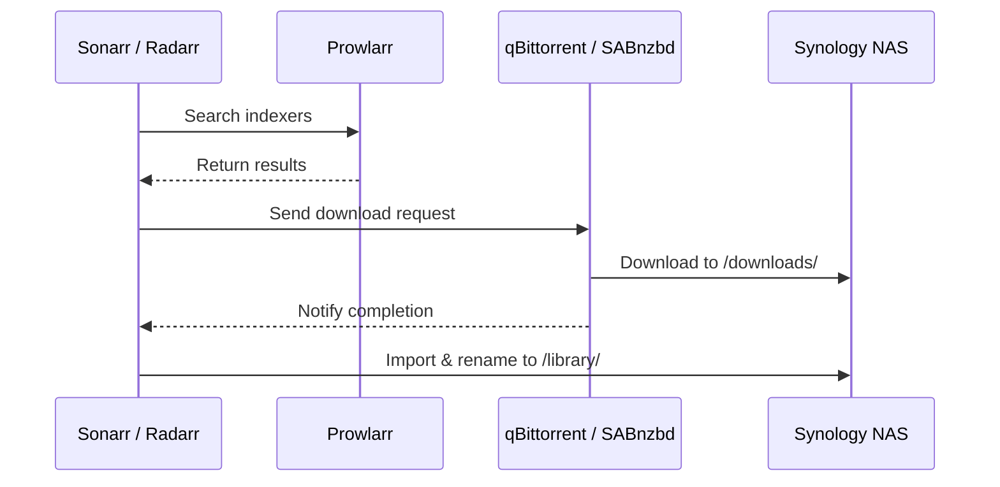

# Downloaders

The media stack uses two download clients: **qBittorrent** for torrents and **SABnzbd** for Usenet. Both are managed by Sonarr and Radarr and download to the shared Synology NAS.

## qBittorrent

[qBittorrent](https://www.qbittorrent.org/) is the primary torrent client, handling downloads triggered by Sonarr, Radarr, and Autobrr.

### Deployment Details

| Setting | Value |
|:--------|:------|
| **Image** | `ghcr.io/home-operations/qbittorrent:5.1.4` |
| **Port** | 8080 (WebUI) |
| **Gateway** | `envoy-internal` |
| **URL** | `qbittorrent.example.com` |

### Configuration

```yaml title="Key environment variables"
env:
  UMASK: "022"
  QBT_WEBUI_PORT: 8080
```

### Storage

| Mount | Source | Purpose |
|:------|:-------|:--------|
| `/config` | PVC `qbittorrent-config` | qBittorrent configuration and database |
| `/data/nas-media/downloads/qbittorrent` | NFS `data:/volume1/media` | Download directory (subpath) |

```yaml title="Download path configuration"
persistence:
  config:
    existingClaim: qbittorrent-config
    advancedMounts:
      qbittorrent:
        app:
          - path: /config
  downloads:
    type: nfs
    server: data
    path: /volume1/media
    globalMounts:
      - path: /data/nas-media
        subPath: downloads/qbittorrent
```

!!! tip "Download Path"
    qBittorrent downloads to `/data/nas-media/downloads/qbittorrent` on the NAS. Sonarr and Radarr see the same NFS mount at `/data/nas-media`, which allows them to hardlink or move completed downloads into the organized library folders without duplicating data.

### Security Context

qBittorrent runs with a hardened security context:

```yaml
securityContext:
  runAsUser: 2000
  runAsGroup: 2000
  runAsNonRoot: true
  allowPrivilegeEscalation: false
  readOnlyRootFilesystem: true
  capabilities:
    drop:
      - ALL
```

### Resources

```yaml
resources:
  requests:
    cpu: 100m
    memory: 128Mi
  limits:
    memory: 8192Mi
```

!!! note "Memory Limit"
    The 8 GiB memory limit accommodates qBittorrent's in-memory torrent state, which can grow significantly with large numbers of active torrents.

---

## SABnzbd

[SABnzbd](https://sabnzbd.org/) is the Usenet download client, providing an alternative download path to torrents for Sonarr and Radarr.

### Deployment Details

| Setting | Value |
|:--------|:------|
| **Image** | `ghcr.io/home-operations/sabnzbd:4.5.5` |
| **Port** | 8080 (WebUI) |
| **Gateway** | `envoy-internal` |
| **URL** | `sabnzbd.example.com` |
| **Node Selector** | `kubernetes.io/arch: amd64` |

### Configuration

```yaml title="Key environment variables"
env:
  SABNZBD__PORT: 8080
  SABNZBD__HOST_WHITELIST_ENTRIES: >-
    sabnzbd,
    sabnzbd.downloads,
    sabnzbd.downloads.svc,
    sabnzbd.downloads.svc.cluster,
    sabnzbd.downloads.svc.cluster.local,
    sabnzbd.example.com
```

!!! info "Host Whitelist"
    SABnzbd requires explicit host whitelist entries to allow connections from Kubernetes service names and the external hostname. Without these entries, SABnzbd rejects requests from Sonarr/Radarr and the Envoy Gateway.

### Storage

| Mount | Source | Purpose |
|:------|:-------|:--------|
| `/config` | PVC `sabnzbd-config` | SABnzbd configuration |
| `/data/nas-media` | NFS `data:/volume1/media` | Media library (for post-processing) |
| `/downloads` | PVC `sabnzbd-downloads` | Active download staging area |
| `/tmp` | `emptyDir` | Temporary files |

```yaml title="Storage mounts"
persistence:
  config:
    existingClaim: sabnzbd-config
  media:
    type: nfs
    server: data
    path: /volume1/media
    globalMounts:
      - path: /data/nas-media
  downloads:
    existingClaim: sabnzbd-downloads
```

### Security Context

SABnzbd runs as UID/GID 568 with a read-only root filesystem and all capabilities dropped.

---

## Integration with Arr Apps

Both download clients are configured as "Download Clients" within Sonarr and Radarr. The typical flow:

1. Sonarr/Radarr find a release on an indexer (managed by Prowlarr)
2. The *arr app sends the `.torrent` or `.nzb` to qBittorrent or SABnzbd
3. The download client fetches the content to the NAS
4. Sonarr/Radarr detect the completed download and import it into the library



!!! warning "Path Mapping"
    If the download client and *arr app see different filesystem paths for the same data, hardlinking will fail and files will be copied instead, doubling disk usage. The shared NFS mount at `/data/nas-media` avoids this problem.
