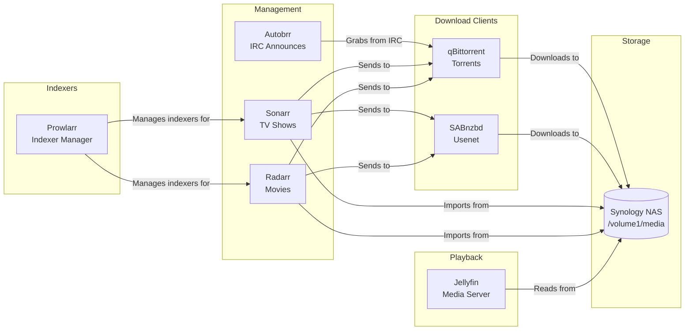

# Media Stack

The media stack provides automated media acquisition, organization, and playback. It consists of seven applications working together in the `media` namespace.

## Architecture



## Application Summary

| App | Purpose | Image | Gateway | URL |
|:----|:--------|:------|:--------|:----|
| [Jellyfin](jellyfin.md) | Media server with GPU transcoding | `ghcr.io/jellyfin/jellyfin` | `envoy-external` | `jellyfin.example.com` |
| [Sonarr](arr-stack.md) | TV show management | `ghcr.io/home-operations/sonarr` | `envoy-internal` | `sonarr.example.com` |
| [Radarr](arr-stack.md) | Movie management | `ghcr.io/home-operations/radarr` | `envoy-internal` | `radarr.example.com` |
| [Prowlarr](arr-stack.md) | Indexer management | `ghcr.io/home-operations/prowlarr` | `envoy-internal` | `prowlarr.example.com` |
| [Autobrr](arr-stack.md) | IRC announce monitoring | `ghcr.io/autobrr/autobrr` | `envoy-internal` | `autobrr.example.com` |
| [qBittorrent](downloaders.md) | Torrent client | `ghcr.io/home-operations/qbittorrent` | `envoy-internal` | `qbittorrent.example.com` |
| [SABnzbd](downloaders.md) | Usenet client | `ghcr.io/home-operations/sabnzbd` | `envoy-internal` | `sabnzbd.example.com` |

## Data Flow

1. **Prowlarr** manages indexer configurations and syncs them to Sonarr and Radarr
2. **Autobrr** monitors IRC announce channels for new releases and pushes matching torrents to qBittorrent
3. **Sonarr** (TV) and **Radarr** (movies) search indexers for wanted content and send downloads to qBittorrent or SABnzbd
4. **qBittorrent** and **SABnzbd** download content to the NAS at `/volume1/media/downloads/`
5. Sonarr and Radarr import completed downloads, renaming and organizing files into the library
6. **Jellyfin** serves the organized media library for playback with hardware-accelerated transcoding

## Shared Storage

All media apps mount the same Synology NAS export:

```yaml
persistence:
  media:
    type: nfs
    server: data
    path: /volume1/media
    globalMounts:
      - path: /data/nas-media
```

This ensures a single unified path structure across all applications, allowing Sonarr/Radarr to hardlink or move files from download directories into library directories without additional copies.

!!! tip "Path Consistency"
    All apps see the NAS at `/data/nas-media`. This shared mount point is critical for hardlinking to work -- both the download client and the *arr app must see the same filesystem.
