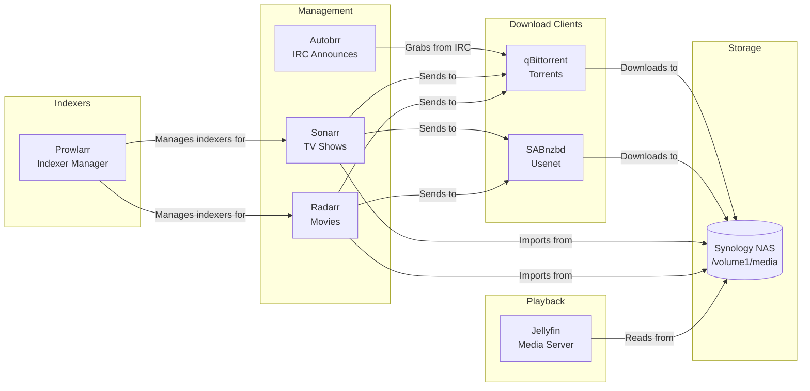

# Media Stack

The media stack provides automated media acquisition, organization, and playback, plus photo management. It consists of eight applications in the `media` namespace.

## Architecture


```mermaid
flowchart LR
    subgraph Indexers
        PR[Prowlarr<br/>Indexer Manager]
    end

    subgraph Management
        SO[Sonarr<br/>TV Shows]
        RA[Radarr<br/>Movies]
        AB[Autobrr<br/>IRC Announces]
    end

    subgraph Download["Download Clients"]
        QB[qBittorrent<br/>Torrents]
        SAB[SABnzbd<br/>Usenet]
    end

    subgraph Storage
        NAS[(Synology NAS<br/>/volume1/media)]
    end

    subgraph Playback
        JF[Jellyfin<br/>Media Server]
    end

    PR -->|Manages indexers for| SO
    PR -->|Manages indexers for| RA
    AB -->|Grabs from IRC| QB
    SO -->|Sends to| QB
    SO -->|Sends to| SAB
    RA -->|Sends to| QB
    RA -->|Sends to| SAB
    QB -->|Downloads to| NAS
    SAB -->|Downloads to| NAS
    SO -->|Imports from| NAS
    RA -->|Imports from| NAS
    JF -->|Reads from| NAS
```

## Application Summary

| App | Purpose | Image | Gateway | URL |
|:----|:--------|:------|:--------|:----|
| [Jellyfin](jellyfin.md) | Media server with GPU transcoding | `ghcr.io/jellyfin/jellyfin` | `envoy-external` | `jellyfin.wibrow.dev` |
| [Immich](#immich) | Photo and video library | `ghcr.io/immich-app/immich-server` | `envoy-external` | `photos.wibrow.dev` |
| [Sonarr](arr-stack.md#sonarr-tv-shows) | TV show management | `ghcr.io/home-operations/sonarr` | `envoy-internal` | `sonarr.wibrow.dev` |
| [Radarr](arr-stack.md#radarr-movies) | Movie management | `ghcr.io/home-operations/radarr` | `envoy-internal` | `radarr.wibrow.dev` |
| [Prowlarr](arr-stack.md#prowlarr-indexer-manager) | Indexer management | `ghcr.io/home-operations/prowlarr` | `envoy-internal` | `prowlarr.wibrow.dev` |
| [Autobrr](arr-stack.md#autobrr-irc-announce-monitoring) | IRC announce monitoring | `ghcr.io/autobrr/autobrr` | `envoy-internal` | `autobrr.wibrow.dev` |
| [qBittorrent](downloaders.md#qbittorrent) | Torrent client | `ghcr.io/home-operations/qbittorrent` | `envoy-internal` | `qbittorrent.wibrow.dev` |
| [SABnzbd](downloaders.md#sabnzbd) | Usenet client | `ghcr.io/home-operations/sabnzbd` | `envoy-internal` | `sabnzbd.wibrow.dev` |

Image tags are pinned (most with digests) in each app's `values.yaml` and updated by Renovate.

## Placement

| Apps | Node | Why |
|:-----|:-----|:----|
| Sonarr, Radarr, Prowlarr, Autobrr, qBittorrent, SABnzbd | worker-07 (`wibrow.dev/compute: "true"`) | The bare-metal compute node |
| Immich server and machine learning | worker-07 (pinned by hostname) | Library and model cache are on worker-07's local ZFS pools |
| Jellyfin | worker-04 | Intel iGPU for Quick Sync transcoding |

## Data Flow

1. **Prowlarr** manages indexer configurations and syncs them to Sonarr and Radarr
2. **Autobrr** monitors IRC announce channels and pushes matching torrents to qBittorrent
3. **Sonarr** (TV) and **Radarr** (movies) search indexers and send downloads to qBittorrent or SABnzbd
4. **qBittorrent** downloads to the NAS at `downloads/qbittorrent`; **SABnzbd** stages downloads on a local PVC (`sabnzbd-downloads`) and also mounts the NAS
5. Sonarr and Radarr import completed downloads, renaming and organizing files into the library
6. **Jellyfin** serves the library with hardware-accelerated transcoding

## Shared Storage

The *arr apps, download clients and Jellyfin mount the same Synology NAS export:

```yaml
persistence:
  media:
    type: nfs
    server: data
    path: /volume1/media
    globalMounts:
      - path: /data/nas-media
```

> [!TIP]
> **Path Consistency**
>
> All apps see the NAS at `/data/nas-media`. Both the download client and the *arr app must see the same filesystem for hardlinks and atomic moves to work.

App config lives on per-app PVCs from the `pvc` component, backed up hourly by `kopiur`. Autobrr has no PVC; its state is in PostgreSQL.

## Immich

[Immich](https://immich.app/) is a self-hosted photo and video library with mobile backup.

| Setting | Value |
|:--------|:------|
| **Controllers** | `server` and `machine-learning`, both pinned to worker-07 |
| **Library** | PVC `immich-library-media` (`openebs-hostpath-media`, worker-07's RAIDZ1 pool at `/var/mnt/media`, reclaim policy `Retain`) mounted at `/data` |
| **ML model cache** | 10Gi on `openebs-hostpath-fast` |
| **Database** | Dedicated `immich` CNPG cluster (VectorChord, PostgreSQL 16) via an inline ExternalSecret against `cnpg-secrets-database`; see [Databases](../databases/index.md) |
| **Cache** | `Dragonfly` instance `immich-dragonfly` (Redis-compatible) |
| **Auth** | OAuth via Kanidm; the whole Immich system config is rendered from Infisical into the `immich-config-secret` Secret |

> [!NOTE]
> **Library location**
>
> The library has been back on worker-07's local pool since 2026-08-16, after a spell on the NAS. The claim is declared in `pvc-library.yaml` rather than through the chart because `storageClassName` is immutable; see the comments there before moving it again.
