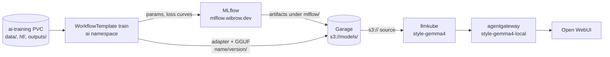

# Model Training

Own fine-tunes are trained, stored and served entirely in the cluster. One
Argo `WorkflowTemplate` runs the training on the RTX 3090 Ti, MLflow records
the run, Garage keeps every published version, and llmkube serves the result
behind agentgateway like any other local model.



| Piece | Where |
|:------|:------|
| WorkflowTemplate `train`, `train.py`, `export.py` | `kubernetes/apps/pitower/ai/ai-training/` |
| MLflow (Postgres backend, artifacts in Garage) | `kubernetes/apps/pitower/ai/mlflow/` |
| Served model `style-gemma4` | `kubernetes/apps/pitower/ai/llmkube/llmkube-models/style-gemma4*.yaml` |
| Gateway entry `style-gemma4-local` | `kubernetes/apps/pitower/ai/agentgateway/config/models.yaml` |
| Bucket `models`, key `models` | [Garage](../storage/garage.md), key in Infisical `/ai/models/` |

## Training a version

The training data is private, so it never goes into git. Copy it onto the
`ai-training` PVC under `data/` (`train.jsonl`, `valid.jsonl`, one chat
`messages` list per line) from a pod that mounts the PVC on worker-ai-01.

Submit from the Argo Workflows UI (`argo-workflows.wibrow.dev`, namespace `ai`)
or the CLI:

```sh
argo -n ai submit --from workflowtemplate/train -p version=v3 -p gguf=true
```

| Parameter | Default | Meaning |
|:----------|:--------|:--------|
| `version` | required | Folder under `s3://models/<name>/`; never reused |
| `name` | `style-gemma-4-12b-lora` | Model name, also the MLflow experiment |
| `model` | `google/gemma-4-12B-it` | Base model |
| `data` | `data` | Directory on the PVC with `train.jsonl` / `valid.jsonl` |
| `epochs`, `rank`, `lr` | `1`, `16`, `2e-4` | QLoRA hyperparameters |
| `gguf` | `false` | Also merge and export a llama.cpp GGUF |
| `quant` | `q4_k_m` | GGUF quantization |

The steps:

1. **check**: fails if `s3://models/<name>/<version>/` already holds anything.
   Garage has no object versioning, so this is what keeps a published version
   immutable, and it runs before any GPU time is spent.
2. **train**: Unsloth QLoRA on the GPU (~85 min for one epoch of the style
   data). Logs to MLflow as run `<version>` in experiment `<name>`, tagged with
   `model_uri` and the Argo workflow name. The base model is cached in
   `hf/` on the PVC.
3. **publish**: uploads the adapter and the final `trainer_state.json` to
   `s3://models/<name>/<version>/`.
4. **export** and **publish-gguf** (with `gguf=true`): merge the adapter into
   the base model and upload the GGUF plus the base model's vision `mmproj` to
   `<version>/gguf/` (~5 min).

To add a GGUF to a version that was published without one:

```sh
argo -n ai submit --from workflowtemplate/train --entrypoint gguf -p version=v2
```

> [!WARNING]
> **The GPU is shared**
>
> Training holds the only GPU. While it runs, strata, ComfyUI and the llmkube
> models cannot scale up; their requests wait or time out. Check that nothing
> holds it first: `kubectl get resourceclaims -A`.

## Serving a version

`style-gemma4.yaml` points the llmkube `Model` at one version's GGUF prefix:

```yaml
spec:
  source: s3://models/style-gemma-4-12b-lora/v2/gguf
```

To ship a new version, change `v2` to the new one and merge. llmkube re-stages
the files from Garage on the next start. The service scales to zero after 15
minutes idle (KEDA) and appears in Open WebUI as `style-gemma4-local`.

## Disk on the PVC

The PVC is 100Gi. The base model cache in `hf/` takes ~22GB, and an export
needs ~46GB at peak (16-bit merged weights plus a BF16 GGUF before
quantization), which the workflow deletes after uploading. Each training run
leaves ~1.5GB in `outputs/<workflow>/` (adapter and checkpoints); once the
version is in Garage those can be removed.
