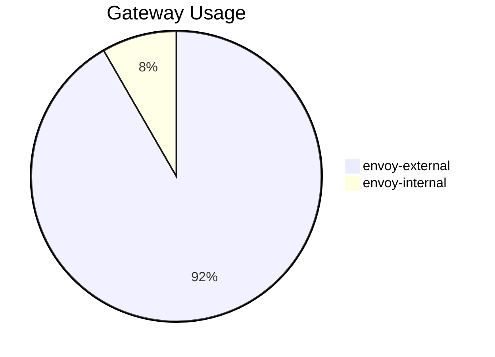

# Self-Hosted Applications

The `selfhosted` namespace contains a variety of productivity tools, dashboards, and utility services. Most are deployed using the bjw-s app-template Helm chart and connect to Envoy Gateways via HTTPRoute resources.

## Application Catalog

| App | Description | Gateway | URL | Database |
|:----|:------------|:--------|:----|:---------|
| **Cryptgeon** | Encrypted secret sharing (view-once notes and files) | `envoy-external` | `secrets.example.com` | Valkey (sidecar) |
| **Echo Server** | HTTP request debugging and inspection | `envoy-external` | `echo.example.com` | -- |
| **Excalidraw** | Collaborative whiteboard and diagramming | `envoy-external` | `draw.example.com` | -- |
| **Glance** | Customizable dashboard with feeds and widgets | `envoy-external` | `glance.example.com` | -- |
| **Homepage** | Kubernetes-aware application dashboard | `envoy-external` | `home.example.com` | -- |
| **House Hunter** | Property search aggregator | `envoy-external` | `house-hunter.example.com` | PostgreSQL |
| **Miniflux** | Minimalist RSS/Atom feed reader | `envoy-external` | `miniflux.example.com` | PostgreSQL |
| **n8n** | Workflow automation platform | `envoy-external` | `n8n.example.com` | SQLite |
| **RRDA** | DNS REST API for querying DNS records over HTTP | `envoy-external` | `rrda.example.com` | -- |
| **Sharkord** | Voice/video communication server | `envoy-external` | `sharkord.example.com` | -- |
| **Tandoor** | Recipe management and meal planning | `envoy-external` | `tandoor.example.com` | PostgreSQL |
| **Whoami** | Simple HTTP debugging endpoint | `envoy-external` | `whoami.example.com` | -- |

---

## Application Details

### Cryptgeon

[Cryptgeon](https://github.com/cupcakearmy/cryptgeon) provides encrypted, self-destructing notes and file sharing. Messages are encrypted client-side and stored in a Valkey (Redis-compatible) sidecar.

- **Image**: `cupcakearmy/cryptgeon:2.9.1`
- **Sidecar**: `valkey/valkey:8.1` for ephemeral encrypted data storage
- **Size limit**: 100 MB per note

### Echo Server

[HTTP Echo Server](https://github.com/mendhak/docker-http-https-echo) returns request headers, body, and metadata. Useful for debugging Envoy Gateway routing, TLS termination, and header injection.

- **Image**: `ghcr.io/mendhak/http-https-echo:39`

### Excalidraw

[Excalidraw](https://excalidraw.com/) is an open-source collaborative whiteboard tool for sketching diagrams and illustrations.

- **Image**: `docker.io/excalidraw/excalidraw:latest`
- **Storage**: `emptyDir` only (stateless)

### Glance

[Glance](https://github.com/glanceapp/glance) is a self-hosted dashboard with configurable widgets for RSS feeds, weather, bookmarks, and system monitoring.

- **Image**: `docker.io/glanceapp/glance:v0.8.4`
- **Configuration**: ConfigMap `glance-config` mounted as `/config/glance.yml`

### Homepage

[Homepage](https://gethomepage.dev/) is a Kubernetes-aware application dashboard that auto-discovers services and displays their status.

- **Image**: `ghcr.io/gethomepage/homepage:v1.9.0`
- **Configuration**: ConfigMap `homepage-config` with multiple YAML files (bookmarks, services, settings, widgets)
- **RBAC**: ServiceAccount with cluster read permissions for Kubernetes service discovery

### House Hunter

[House Hunter](https://github.com/swibrow/house-hunter) is a custom property search aggregator backed by PostgreSQL.

- **Image**: `ghcr.io/swibrow/house-hunter:latest`
- **Database**: PostgreSQL (CloudNative-PG `house-hunter` cluster)

### Miniflux

[Miniflux](https://miniflux.app/) is a minimalist, opinionated RSS feed reader with a clean interface.

- **Image**: `ghcr.io/miniflux/miniflux:2.2.17-distroless`
- **Database**: PostgreSQL (CloudNative-PG `miniflux` cluster)
- **Polling**: Every 15 minutes using entry frequency scheduler

### n8n

[n8n](https://n8n.io/) is a workflow automation platform with a visual editor, supporting hundreds of integrations.

- **Image**: `ghcr.io/n8n-io/n8n:2.6.2`
- **Storage**: PVC `n8n` at `/home/node/.n8n`
- **Webhook URL**: `https://n8n-webhook.example.com` (separate HTTPRoute)
- **Timezone**: `Europe/Zurich`

!!! info "Dual Routes"
    n8n has two HTTPRoutes: one for the main UI (`n8n.example.com`) and one for webhook callbacks (`n8n-webhook.example.com`). Both use `envoy-external`.

### RRDA

[RRDA](https://github.com/swibrow/rrda) is a REST API for DNS record lookups, providing an HTTP interface to DNS queries.

- **Image**: `ghcr.io/swibrow/rrda:1.4.1`
- **Sidecar**: `adguard/dnsproxy:v0.78.2` -- DNS-over-HTTPS proxy to bypass the Ubiquiti router's DNS interception on port 53

!!! note "DoH Sidecar"
    The dnsproxy sidecar resolves DNS queries over HTTPS (DoH) to Cloudflare (`1.1.1.1` / `1.0.0.1`), bypassing the Ubiquiti router which intercepts all DNS traffic on port 53. See [DNS Management](../../networking/dns-management.md) for details on this workaround.

### Sharkord

Sharkord is a voice and video communication server that uses WebRTC for real-time media.

- **Image**: `sharkord/sharkord:latest`
- **Gateway**: `envoy-external`
- **Storage**: PVC `sharkord` at `/root/.config/sharkord`

### Tandoor

[Tandoor Recipes](https://tandoor.dev/) is a recipe management and meal planning application.

- **Image**: `ghcr.io/tandoorrecipes/recipes:2.4.2`
- **Sidecar**: `nginx-unprivileged:1.27.4-alpine` for serving static files and media
- **Database**: PostgreSQL (CloudNative-PG `tandoor` cluster)
- **Storage**: PVC `tandoor-data` with subpaths for media, static files, and data

### Whoami

[Whoami](https://github.com/traefik/whoami) is a lightweight HTTP server that returns connection and request information. Useful for testing gateway routing and TLS configuration.

- **Image**: `docker.io/traefik/whoami:v1.11.0`

---

## Gateway Distribution

!!! note "Internal-Only Apps"
    Most selfhosted apps use `envoy-external` for convenience, relying on Cloudflare Access or Authelia for authentication.
