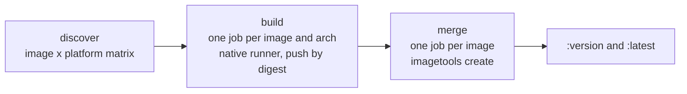

# Docker Builds

Container images built from this repository by `.github/workflows/build-docker-images.yaml` and pushed to the GitHub Container Registry (GHCR).

---

## Overview

> [!WARNING]
> **Most images live in `cloudsnacks/containers`**
>
> General-purpose images were migrated to [cloudsnacks/containers](https://github.com/cloudsnacks/containers),
> which publishes to `ghcr.io/cloudsnacks/<name>`. Add new images there by default.
>
> The `docker/` directory here is for images that do not fit that repo's conventions, such as
> `browser-use`, which runs a supervised multi-process VNC stack as root.

Each subdirectory of `docker/` holds one image:

```
docker/
├── browser-use/
│   ├── Dockerfile
│   └── supervisord.conf
└── strata/
    ├── Dockerfile
    └── platforms        # linux/amd64 only
```

---

## Pipeline

The workflow has three jobs:



### discover

- **Push to `main`**: [tj-actions/changed-files](https://github.com/tj-actions/changed-files) lists the changed `docker/<image>` directories.
- **Manual dispatch**: every directory under `docker/`.

Directories without a `Dockerfile` are skipped. For each image, the platforms come from `docker/<image>/platforms` (one per line), defaulting to `linux/amd64` and `linux/arm64`. The output is a matrix of `{image, platform, arch}` entries.

### build

One job per image and architecture, each on a native runner: `home-ops` for amd64 and `home-ops-arm64` for arm64. There is no QEMU emulation. Each job builds with Buildx and pushes **by digest only** (`push-by-digest=true`), then uploads the digest as an artifact.

### merge

One job per image, run even if another image failed. It downloads that image's digests and, if every expected architecture is present, creates the multi-arch manifest with `docker buildx imagetools create`. An image missing any architecture is not tagged.

---

## Version Extraction

The tag comes from the first `ARG <NAME>_VERSION=` line in the Dockerfile:

```bash
version=$(grep -oP 'ARG \w+_VERSION=\K.+' docker/${{ matrix.image }}/Dockerfile | head -1)
```

| Scenario | Tag |
|:---------|:----|
| `ARG STRATA_VERSION=v0.1.39` found | `v0.1.39` |
| No `*_VERSION` ARG found | Git commit SHA |

---

## Image Tags

Each image gets two tags on the merged manifest:

```
ghcr.io/swibrow/<image>:<version>
ghcr.io/swibrow/<image>:latest
```

Authentication uses the workflow's `GITHUB_TOKEN` with `packages: write`.

---

## Adding a New Docker Image

> [!TIP]
> **Prefer `cloudsnacks/containers`**
>
> Only use `docker/` when an image cannot follow that repo's conventions.

1. Create `docker/my-app/Dockerfile` with a version ARG:

    ```dockerfile
    FROM python:3.12-slim

    ARG MY_APP_VERSION=1.0.0
    # ... build steps
    ```

2. Optionally add `docker/my-app/platforms` to limit architectures:

    ```
    linux/amd64
    ```

3. Merge to `main`. The workflow builds the image and publishes `ghcr.io/swibrow/my-app:1.0.0` and `:latest`.

Renovate's Dockerfile manager updates the `FROM` base images. The `*_VERSION` ARGs carry no Renovate annotation today, so they are bumped by hand.
