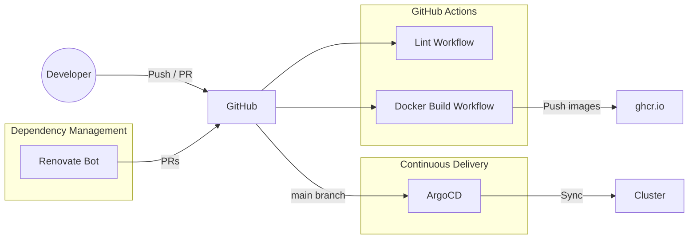

# CI/CD

Continuous integration and delivery pipeline for the home lab.

---

## Overview

The CI/CD pipeline combines three systems to automate code quality, image builds, dependency updates, and cluster deployment:

---

## Pipeline Components

### GitHub Actions

Two workflows automate CI tasks:

| Workflow | Trigger | Purpose |
|:---------|:--------|:--------|
| **Lint** | Pull requests to `main` | Code quality checks on PR changes |
| **Build Docker Images** | Push to `main` (docker/**) or manual dispatch | Build and push multi-arch Docker images to GHCR |

Details: [GitHub Actions](github-actions.md)

### Docker Builds

The Docker build workflow provides:

- Automatic discovery of changed Dockerfiles
- Version extraction from `ARG` directives
- Multi-platform builds (linux/amd64, linux/arm64)
- Push to GitHub Container Registry (ghcr.io)

Details: [Docker Builds](docker-builds.md)

### Renovate

Renovate Bot automatically manages dependency updates:

- Extends [bjw-s presets](https://github.com/bjw-s/renovate-config) for home-ops patterns
- Auto-merges Docker digest and patch updates
- Auto-merges GitHub Actions digest and patch updates
- Auto-merges Helm patch updates
- Groups related packages (Cilium, Rook Ceph, Talos)
- Custom Grafana dashboard version tracking

Details: [Renovate](renovate.md)

### ArgoCD

ArgoCD provides GitOps-based continuous delivery:

- Watches the `main` branch of the repository
- Auto-discovers applications via ApplicationSets
- Syncs Kubernetes manifests to the cluster
- Provides health monitoring and rollback capabilities

Details: [ArgoCD Setup](../gitops/argocd-setup.md)

---

## Workflow Summary

| Event | Action | Result |
|:------|:-------|:-------|
| PR opened | Lint workflow runs | Code quality verified |
| PR merged to `main` with docker/ changes | Docker build workflow | New images pushed to GHCR |
| PR merged to `main` with app changes | ArgoCD detects change | Application synced to cluster |
| Renovate detects update | Creates PR | Auto-merged (digest/patch) or awaits review |
| Manual dispatch | Docker build for all images | All images rebuilt and pushed |

---

## Documentation Deployment

The documentation site itself is also CI/CD managed:

| Workflow | Trigger | Purpose |
|:---------|:--------|:--------|
| **Deploy Docs** | Push to `main` (docs/** or mkdocs.yml) | Build and deploy MkDocs Material site to GitHub Pages |
