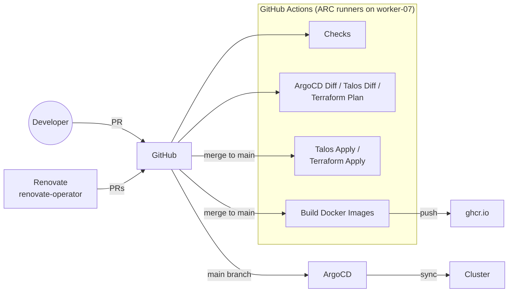

# CI/CD

Continuous integration and delivery for the home lab.

---

## Overview

Four systems work together: GitHub Actions validates PRs and applies the non-Kubernetes stacks, Renovate keeps dependencies current, ArgoCD delivers Kubernetes manifests, and self-hosted runners in the cluster execute the workflows.

```mermaid
flowchart LR
    Dev((Developer)) -->|PR| GitHub[GitHub]
    Renovate[Renovate\nrenovate-operator] -->|PRs| GitHub

    subgraph CI["GitHub Actions (ARC runners on worker-07)"]
        Checks[Checks]
        Diff[ArgoCD Diff / Talos Diff /\nTerraform Plan]
        Apply[Talos Apply /\nTerraform Apply]
        Build[Build Docker Images]
    end

    GitHub --> Checks
    GitHub --> Diff
    GitHub -->|merge to main| Apply
    GitHub -->|merge to main| Build
    Build -->|push| GHCR[ghcr.io]
    GitHub -->|main branch| ArgoCD[ArgoCD]
    ArgoCD -->|sync| Cluster[Cluster]
```

---

## Pipeline Components

### GitHub Actions

| Workflow | Trigger | Purpose |
|:---------|:--------|:--------|
| **Checks** | Every PR to `main` | actionlint and pre-commit (yamllint, whitespace, terraform fmt/tflint); the required status check |
| **ArgoCD Diff** | PR touching `kubernetes/**` | Render changed apps with drydock and comment the diff |
| **Talos Diff** / **Talos Apply** | PR / push touching `talos/**` | `topf apply --dry-run` on PRs, `topf apply` on merge |
| **Terraform Plan** / **Terraform Apply** | PR / push touching `terraform/{alexa,garrison-alexa,bootstrap,general}` | dflook plan and apply (AWS via OIDC) |
| **Terraform UniFi** | PR / push touching `terraform/unifi/**` | Plan and apply against the UniFi gateway |
| **Build Docker Images** | Push touching `docker/**`, or manual | Native multi-arch builds to `ghcr.io/swibrow/<image>` |
| **Deploy Docs** | Push touching `docs/**`, `site/**` or `images/**` | Build this site with Astro and publish it to GitHub Pages |
| **krr-rightsize** / **rightsize-report** | Weekly schedule | Resource request PR and a rolling sizing issue |
| **Deploy Status Worker** | Manual | Deploy the `status.wibrow.dev` Cloudflare Worker |

Details: [GitHub Actions](github-actions.md)

### Runners

Almost every job runs on `home-ops`, an [Actions Runner Controller](https://github.com/actions/actions-runner-controller) scale set in the cluster (`kubernetes/apps/pitower/arc/`). Runner pods are pinned to worker-07 (`wibrow.dev/compute: "true"`), and arm64 image builds use the `home-ops-arm64` set on the Raspberry Pi workers.

> [!WARNING]
> **worker-07 down means CI queues**
>
> While worker-07 is drained or down, workflows on `home-ops` wait in the queue. Plan and apply Terraform or `topf` locally in the meantime.

### Docker Builds

Images that cannot live in [cloudsnacks/containers](https://github.com/cloudsnacks/containers) are built from `docker/`. Each image is built natively per architecture and merged into one manifest.

Details: [Docker Builds](docker-builds.md)

### Renovate

Renovate runs in the cluster via renovate-operator, daily and on GitHub webhooks. Presets live in `.renovate/`.

- Auto-merges patch updates, container and Helm digest/patch/minor updates, and GitHub Actions minor/patch updates
- Excludes risky infrastructure (Cilium, Rook Ceph, CNPG, Talos, Envoy Gateway, cert-manager, OpenEBS) from auto-merge
- Groups related packages (Cilium, Rook Ceph, Talos, ARC)

Details: [Renovate](renovate.md)

### ArgoCD

ArgoCD delivers everything under `kubernetes/`. CI never applies Kubernetes manifests.

Details: [ArgoCD Setup](../gitops/argocd-setup.md)

---

## Workflow Summary

| Event | Action | Result |
|:------|:-------|:-------|
| PR opened | Checks, plus the diff/plan workflow for each changed stack | Lint results and diff comments on the PR |
| Merge with `kubernetes/` changes | ArgoCD webhook | Applications synced |
| Merge with `talos/` changes | Talos Apply | `topf apply` across changed clusters |
| Merge with `terraform/` changes | Terraform Apply or Terraform UniFi | Stack applied |
| Merge with `docker/` changes | Build Docker Images | Changed images pushed to GHCR |
| Renovate finds an update | PR | Auto-merged or awaits review |
