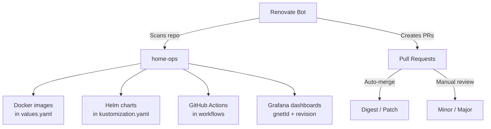

# Renovate

Automated dependency management using [Renovate Bot](https://docs.renovatebot.com/) to keep Docker images, Helm charts, and GitHub Actions up to date.

---

## Overview

Renovate scans the repository for dependency declarations and creates pull requests when updates are available. The configuration extends community presets and adds custom rules for the cluster.



---

## Configuration

The root configuration lives in `renovate.json5`:

```json5 title="renovate.json5"
{
  $schema: "https://docs.renovatebot.com/renovate-schema.json",
  extends: [
    "github>bjw-s/renovate-config",
    "github>bjw-s/renovate-config:automerge-docker-digest",
    "github>bjw-s/renovate-config:automerge-github-actions",
    "github>swibrow/home-ops//.renovate/allowedVersions.json5",
    "github>swibrow/home-ops//.renovate/autoMerge.json5",
    "github>swibrow/home-ops//.renovate/clusters.json5",
    "github>swibrow/home-ops//.renovate/grafanaDashboards.json5",
    "github>swibrow/home-ops//.renovate/groups.json5",
    "github>swibrow/home-ops//.renovate/versioning.json5",
  ],
  ignorePaths: [".archive/**"],
  flux: {
    fileMatch: ["^kubernetes/.+\\.ya?ml$"],
  },
  "helm-values": {
    fileMatch: ["^kubernetes/.+\\.ya?ml$"],
  },
  kubernetes: {
    fileMatch: ["^kubernetes/.+\\.ya?ml$"],
  },
}
```

### Base Presets

| Preset | Purpose |
|:-------|:--------|
| `bjw-s/renovate-config` | Base configuration for home-ops repositories |
| `bjw-s/renovate-config:automerge-docker-digest` | Auto-merge Docker digest updates |
| `bjw-s/renovate-config:automerge-github-actions` | Auto-merge GitHub Actions updates |

---

## Custom Configurations

Custom rules are stored in the `.renovate/` directory:

### Allowed Versions (`.renovate/allowedVersions.json5`)

Restricts which versions Renovate will propose for specific packages:

```json5
{
  packageRules: [
    {
      matchDatasources: ["docker"],
      matchPackageNames: ["ghcr.io/linuxserver/calibre-web"],
      allowedVersions: "<1",
    },
    {
      matchDatasources: ["docker"],
      matchPackageNames: ["tomsquest/docker-radicale"],
      allowedVersions: "/^[0-9]+\\.[0-9]+\\.[0-9]+(\\.[0-9]+)?$/",
    },
  ],
}
```

Use this to pin packages to specific version ranges or filter out pre-release versions.

### Auto-Merge (`.renovate/autoMerge.json5`)

Defines which update types are automatically merged without manual review:

| Rule | Datasource | Update Types | Auto-Merge |
|:-----|:-----------|:-------------|:-----------|
| Container digests and patches | Docker | digest, patch, pin, pinDigest | Yes |
| KPS minor and patches | Helm (`kube-prometheus-stack`) | minor, patch | Yes |
| Helm patches | Helm | patch, digest, pin, pinDigest | Yes |

```json5
{
  packageRules: [
    {
      description: "Auto merge container digests and patches",
      matchDatasources: ["docker"],
      automerge: true,
      matchUpdateTypes: ["digest", "patch", "pin", "pinDigest"],
    },
    {
      description: "Auto merge KPS minors and patches",
      matchDatasources: ["helm"],
      automerge: true,
      matchUpdateTypes: ["minor", "patch"],
      matchPackageNames: ["kube-prometheus-stack"],
    },
    {
      description: "Auto merge helm patches",
      matchDatasources: ["helm"],
      automerge: true,
      matchUpdateTypes: ["patch", "digest", "pin", "pinDigest"],
    },
  ],
}
```

### Clusters (`.renovate/clusters.json5`)

Adds a branch prefix for cluster-specific updates:

```json5
{
  packageRules: [
    {
      description: "Separate PRs for the cluster",
      matchFileNames: ["**/kubernetes/pitower/**"],
      additionalBranchPrefix: "cluster-",
    },
  ],
}
```

### Groups (`.renovate/groups.json5`)

Groups related packages into single PRs to avoid upgrade conflicts:

| Group | Packages | Datasources |
|:------|:---------|:------------|
| Flux | `flux*`, `ghcr.io/fluxcd/*` | Docker, GitHub Tags |
| Rook Ceph | `rook.ceph*` | Docker, Helm |
| Cilium | `quay.io/cilium/*`, `cilium` | Docker, Helm |
| ARC | Actions Runner Controller charts | Docker, Helm |
| Talos | `ghcr.io/siderolabs/installer`, `talosctl` | Docker |
| silence-operator | `silence-operator*` | Docker, GitHub Releases |

!!! info "Separate Minor/Patch"
    Most groups use `separateMinorPatch: true`, creating separate PRs for minor vs. patch updates to allow different review levels.

### Versioning (`.renovate/versioning.json5`)

Custom versioning schemes for packages that do not follow standard semver:

```json5
{
  packageRules: [
    {
      description: "Loose versioning for non-semver packages",
      matchDatasources: ["docker"],
      matchPackageNames: [
        "ghcr.io/cross-seed/cross-seed",
        "ghcr.io/home-operations/plex",
      ],
      versioning: "loose",
    },
    {
      description: "Custom versioning for http-https-echo",
      matchDatasources: ["docker"],
      matchPackageNames: ["ghcr.io/mendhak/http-https-echo"],
      versioning: "regex:^(?<major>\\d+)$",
    },
  ],
}
```

### Grafana Dashboards (`.renovate/grafanaDashboards.json5`)

Custom manager and datasource for tracking Grafana dashboard revisions:

```json5
{
  customDatasources: {
    "grafana-dashboards": {
      defaultRegistryUrlTemplate:
        "https://grafana.com/api/dashboards/{{packageName}}",
      format: "json",
      transformTemplates: [
        '{"releases":[{"version": $string(revision)}]}',
      ],
    },
  },
  customManagers: [
    {
      customType: "regex",
      description: "Process Grafana dashboards",
      fileMatch: ["(^|/)kubernetes/.+\\.ya?ml(\\.j2)?$"],
      matchStrings: [
        '# renovate: dashboardName="(?<depName>.*)"\\n(?<indentation>\\s+)gnetId: (?<packageName>\\d+)\\n.+revision: (?<currentValue>\\d+)',
      ],
      datasourceTemplate: "custom.grafana-dashboards",
      versioningTemplate: "regex:^(?<major>\\d+)$",
    },
  ],
}
```

Grafana dashboard updates are auto-merged and committed directly to the branch (no PR review needed):

```json5
{
  packageRules: [
    {
      automerge: true,
      automergeType: "branch",
      matchDatasources: ["custom.grafana-dashboards"],
      matchUpdateTypes: ["major"],
      semanticCommitScope: "grafana-dashboards",
    },
  ],
}
```

---

## How It Works

### Dependency Detection

Renovate detects dependencies in:

| Source | Pattern | Example |
|:-------|:--------|:--------|
| Helm charts | `version:` in `kustomization.yaml` | `version: 4.6.2` |
| Docker images | `tag:` in `values.yaml` | `tag: 39` |
| GitHub Actions | `uses:` in workflow files | `uses: actions/checkout@v6` |
| Grafana dashboards | `gnetId:` + `revision:` | `gnetId: 1860` / `revision: 37` |

### PR Flow

1. Renovate detects an available update
2. Creates a PR with the version bump
3. Based on rules:
    - **Auto-merge eligible**: PR is merged automatically after CI passes
    - **Manual review required**: PR awaits human review and approval
4. On merge to `main`, ArgoCD picks up the change and syncs to the cluster

### Labels and Commit Messages

- Grouped PRs use topic-based commit messages (e.g., `chore(deps): update Cilium group`)
- Grafana dashboard PRs are labeled with `renovate/grafana-dashboard`
- Semantic commit types follow conventional commit format
