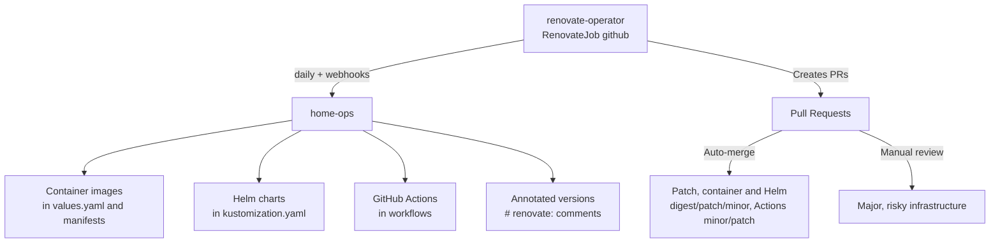

# Renovate

Automated dependency management with [Renovate](https://docs.renovatebot.com/) keeps container images, Helm charts, GitHub Actions and annotated tool versions up to date.

---

## Overview

Renovate runs **inside the cluster** via [renovate-operator](https://github.com/mogenius/renovate-operator) (`kubernetes/apps/pitower/renovate/renovate-operator/`). A `RenovateJob` named `github` authenticates as a GitHub App, discovers `swibrow/*` repositories (skipping forks), and runs:

- **Daily at 06:00** (`schedule: "0 6 * * *"`, parallelism 4)
- **On demand** from GitHub webhooks, so ticking a box on the Dependency Dashboard triggers a run immediately

A second job covers the `cloudsnacks` org, which is a separate installation of the same app. Credentials for Docker Hub and private `ghcr.io/swibrow/*` lookups come from `RENOVATE_HOST_RULES`, templated from Infisical.


```mermaid
flowchart TD
    Op[renovate-operator\nRenovateJob github] -->|daily + webhooks| Repo[home-ops]
    Repo --> Docker[Container images<br/>in values.yaml and manifests]
    Repo --> Helm[Helm charts<br/>in kustomization.yaml]
    Repo --> Actions[GitHub Actions<br/>in workflows]
    Repo --> Annotated[Annotated versions<br/># renovate: comments]

    Op -->|Creates PRs| PRs[Pull Requests]
    PRs -->|Auto-merge| AutoMerge[Patch, container and Helm<br/>digest/patch/minor, Actions minor/patch]
    PRs -->|Manual review| Manual[Major, risky infrastructure]
```

---

## Configuration

The root configuration lives in `renovate.json5`:

```json5 title="renovate.json5"
{
  $schema: 'https://docs.renovatebot.com/renovate-schema.json',
  extends: [
    'github>swibrow/home-ops//.renovate/default.json',
    'github>swibrow/home-ops//.renovate/automerge-docker-digest.json',
    'github>swibrow/home-ops//.renovate/automerge-github-actions.json',
    'github>swibrow/home-ops//.renovate/allowedVersions.json5',
    'github>swibrow/home-ops//.renovate/autoMerge.json5',
    'github>swibrow/home-ops//.renovate/clusters.json5',
    'github>swibrow/home-ops//.renovate/grafanaDashboards.json5',
    'github>swibrow/home-ops//.renovate/groups.json5',
    'github>swibrow/home-ops//.renovate/versioning.json5',
  ],
  ignorePaths: ['.archive/**'],
  flux: { managerFilePatterns: ['/^kubernetes/.+\\.ya?ml$/'] },
  'helm-values': { managerFilePatterns: ['/^kubernetes/.+\\.ya?ml$/'] },
  kubernetes: { managerFilePatterns: ['/^kubernetes/.+\\.ya?ml$/'] },
  customManagers: [
    // Renovate image pinned in RenovateJob CRs, which the kubernetes manager does not parse
    {
      customType: 'regex',
      managerFilePatterns: ['/^kubernetes/.+\\.ya?ml$/'],
      matchStrings: [
        '# renovate: datasource=(?<datasource>\\S+) depName=(?<depName>\\S+)\\s+image:\\s+\\S+:(?<currentValue>\\S+)',
      ],
    },
  ],
}
```

### Base Presets

The upstream [`bjw-s/renovate-config`](https://github.com/bjw-s/renovate-config) presets are vendored into `.renovate/` rather than extended remotely, so the config is self-contained. Renovate's built-in presets (`config:recommended`, `docker:enableMajor`, `helpers:pinGitHubActionDigestsToSemver`, `:dependencyDashboard`, `:disableRateLimiting`, `:enablePreCommit`) are referenced from `default.json`.

| Preset | Purpose |
|:-------|:--------|
| `.renovate/default.json` | Base configuration: timezone `Europe/Zurich`, Dependency Dashboard, platform commits |
| `.renovate/automerge-docker-digest.json` | Auto-merge container digest updates |
| `.renovate/automerge-github-actions.json` | Auto-merge GitHub Actions minor/patch after 3 days; `actions/*` and `bjw-s-labs/*` (including digests) immediately |
| `.renovate/custom-managers.json5` | `# renovate:` annotations, raw GitHub URLs, and GitHub release asset URLs in `kustomization.yaml` |
| `.renovate/commit-message.json` | Conventional commit messages, e.g. `feat(container): update X ( 1.0 ➔ 1.1 )` |
| `.renovate/pr-labels.json` | `type/*` and `renovate/*` PR labels |

---

## Custom Rules

### Auto-Merge (`.renovate/autoMerge.json5`)

| Rule | Datasource | Update Types |
|:-----|:-----------|:-------------|
| All patch updates | any | patch |
| Container updates | Docker | digest, patch, minor, pin, pinDigest |
| Helm updates | Helm | digest, patch, minor, pin, pinDigest |

All of these keep `ignoreTests: false`, so required checks must pass first.

These packages are **never** auto-merged:

`rook-ceph`, `rook-ceph-cluster`, anything matching `rook.ceph`, `cilium` and its images, `cloudnative-pg` and its images, `ghcr.io/siderolabs/installer`, `ghcr.io/siderolabs/talosctl`, `envoy-gateway`, `cert-manager`, `volsync`, `snapshot-controller`, `openebs`, `renovate-operator`.

### Allowed Versions (`.renovate/allowedVersions.json5`)

Restricts the versions Renovate proposes, for example:

- `docker.io/kopia/kopia` capped below `999`
- `cr.agentgateway.dev/charts/**` excludes stale `v2.2.x` tags that outrank the current line
- `mcr.microsoft.com/playwright` disabled: Open-WebUI pins the exact Playwright version, so both are bumped by hand
- `python` in `docker/browser-use/Dockerfile` held below 3.13 for a dependency constraint

### Groups (`.renovate/groups.json5`)

| Group | Packages | Datasources |
|:------|:---------|:------------|
| Rook Ceph | `rook.ceph*` | Docker, Helm |
| cilium | `quay.io/cilium/cilium`, `quay.io/cilium/operator-generic`, `cilium` | Docker, Helm |
| ARC | `gha-runner-scale-set-controller`, `gha-runner-scale-set` | Docker, Helm |
| Talos | `ghcr.io/siderolabs/installer`, `ghcr.io/siderolabs/talosctl` | Docker |
| github-actions | All GitHub Actions patch updates | GitHub Actions |
| Flux, silence-operator | Legacy groups with no matching packages today | |

Most groups set `separateMinorPatch: true`, so minor and patch updates get separate PRs.

### Clusters (`.renovate/clusters.json5`)

Adds a branch prefix by path, so updates under `kubernetes/apps/**` use `renovate/kubernetes-*` branches. The `pitower/**` and `pistack/**` rules are leftovers from an older layout.

### Versioning (`.renovate/versioning.json5`)

Loose versioning for `ghcr.io/cross-seed/cross-seed` and `ghcr.io/home-operations/plex`, and a single-number regex for `ghcr.io/mendhak/http-https-echo`.

### Grafana Dashboards (`.renovate/grafanaDashboards.json5`)

A custom datasource queries `https://grafana.com/api/dashboards/<id>` and a regex manager tracks dashboards annotated with `# renovate: dashboardName="..."` followed by `gnetId:` and `revision:` lines. Bumps are auto-merged, labelled `renovate/grafana-dashboard`, and committed as `chore(grafana-dashboards): ...`. No manifest currently carries the annotation.

---

## How It Works

### Dependency Detection

| Source | Manager | Example |
|:-------|:--------|:--------|
| Helm charts | `kustomize` (`helmCharts` in `kustomization.yaml`) | `version: 5.2.1` |
| Container images | `helm-values`, `kubernetes` | `tag: 0.18.0` in `values.yaml` |
| GitHub Actions | `github-actions` (pinned to SHAs) | `uses: actions/checkout@<sha> # v7.0.1` |
| Tool versions | regex on `# renovate: datasource=... depName=...` | `TOPF_VERSION: v0.6.1` in workflows |
| Release assets | regex on GitHub release URLs in `kustomization.yaml` | KubeVirt operator manifests |
| Pre-commit hooks | `pre-commit` | `rev: v6.0.0` |

### PR Flow

1. Renovate finds an update and opens a PR.
2. PR checks run (Checks, plus ArgoCD Diff for `kubernetes/` changes).
3. Auto-merge-eligible PRs merge once checks pass; the rest wait for review.
4. On merge, ArgoCD (or the relevant workflow) rolls the change out.

> [!NOTE]
> **Some bumps need a manual step**
>
> The ACK ApplicationSet (`kubernetes/argocd/ack-applicationset.yaml`) is applied by hand, so a Renovate bump of its chart version only reaches the cluster after `kubectl apply -f`.
