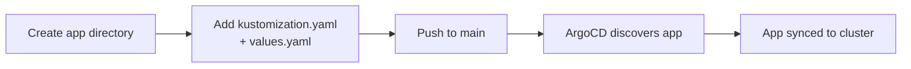

# Adding Applications

Step-by-step guide for adding a new application to the cluster.

---

## Overview

Adding a new application involves creating a directory with two files, pushing to `main`, and letting ArgoCD auto-discover and deploy it.



---

## Step 1: Choose a Category

Applications are organized by category under `pitower/kubernetes/apps/`. Choose the appropriate category for your application:

| Category | Purpose | Examples |
|:---------|:--------|:--------|
| `ai` | AI and ML workloads | kagent |
| `banking` | Financial tools | firefly, firefly-importer |
| `home-automation` | Smart home | home-assistant, zigbee2mqtt |
| `media` | Media management | jellyfin, sonarr, radarr |
| `monitoring` | Observability | grafana, loki |
| `networking` | Network infrastructure | cloudflared, external-dns |
| `security` | Auth and secrets | authelia, lldap |
| `selfhosted` | General self-hosted apps | miniflux, n8n, tandoor |
| `system` | System utilities | reloader, node-feature-discovery |

---

## Step 2: Create the Directory

```bash
mkdir -p pitower/kubernetes/apps/<category>/<app-name>
```

For example:

```bash
mkdir -p pitower/kubernetes/apps/selfhosted/my-app
```

---

## Step 3: Create kustomization.yaml

Create a `kustomization.yaml` that references the bjw-s app-template Helm chart:

```yaml title="pitower/kubernetes/apps/<category>/<app-name>/kustomization.yaml"
---
apiVersion: kustomize.config.k8s.io/v1beta1
kind: Kustomization
namespace: <category>
helmCharts:
  - name: app-template
    repo: oci://ghcr.io/bjw-s-labs/helm
    version: 4.6.2
    releaseName: <app-name>
    namespace: <category>
    valuesFile: values.yaml
```

!!! important "Namespace"
    The namespace typically matches the category directory name. Ensure the namespace exists in the cluster or is created by another resource.

---

## Step 4: Create values.yaml

Create a `values.yaml` with your application's configuration. At minimum, define a controller, container, and service:

```yaml title="pitower/kubernetes/apps/<category>/<app-name>/values.yaml"
controllers:
  <app-name>:
    annotations:
      reloader.stakater.com/auto: "true"
    containers:
      app:
        image:
          repository: <image-repository>
          tag: <image-tag>
        env:
          TZ: Europe/Zurich
        resources:
          requests:
            cpu: 10m
            memory: 64Mi
          limits:
            memory: 256Mi
        probes:
          liveness:
            enabled: true
          readiness:
            enabled: true
          startup:
            enabled: true
            spec:
              failureThreshold: 30
              periodSeconds: 5
service:
  app:
    ports:
      http:
        port: 8080
```

See the [App Template](app-template.md) page for the full values reference.

---

## Step 5: Configure Routing (Optional)

If the application needs to be accessible via a URL, add an HTTPRoute configuration to `values.yaml`:

=== "External (Cloudflare-proxied)"

    ```yaml
    route:
      app:
        enabled: true
        hostnames:
          - <app-name>.example.com
        parentRefs:
          - name: envoy-external
            namespace: networking
            sectionName: https
    ```

=== "Internal (LAN/VPN only)"

    ```yaml
    route:
      app:
        enabled: true
        hostnames:
          - <app-name>.internal.example.com
        parentRefs:
          - name: envoy-internal
            namespace: networking
            sectionName: https
    ```

---

## Step 6: Add Persistence (Optional)

If the application needs persistent storage:

```yaml
persistence:
  config:
    enabled: true
    type: persistentVolumeClaim
    accessMode: ReadWriteOnce
    size: 1Gi
    storageClass: ceph-block
    globalMounts:
      - path: /config
```

Available storage classes:

| Storage Class | Backend | Access Modes | Use Case |
|:-------------|:--------|:-------------|:---------|
| `ceph-block` | Rook Ceph RBD | ReadWriteOnce | General purpose, databases |
| `ceph-filesystem` | Rook CephFS | ReadWriteMany | Shared storage across pods |
| `openebs-hostpath` | OpenEBS | ReadWriteOnce | Local node storage |

---

## Step 7: Add Secrets (Optional)

If your application needs secrets, create an ExternalSecret to pull from 1Password:

```yaml title="pitower/kubernetes/apps/<category>/<app-name>/externalsecret.yaml"
apiVersion: external-secrets.io/v1beta1
kind: ExternalSecret
metadata:
  name: <app-name>-secrets
  namespace: <category>
spec:
  refreshInterval: 5m
  secretStoreRef:
    kind: ClusterSecretStore
    name: onepassword
  target:
    name: <app-name>-secrets
    creationPolicy: Owner
  data:
    - secretKey: DB_PASSWORD
      remoteRef:
        key: <app-name>
        property: DB_PASSWORD
```

Then reference it in `kustomization.yaml`:

```yaml
apiVersion: kustomize.config.k8s.io/v1beta1
kind: Kustomization
namespace: <category>
resources:
  - externalsecret.yaml
helmCharts:
  - name: app-template
    repo: oci://ghcr.io/bjw-s-labs/helm
    version: 4.6.2
    releaseName: <app-name>
    namespace: <category>
    valuesFile: values.yaml
```

And reference the secret in `values.yaml`:

```yaml
envFrom:
  - secretRef:
      name: <app-name>-secrets
```

---

## Step 8: Validate Locally

Test that your manifests render correctly:

```bash
cd pitower/kubernetes/apps/<category>/<app-name>
kustomize build . --enable-helm
```

This outputs the full rendered Kubernetes manifests. Check for errors and verify the output looks correct.

For a server-side dry run:

```bash
kustomize build . --enable-helm | kubectl apply --dry-run=server -f -
```

---

## Step 9: Push to Main

Commit and push your changes to the `main` branch:

```bash
git add pitower/kubernetes/apps/<category>/<app-name>/
git commit -m "feat(<category>): add <app-name>"
git push origin main
```

!!! tip "PR Workflow"
    For non-trivial additions, create a feature branch and open a pull request. This triggers the lint workflow and allows for code review before deployment.

---

## Step 10: Verify Deployment

ArgoCD will auto-discover the new application and begin syncing:

```bash
# Check ArgoCD application status
argocd app list | grep <app-name>

# Check pods
kubectl get pods -n <category> -l app.kubernetes.io/name=<app-name>

# Check service
kubectl get svc -n <category> -l app.kubernetes.io/name=<app-name>

# Check HTTPRoute
kubectl get httproutes -n <category>
```

---

## Complete Example

Here is a complete example for adding a new app called "linkding" (a bookmarks manager) to the `selfhosted` category.

### Directory structure

```
pitower/kubernetes/apps/selfhosted/linkding/
├── kustomization.yaml
└── values.yaml
```

### kustomization.yaml

```yaml
---
apiVersion: kustomize.config.k8s.io/v1beta1
kind: Kustomization
namespace: selfhosted
helmCharts:
  - name: app-template
    repo: oci://ghcr.io/bjw-s-labs/helm
    version: 4.6.2
    releaseName: linkding
    namespace: selfhosted
    valuesFile: values.yaml
```

### values.yaml

```yaml
controllers:
  linkding:
    annotations:
      reloader.stakater.com/auto: "true"
    containers:
      app:
        image:
          repository: sissbruecker/linkding
          tag: 1.25.0
        env:
          LD_SUPERUSER_NAME: admin
          LD_SERVER_PORT: "9090"
        envFrom:
          - secretRef:
              name: linkding-secrets
        resources:
          requests:
            cpu: 10m
            memory: 64Mi
          limits:
            memory: 256Mi
        probes:
          liveness:
            enabled: true
          readiness:
            enabled: true
          startup:
            enabled: true
            spec:
              failureThreshold: 30
              periodSeconds: 5
service:
  app:
    ports:
      http:
        port: 9090
route:
  app:
    enabled: true
    hostnames:
      - linkding.example.com
    parentRefs:
      - name: envoy-external
        namespace: networking
        sectionName: https
persistence:
  data:
    enabled: true
    type: persistentVolumeClaim
    accessMode: ReadWriteOnce
    size: 1Gi
    storageClass: ceph-block
    globalMounts:
      - path: /etc/linkding/data
```

---

## Checklist

Before pushing your new application:

- [ ] `kustomization.yaml` has correct namespace and chart version
- [ ] `values.yaml` has resource requests and limits set
- [ ] Health probes are configured
- [ ] `reloader.stakater.com/auto: "true"` annotation is set
- [ ] HTTPRoute points to the correct gateway
- [ ] Secrets are managed via ExternalSecret (no plaintext)
- [ ] `kustomize build . --enable-helm` renders without errors
- [ ] Hostname follows `<app>.example.com` convention
