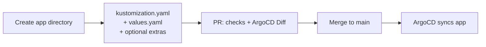

# Adding Applications

Step-by-step guide for adding a new application to the cluster.

---

## Overview

Adding an application means creating a directory under `kubernetes/apps/pitower/<category>/`, opening a PR, and merging it. ArgoCD discovers the directory and deploys it as `pitower-<category>-<app>`.


```mermaid
flowchart LR
    Create[Create app directory] --> Files[kustomization.yaml<br/>+ values.yaml<br/>+ optional extras]
    Files --> PR[PR: checks + ArgoCD Diff]
    PR --> Merge[Merge to main]
    Merge --> Sync[ArgoCD syncs app]
```

---

## Step 1: Choose a Category

The category is the namespace. See [GitOps > Adding Apps](../gitops/adding-apps.md#categories) for the full list. Common choices:

| Category | Purpose | Examples |
|:---------|:--------|:---------|
| `ai` | AI and ML workloads | open-webui, comfyui, searxng |
| `banking` | Financial tools | actual, firefly, ghostfolio, paperless |
| `dev` | Developer tooling | forgejo, dev-desktop |
| `media` | Media management | jellyfin, immich, sonarr, radarr |
| `monitoring` | Observability | gatus, grafana-operator, victoria-logs |
| `networking` | Network infrastructure | envoy-gateway, external-dns, tailscale |
| `security` | Auth and secrets | kanidm, external-secrets, crowdsec |
| `selfhosted` | General self-hosted apps | homepage, miniflux, mealie, n8n |
| `system` | Cluster utilities | reloader, keda, node-feature-discovery |

---

## Step 2: Create the Directory

```bash
mkdir -p kubernetes/apps/pitower/<category>/<app-name>
```

---

## Step 3: Create kustomization.yaml

```yaml title="kubernetes/apps/pitower/<category>/<app-name>/kustomization.yaml"
---
# yaml-language-server: $schema=https://raw.githubusercontent.com/SchemaStore/schemastore/master/src/schemas/json/kustomization.json
apiVersion: kustomize.config.k8s.io/v1beta1
kind: Kustomization
namespace: <category>
helmCharts:
  - name: app-template
    repo: oci://ghcr.io/bjw-s-labs/helm
    version: 5.2.1
    releaseName: <app-name>
    namespace: <category>
    valuesFile: values.yaml
```

The namespace is created by ArgoCD (`CreateNamespace=true`), so no Namespace manifest is needed.

---

## Step 4: Create values.yaml

```yaml title="kubernetes/apps/pitower/<category>/<app-name>/values.yaml"
controllers:
  <app-name>:
    annotations:
      reloader.stakater.com/auto: "true"
    containers:
      app:
        image:
          repository: <image-repository>
          tag: <image-tag>
        env:
          TZ: Europe/Zurich
        resources:
          requests:
            cpu: 10m
            memory: 64Mi
          limits:
            memory: 256Mi

service:
  app:
    controller: <app-name>
    ports:
      http:
        port: 8080

route:
  app:
    hostnames:
      - <app-name>.wibrow.dev
    parentRefs:
      - name: envoy-internal
        namespace: networking
        sectionName: https
```

See [App Template](app-template.md) for more patterns.

---

## Step 5: Pick a Gateway

| Gateway | Exposure | Use for |
|:--------|:---------|:--------|
| `envoy-external` | Public, through the towonel tunnel | Apps used from outside the LAN |
| `envoy-internal` | LAN and Tailscale only | Admin UIs, *arr apps, anything not meant to be public |

External DNS creates the record from the HTTPRoute hostname. Apps that support OIDC authenticate against Kanidm (`idm.wibrow.dev`).

---

## Step 6: Add Persistence (Optional)

App data PVCs come from the `pvc` component, not from the chart, so backup tooling can be added or removed without touching the volume:

```yaml title="kustomization.yaml"
components:
  - ../../../../components/pvc
configMapGenerator:
  - name: pvc-config
    options:
      disableNameSuffixHash: true
    literals:
      - APP_NAME=<app-name>-pvc        # names the ConfigMap; must be unique in the namespace
      - CLAIM_NAME=<app-name>-data     # the PVC name
      - STORAGE_SIZE=1Gi
```

The component creates a `ReadWriteOnce` PVC on `ceph-block`. Mount it in `values.yaml`:

```yaml title="values.yaml"
persistence:
  data:
    existingClaim: <app-name>-data
    globalMounts:
      - path: /data
```

> [!CAUTION]
> **Keep CLAIM_NAME stable**
>
> Renaming the claim makes ArgoCD prune the old PVC, and Ceph deletes the volume with it.

Other storage classes:

| Storage Class | Backend | Use Case |
|:--------------|:--------|:---------|
| `ceph-block` (default) | Rook Ceph RBD | General purpose app data |
| `openebs-hostpath` | OpenEBS local PV | Node-local data such as CNPG clusters and caches |
| `openebs-hostpath-fast`, `-media`, `-runners` | OpenEBS on worker-07's ZFS pools | Only provision on worker-07 |

---

## Step 7: Add Backups (Optional)

Add the `kopiur` component next to `pvc` to snapshot the PVC hourly to the `garage` ClusterRepository (keeps 24 hourly, 7 daily, 4 weekly, 3 latest):

```yaml title="kustomization.yaml"
components:
  - ../../../../components/pvc
  - ../../../../components/kopiur
configMapGenerator:
  # ... pvc-config as above
  - name: kopiur-config
    options:
      disableNameSuffixHash: true
    literals:
      - APP_NAME=<app-name>-kopiur
      - CLAIM_NAME=<app-name>-data
```

The mover runs as uid/gid 1000 by default. If the app writes its files as another user, patch the `SnapshotPolicy` to match, or the mover cannot read files written `0600`:

```yaml title="kustomization.yaml"
patches:
  - target:
      kind: SnapshotPolicy
      name: <app-name>-kopiur
    patch: |
      - op: replace
        path: /spec/mover/securityContext/runAsUser
        value: 2000
      - op: replace
        path: /spec/mover/securityContext/runAsGroup
        value: 2000
```

See [Backup & Restore](../storage/backup-restore.md) for restores.

---

## Step 8: Add a Database (Optional)

PostgreSQL databases are tenants on a shared CNPG cluster in the `database` namespace. Add the tenant under `kubernetes/apps/pitower/database/tenants/` first, then consume it with the `cnpg-db-shared` component:

```yaml title="kustomization.yaml"
components:
  - ../../../../components/cnpg-db-shared
configMapGenerator:
  - name: cnpg-db-config
    literals:
      - APP_NAME=<app-name>
      - SECRET_NAME=<app-name>-db-secret
      - CNPG_SECRET_KEY=shared-<app-name>   # tenant secret in the database namespace
      - DB_SCHEME=postgresql                # or postgresql+psycopg for psycopg 3
```

This creates `<app-name>-db-secret` with `DB_HOST`, `DB_PORT`, `DB_USER`, `DB_PASS`, `DB_NAME` and `DB_URL`. The full recipe is in [Databases](../applications/databases/index.md#adding-a-database).

---

## Step 9: Add Secrets (Optional)

Secrets live in Infisical at `/<category>/<app-name>/<SECRET_NAME>` and are pulled by an ExternalSecret:

```yaml title="kubernetes/apps/pitower/<category>/<app-name>/externalsecret.yaml"
---
apiVersion: external-secrets.io/v1
kind: ExternalSecret
metadata:
  name: <app-name>
spec:
  secretStoreRef:
    kind: ClusterSecretStore
    name: infisical
  target:
    name: <app-name>-secret
  data:
    - secretKey: API_KEY
      remoteRef:
        key: /<category>/<app-name>/API_KEY
```

Add it to `resources:` in `kustomization.yaml` and reference it from `values.yaml`:

```yaml
envFrom:
  - secretRef:
      name: <app-name>-secret
```

Keep `reloader.stakater.com/auto: "true"` on the controller so a rotated secret restarts the pod.

---

## Step 10: Validate Locally

```bash
kustomize build --enable-helm --load-restrictor LoadRestrictionsNone \
  kubernetes/apps/pitower/<category>/<app-name>
```

For a server-side dry run, pipe the output to `kubectl apply --dry-run=server -f -`.

---

## Step 11: Open a PR and Merge

```bash
git switch -c feat/<app-name>
git add kubernetes/apps/pitower/<category>/<app-name>/
git commit -s -m "feat(<category>): add <app-name>"
git push -u origin feat/<app-name>
gh pr create --fill
```

On the PR, **Checks** runs yamllint and the other pre-commit hooks, and **ArgoCD Diff** comments the rendered manifests. After merge, verify:

```bash
kubectl get applications.argoproj.io -n argocd pitower-<category>-<app-name>
kubectl get pods,httproute -n <category> -l app.kubernetes.io/name=<app-name>
```

---

## Complete Example

[Mealie](https://mealie.io/) in `selfhosted`, with a backed-up PVC and an OIDC secret:

```
kubernetes/apps/pitower/selfhosted/mealie/
├── externalsecret.yaml
├── kustomization.yaml
└── values.yaml
```

```yaml title="kustomization.yaml"
---
apiVersion: kustomize.config.k8s.io/v1beta1
kind: Kustomization
namespace: selfhosted
resources:
  - externalsecret.yaml
components:
  - ../../../../components/pvc
  - ../../../../components/kopiur
configMapGenerator:
  - name: pvc-config
    options:
      disableNameSuffixHash: true
    literals:
      - APP_NAME=mealie-pvc
      - CLAIM_NAME=mealie-data
      - STORAGE_SIZE=1Gi
  - name: kopiur-config
    options:
      disableNameSuffixHash: true
    literals:
      - APP_NAME=mealie-kopiur
      - CLAIM_NAME=mealie-data
patches:
  # mealie writes its data as uid 911; the kopiur mover must match to read it.
  - target:
      kind: SnapshotPolicy
      name: mealie-kopiur
    patch: |
      - op: replace
        path: /spec/mover/securityContext/runAsUser
        value: 911
      - op: replace
        path: /spec/mover/securityContext/runAsGroup
        value: 911
helmCharts:
  - name: app-template
    repo: oci://ghcr.io/bjw-s-labs/helm
    version: 5.2.1
    releaseName: mealie
    namespace: selfhosted
    valuesFile: values.yaml
```

In `values.yaml`, the PVC is mounted with `existingClaim: mealie-data` and the route uses `recipes.wibrow.dev` on `envoy-external`.

---

## Checklist

- [ ] `kustomization.yaml` has the right `namespace` and app-template version
- [ ] `values.yaml` sets resource requests and a memory limit
- [ ] `reloader.stakater.com/auto: "true"` on controllers that consume secrets
- [ ] HTTPRoute on `envoy-internal` or `envoy-external` with `sectionName: https`
- [ ] Persistent data uses the `pvc` component, with `kopiur` if it needs backups
- [ ] Database via a tenant and `cnpg-db-shared`, not a dedicated cluster
- [ ] Secrets via ExternalSecret from Infisical (no plaintext)
- [ ] `kustomize build --enable-helm --load-restrictor LoadRestrictionsNone` renders cleanly
