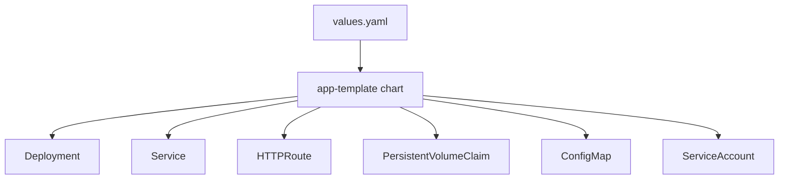

# App Template

The [bjw-s app-template](https://github.com/bjw-s-labs/helm-charts/tree/main/charts/other/app-template) Helm chart is used for most applications in the cluster. It provides a standardized, opinionated structure for deploying containerized workloads.

**Current version**: 5.2.1 (pinned in each app's `kustomization.yaml` and bumped by Renovate)

---

## Overview

The app-template chart abstracts common Kubernetes patterns (Deployments, Services, HTTPRoutes, PVCs) into a declarative `values.yaml` format. Instead of writing raw Kubernetes manifests, you define controllers, containers, services, and routes.


```mermaid
flowchart TD
    Values[values.yaml] --> Chart[app-template chart]
    Chart --> Deploy[Deployment]
    Chart --> Svc[Service]
    Chart --> Route[HTTPRoute]
    Chart --> PVC[PersistentVolumeClaim]
    Chart --> CM[ConfigMap]
    Chart --> SA[ServiceAccount]
```

---

## Chart Reference

The chart is referenced in `kustomization.yaml` using OCI:

```yaml title="kustomization.yaml"
apiVersion: kustomize.config.k8s.io/v1beta1
kind: Kustomization
namespace: selfhosted
helmCharts:
  - name: app-template
    repo: oci://ghcr.io/bjw-s-labs/helm
    version: 5.2.1
    releaseName: my-app
    namespace: selfhosted
    valuesFile: values.yaml
```

---

## Values Structure

### Minimal Example

A minimal application with a single container, service, and HTTP route:

```yaml title="values.yaml"
controllers:
  my-app:
    annotations:
      reloader.stakater.com/auto: "true"
    containers:
      app:
        image:
          repository: ghcr.io/example/my-app
          tag: 1.0.0
        env:
          HTTP_PORT: 8080
        resources:
          requests:
            cpu: 10m
            memory: 64Mi
          limits:
            memory: 128Mi
        probes:
          liveness:
            enabled: true
          readiness:
            enabled: true
          startup:
            enabled: true
            spec:
              failureThreshold: 30
              periodSeconds: 5
service:
  app:
    controller: my-app
    ports:
      http:
        port: 8080
route:
  app:
    hostnames:
      - my-app.wibrow.dev
    parentRefs:
      - name: envoy-external
        namespace: networking
        sectionName: https
```

---

## Controllers

Controllers define the workload type (Deployment by default) and its containers.

```yaml
controllers:
  my-app:
    # Optional: set replicas
    replicas: 1

    # Optional: set strategy
    strategy: Recreate

    # Annotations applied to the pod template
    annotations:
      reloader.stakater.com/auto: "true"

    # Pod-level settings
    pod:
      securityContext:
        runAsUser: 1000
        runAsGroup: 1000
        fsGroup: 1000

    containers:
      app:
        image:
          repository: ghcr.io/example/my-app
          tag: 1.0.0
        env:
          TZ: Europe/Zurich
          PORT: "8080"
        envFrom:
          - secretRef:
              name: my-app-secrets
        resources:
          requests:
            cpu: 10m
            memory: 64Mi
          limits:
            memory: 256Mi
```

### Multiple Containers (Sidecars)

```yaml
controllers:
  my-app:
    containers:
      app:
        image:
          repository: ghcr.io/example/my-app
          tag: 1.0.0
      sidecar:
        image:
          repository: ghcr.io/example/sidecar
          tag: 2.0.0
        args:
          - --config=/etc/sidecar/config.yaml
```

---

## Services

Define Kubernetes Services that expose container ports:

```yaml
service:
  app:
    controller: my-app
    ports:
      http:
        port: 8080
      metrics:
        port: 9090
```

### Multiple Services

```yaml
service:
  app:
    controller: frigate
    ports:
      http:
        port: 5000
  webrtc-udp:
    controller: frigate
    type: LoadBalancer
    annotations:
      lbipam.cilium.io/ips: 10.20.10.235
    ports:
      webrtc-udp:
        port: 8555
        protocol: UDP
```

LoadBalancer Services get a fixed address from the Cilium LB-IPAM pool (`10.20.10.128`-`255`) via `lbipam.cilium.io/ips`.

---

## Routes (HTTPRoute)

Routes configure Gateway API HTTPRoutes for ingress:

### External Route (public, via the towonel tunnel)

```yaml
route:
  app:
    hostnames:
      - my-app.wibrow.dev
    parentRefs:
      - name: envoy-external
        namespace: networking
        sectionName: https
```

### Internal Route (LAN and Tailscale only)

```yaml
route:
  app:
    hostnames:
      - my-app.wibrow.dev
    parentRefs:
      - name: envoy-internal
        namespace: networking
        sectionName: https
```

When a Service exposes several ports, pin the backend with `rules`:

```yaml
route:
  app:
    hostnames:
      - frigate.wibrow.dev
    parentRefs:
      - name: envoy-internal
        namespace: networking
        sectionName: https
    rules:
      - backendRefs:
          - identifier: app
            port: 5000
```

---

## Persistence

Define persistent storage for your application:

### Existing PVC (preferred)

App data PVCs are declared with the `pvc` kustomize component (see [Adding Apps](adding-apps.md#step-6-add-persistence-optional)) and mounted by name:

```yaml
persistence:
  config:
    existingClaim: my-app-config
    globalMounts:
      - path: /config
```

### Chart-managed PVC

For disposable data such as caches, the chart can create the PVC itself:

```yaml
persistence:
  model-cache:
    accessMode: ReadWriteOnce
    size: 10Gi
    storageClass: openebs-hostpath-fast
    advancedMounts:
      machine-learning:
        app:
          - path: /cache
```

### NFS

```yaml
persistence:
  media:
    type: nfs
    server: data
    path: /volume1/media
    globalMounts:
      - path: /data/nas-media
```

### EmptyDir

```yaml
persistence:
  tmp:
    type: emptyDir
    globalMounts:
      - path: /tmp
```

### ConfigMap Mount

```yaml
persistence:
  config:
    type: configMap
    name: my-app-config
    globalMounts:
      - path: /config/app.yaml
        subPath: app.yaml
        readOnly: true
```

### Secret Mount

```yaml
persistence:
  secrets:
    type: secret
    name: my-app-secrets
    globalMounts:
      - path: /secrets
        readOnly: true
```

---

## Health Probes

Always configure health probes for production workloads:

```yaml
probes:
  liveness:
    enabled: true
    custom: true
    spec:
      httpGet:
        path: /healthz
        port: 8080
      initialDelaySeconds: 10
      periodSeconds: 30
  readiness:
    enabled: true
  startup:
    enabled: true
    spec:
      failureThreshold: 30
      periodSeconds: 5
```

> [!TIP]
> **Startup Probes**
>
> Use startup probes with a high `failureThreshold` for applications that take a long time to initialize. This prevents the liveness probe from killing the container during startup.

---

## Environment Variables

### Static Environment Variables

```yaml
env:
  TZ: Europe/Zurich
  LOG_LEVEL: info
  HTTP_PORT: "8080"
```

### From Secrets

```yaml
envFrom:
  - secretRef:
      name: my-app-secrets
```

### From ConfigMap

```yaml
envFrom:
  - configMapRef:
      name: my-app-config
```

### Value From (Field Reference)

```yaml
env:
  POD_NAME:
    valueFrom:
      fieldRef:
        fieldPath: metadata.name
```

---

## Full Example

Miniflux (`selfhosted/miniflux`), with OIDC, a shared CNPG database and a custom liveness probe:

```yaml title="values.yaml"
controllers:
  miniflux:
    strategy: RollingUpdate
    annotations:
      reloader.stakater.com/auto: "true"
    pod:
      securityContext:
        runAsUser: 2000
        runAsGroup: 2000
    containers:
      app:
        image:
          repository: ghcr.io/miniflux/miniflux
          tag: 2.3.3-distroless
        env:
          BASE_URL: https://miniflux.wibrow.dev
          RUN_MIGRATIONS: "1"
          OAUTH2_PROVIDER: oidc
          OAUTH2_CLIENT_ID: miniflux
          OAUTH2_OIDC_DISCOVERY_ENDPOINT: https://idm.wibrow.dev/oauth2/openid/miniflux
          DATABASE_URL:
            valueFrom:
              secretKeyRef:
                name: miniflux-db-secret
                key: DB_URL
        envFrom:
          - secretRef:
              name: miniflux-secret
        probes:
          liveness:
            enabled: true
            custom: true
            spec:
              httpGet:
                path: /healthcheck
                port: 8080
        resources:
          requests:
            cpu: 12m
            memory: 64M
          limits:
            memory: 256M

service:
  app:
    controller: miniflux
    ports:
      http:
        port: 8080

route:
  app:
    hostnames:
      - miniflux.wibrow.dev
    parentRefs:
      - name: envoy-external
        namespace: networking
        sectionName: https
```

`miniflux-db-secret` comes from the `cnpg-db-shared` component and `miniflux-secret` from an Infisical ExternalSecret (abridged; see `kubernetes/apps/pitower/selfhosted/miniflux/`).
