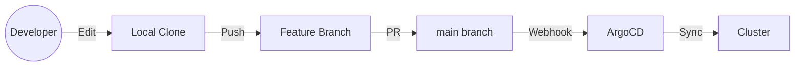

# Development

Guide for contributing to the home lab repository and developing new applications.

---

## Overview

All cluster state is defined as code in this Git repository. Changes are made via pull requests to the `main` branch, and ArgoCD automatically syncs the desired state to the cluster.



---

## Repository Layout

```
pitower/kubernetes/apps/
├── ai/                    # AI workloads
├── banking/               # Financial tools
├── cert-manager/          # TLS certificate management
├── cloudnative-pg/        # PostgreSQL operator and clusters
├── home-automation/       # Home Assistant ecosystem
├── kube-system/           # Core Kubernetes components
├── media/                 # Media management stack
├── monitoring/            # Observability stack
├── networking/            # Network infrastructure
├── openebs/               # Local persistent volumes
├── rook-ceph/             # Distributed storage
├── security/              # Auth, secrets, identity
├── selfhosted/            # General self-hosted apps
└── system/                # System utilities
```

Each application lives in its own subdirectory and contains:

- `kustomization.yaml` -- Kustomize config with Helm chart reference
- `values.yaml` -- Helm chart values

---

## Local Development

### Prerequisites

| Tool | Purpose |
|:-----|:--------|
| `kubectl` | Kubernetes CLI |
| `kustomize` | Manifest generation (with Helm support) |
| `helm` | Helm chart operations |
| `talosctl` | Talos node management |
| `sops` | Secret decryption |
| `just` | Task runner for justfile recipes |
| `argocd` | ArgoCD CLI (optional) |

### Validate Changes Locally

Before pushing, validate your Helm templates render correctly:

```bash
cd pitower/kubernetes/apps/<category>/<app>
kustomize build . --enable-helm
```

This renders the full Kubernetes manifest without applying it.

### Test with Dry Run

Apply with `--dry-run=server` to validate against the cluster's API:

```bash
kustomize build . --enable-helm | kubectl apply --dry-run=server -f -
```

---

## Development Sections

| Page | Description |
|:-----|:------------|
| [App Template](app-template.md) | bjw-s app-template Helm chart patterns and common values |
| [Adding Apps](adding-apps.md) | Step-by-step guide to adding a new application to the cluster |

---

## Conventions

### Naming

- **Namespaces** match the category directory name (e.g., `selfhosted`, `media`, `networking`)
- **Release names** match the application directory name
- **Hostnames** follow the pattern `<app>.example.com`

### Values Files

- Use the bjw-s [app-template](https://github.com/bjw-s-labs/helm-charts/tree/main/charts/other/app-template) chart (v4.6.2) for most applications
- Always set resource requests and limits
- Use `reloader.stakater.com/auto: "true"` annotation for automatic reloads on ConfigMap/Secret changes
- Configure health probes (liveness, readiness, startup)

### Gateway Routing

- **External services** (public, Cloudflare-proxied): Use `envoy-external` gateway
- **Internal services** (LAN/VPN only): Use `envoy-internal` gateway

### Secrets

- Never commit plaintext secrets
- Use External Secrets Operator with 1Password Connect for runtime secrets
- Use SOPS with age encryption for secrets that must live in Git (e.g., Talos configs)
