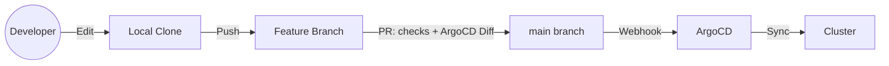

# Development

Guide for contributing to the home lab repository and developing new applications.

---

## Overview

All cluster state is defined as code in this Git repository. Changes go through pull requests to `main`; CI renders and diffs them, and ArgoCD syncs `main` to the cluster.


```mermaid
flowchart LR
    Dev((Developer)) -->|Edit| Local[Local Clone]
    Local -->|Push| Branch[Feature Branch]
    Branch -->|PR: checks + ArgoCD Diff| Main[main branch]
    Main -->|Webhook| ArgoCD[ArgoCD]
    ArgoCD -->|Sync| Cluster[Cluster]
```

---

## Repository Layout

```
kubernetes/
├── apps/pitower/          # <category>/<app>/ - one ArgoCD Application per app directory
├── argocd/                # ApplicationSets (applied manually)
├── bootstrap/             # ArgoCD installation
└── components/            # Reusable kustomize components: pvc, kopiur, cnpg-db-shared
talos/pitower/             # Talos machine config, managed with topf
terraform/                 # AWS, Cloudflare, UniFi and other stacks
docker/                    # Images built by the Build Docker Images workflow
docs/                      # These pages (Markdown)
site/                      # Astro project that builds docs/ into this site
```

Each application directory typically contains:

- `kustomization.yaml`: namespace, components, and the `helmCharts` generator
- `values.yaml`: Helm values (usually app-template)
- `externalsecret.yaml`: optional, secrets from Infisical

See [GitOps > Adding Apps](../gitops/adding-apps.md#categories) for the current categories.

---

## Local Development

### Prerequisites

Tool versions are pinned in the root `mise.toml`; `mise install` installs them, and `mise` also sets `KUBECONFIG` to `~/.kube/pitower.yaml` (the default `~/.kube/config` is a different cluster).

| Tool | Purpose |
|:-----|:--------|
| `kubectl` | Kubernetes CLI |
| `kustomize` | Manifest rendering (with Helm support) |
| `helm` | Used by `kustomize --enable-helm` |
| `talosctl` | Talos diagnostics |
| `sops` | Secret decryption (Talos secrets) |
| `jq` | JSON processing |
| `just` | Task runner for `justfile` recipes (not managed by mise) |
| `pre-commit` | yamllint, whitespace and terraform hooks (`just pre-commit-init`) |

### Validate Changes Locally

Render an app the same way ArgoCD does:

```bash
kustomize build --enable-helm --load-restrictor LoadRestrictionsNone \
  kubernetes/apps/pitower/<category>/<app>
```

`--load-restrictor LoadRestrictionsNone` is needed for apps that use `kubernetes/components/`. Kustomize downloads charts into a `charts/` directory inside the app, which is gitignored.

### Test with Dry Run

```bash
kustomize build --enable-helm --load-restrictor LoadRestrictionsNone \
  kubernetes/apps/pitower/<category>/<app> | kubectl apply --dry-run=server -f -
```

---

## Development Sections

| Page | Description |
|:-----|:------------|
| [App Template](app-template.md) | bjw-s app-template Helm chart patterns and common values |
| [Adding Apps](adding-apps.md) | Step-by-step guide to adding a new application to the cluster |

---

## Conventions

### Naming

- **Namespaces** match the category directory name (`selfhosted`, `media`, `networking`)
- **Release names** match the application directory name
- **Hostnames** are `<app>.wibrow.dev`

### Values Files

- Use the bjw-s [app-template](https://github.com/bjw-s-labs/helm-charts/tree/main/charts/other/app-template) chart (5.2.1) for most applications
- Set resource requests and a memory limit; the weekly [krr-rightsize](../ci-cd/github-actions.md#krr-rightsize) workflow tunes requests from Prometheus data
- Add `reloader.stakater.com/auto: "true"` to controllers that consume Secrets or ConfigMaps
- Set `TZ: Europe/Zurich` where the app cares about time zones

### Gateway Routing

- **`envoy-external`**: public, reached through the towonel tunnel
- **`envoy-internal`**: LAN and Tailscale only

Both live in the `networking` namespace and are referenced with `sectionName: https`.

### Secrets

- Never commit plaintext secrets
- Runtime secrets come from Infisical via External Secrets (`ClusterSecretStore` `infisical`), stored at `/<category>/<app>/<SECRET_NAME>`
- Database credentials come from the `cnpg-secrets-database` store via the `cnpg-db-shared` component
- SOPS with age is used for secrets that must live in Git (Talos configs, ArgoCD bootstrap)

### Commits

Conventional Commits (`type(scope): summary`), for example `feat(selfhosted): add linkding`.

### Documentation

Pages are plain Markdown in `docs/`, written to read well on GitHub too. `site/` is an Astro project that renders them to [swibrow.github.io/home-ops](https://swibrow.github.io/home-ops); `just docs serve` runs it locally on port 8888 and `just docs build` does what CI does.

- Link between pages with relative `.md` paths (`../storage/garage.md#buckets`); the build rewrites them and fails on any link or anchor that does not resolve
- Callouts use GitHub alerts (`> [!NOTE]`, `[!TIP]`, `[!IMPORTANT]`, `[!WARNING]`, `[!CAUTION]`); a bold first line becomes the title. Collapsible blocks use `<details><summary>`
- Diagrams are ` ```mermaid ` fences, rendered in the browser
- A new page must be added to the navigation in `site/src/nav.ts`, or the build fails
