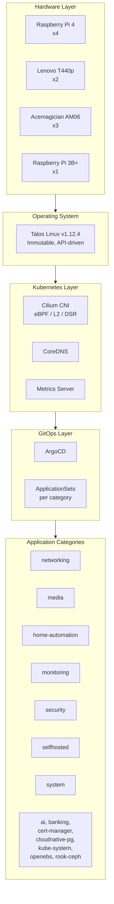
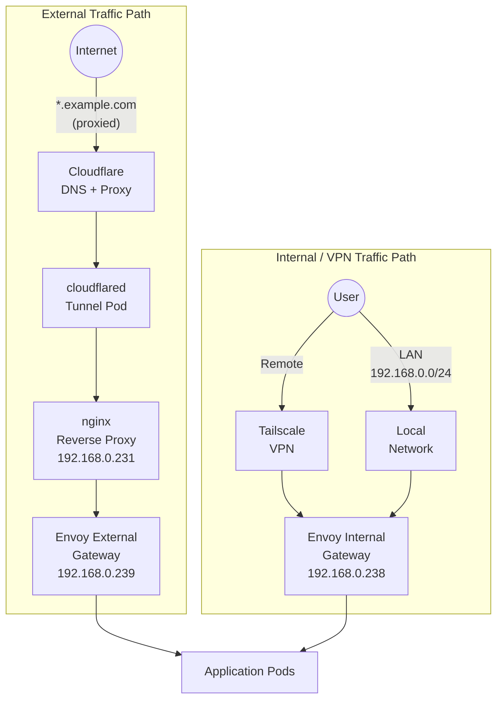
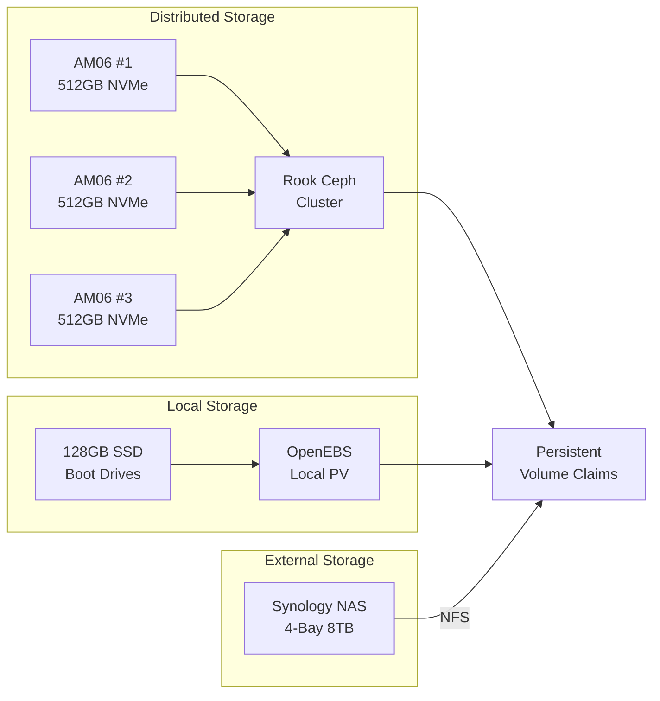

# Architecture Overview

This page describes the full architecture of the cluster, from physical hardware through to application deployment. Two key diagrams illustrate the infrastructure stack and the network traffic flows.

---

## Infrastructure Stack

The cluster is built in layers, each managed declaratively through code in this repository.

### Layer Descriptions

#### Hardware Layer

The cluster runs on a mix of ARM64 and AMD64 hardware. Raspberry Pi 4 boards serve as control plane nodes and lightweight workers. Lenovo ThinkPad T440p laptops and Acemagician AM06 mini-PCs provide AMD64 compute capacity, with the AM06 units contributing 512 GB NVMe drives for Ceph distributed storage. A TP-Link 24-port PoE switch powers the Pi nodes, and an Eaton 500VA UPS protects core infrastructure from power outages.

#### Operating System

All nodes run [Talos Linux](https://www.talos.dev/) v1.12.4, an immutable, minimal Linux distribution purpose-built for Kubernetes. There is no SSH access, no shell, and no package manager. All configuration is applied through the Talos API using `talosctl`. Machine configs are generated from patches stored in `pitower/talos/patches/` and applied per node.

#### Kubernetes Layer

The Kubernetes cluster uses [Cilium](https://cilium.io/) as the CNI, fully replacing kube-proxy with eBPF datapath. Cilium is configured with:

- **L2 announcements** for LoadBalancer IP allocation (`192.168.0.220-239`)
- **Direct Server Return (DSR)** for efficient load balancing
- **Maglev** consistent hashing for connection affinity

CoreDNS handles in-cluster DNS, and Metrics Server provides resource utilization data.

#### GitOps Layer

[ArgoCD](https://argoproj.github.io/cd/) is the sole deployment mechanism. An `ApplicationSet` resource exists for each app category (e.g., `appset-networking.yaml`, `appset-media.yaml`), which automatically discovers and deploys all applications within that category directory. This means adding a new app is as simple as creating a new directory under the appropriate category in `pitower/kubernetes/apps/`.

#### Application Layer

Applications are organized into 14 categories:

| Category | Example Applications |
|:---------|:--------------------|
| `ai` | kagent |
| `banking` | -- |
| `cert-manager` | cert-manager |
| `cloudnative-pg` | CloudNativePG operator |
| `home-automation` | Home Assistant, Zigbee2MQTT, Mosquitto, Matter Server, OTBR |
| `kube-system` | Cilium, CoreDNS, metrics-server |
| `media` | Jellyfin, Sonarr, Radarr, Prowlarr, qBittorrent, SABnzbd, Autobrr |
| `monitoring` | kube-prometheus-stack, Grafana, Loki, Fluent Bit |
| `networking` | Envoy Gateway, external-dns, cloudflared, nginx, Tailscale |
| `openebs` | OpenEBS local volumes |
| `rook-ceph` | Rook Ceph distributed storage |
| `security` | Authelia, LLDAP, External Secrets, 1Password Connect |
| `selfhosted` | Miniflux, n8n, Excalidraw, Glance, Homepage, Tandoor, and more |
| `system` | Reloader, VolSync, Node Feature Discovery, snapshot-controller |

---

## Network Architecture

Traffic reaches the cluster through two distinct paths depending on the source and intended audience.

### External Traffic (Cloudflare Tunnel)

Public-facing services are exposed through Cloudflare's proxy network. DNS records for `*.example.com` point to Cloudflare, which routes traffic through a `cloudflared` tunnel pod running in the cluster. The tunnel terminates at an nginx reverse proxy, which forwards to the `envoy-external` gateway at `192.168.0.239`. This path provides DDoS protection, caching, and hides the origin IP.

!!! info "No port forwarding required"
    The Cloudflare Tunnel creates an outbound connection from the cluster to Cloudflare's edge, so no inbound firewall rules or port forwarding is needed on the home router.

### Internal / VPN Traffic

Internal services are accessed either from the local network (`192.168.0.0/24`) or remotely through [Tailscale](https://tailscale.com/) VPN. Both paths route through the `envoy-internal` gateway at `192.168.0.238`, resolving as `internal.example.com`. These services are never exposed to the public internet.

---

## Gateway Architecture

The two Envoy Gateway instances serve different audiences and have distinct configurations:

| Gateway | IP Address | Domain Target | Audience | DNS Proxy |
|:--------|:-----------|:--------------|:---------|:----------|
| `envoy-external` | `192.168.0.239` | `external.example.com` | Public (via Cloudflare) | Cloudflare proxied |
| `envoy-internal` | `192.168.0.238` | `internal.example.com` | LAN and VPN users | Not proxied |

Cilium L2 announcements advertise the gateway IPs on the local network. The `external-dns` controller watches for Gateway and HTTPRoute resources with the label `external-dns.alpha.kubernetes.io/enabled=true` and automatically creates or updates DNS records in Cloudflare.

!!! note "Routing an app to a specific gateway"
    To control which gateway serves an application, set the `parentRefs` field in the HTTPRoute to reference the desired gateway (`envoy-external` for public services or `envoy-internal` for internal-only access).

---

## Storage Architecture

- **Rook Ceph** provides replicated block storage across three Acemagician AM06 nodes, each contributing a 512 GB NVMe drive as a Ceph OSD. This is used for workloads that need high availability and data replication.
- **OpenEBS** provides local persistent volumes backed by the 128 GB SSD boot drives. This is used for workloads that benefit from local-disk performance and do not require replication.
- **Synology NAS** provides NFS-backed volumes for bulk storage (media files, backups), accessed over the local network.
