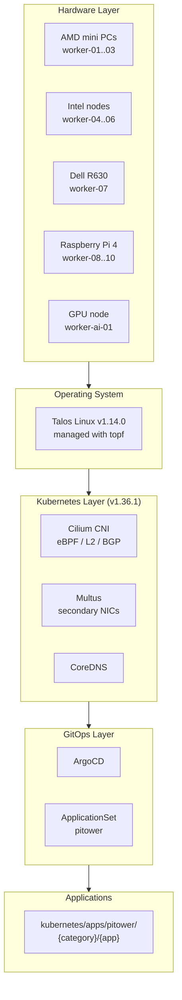
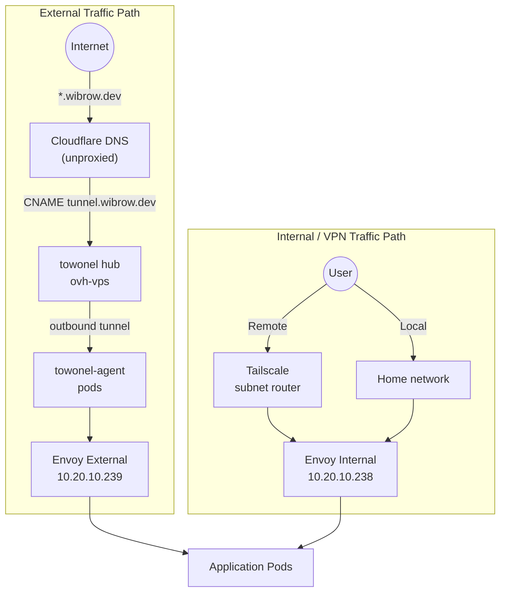
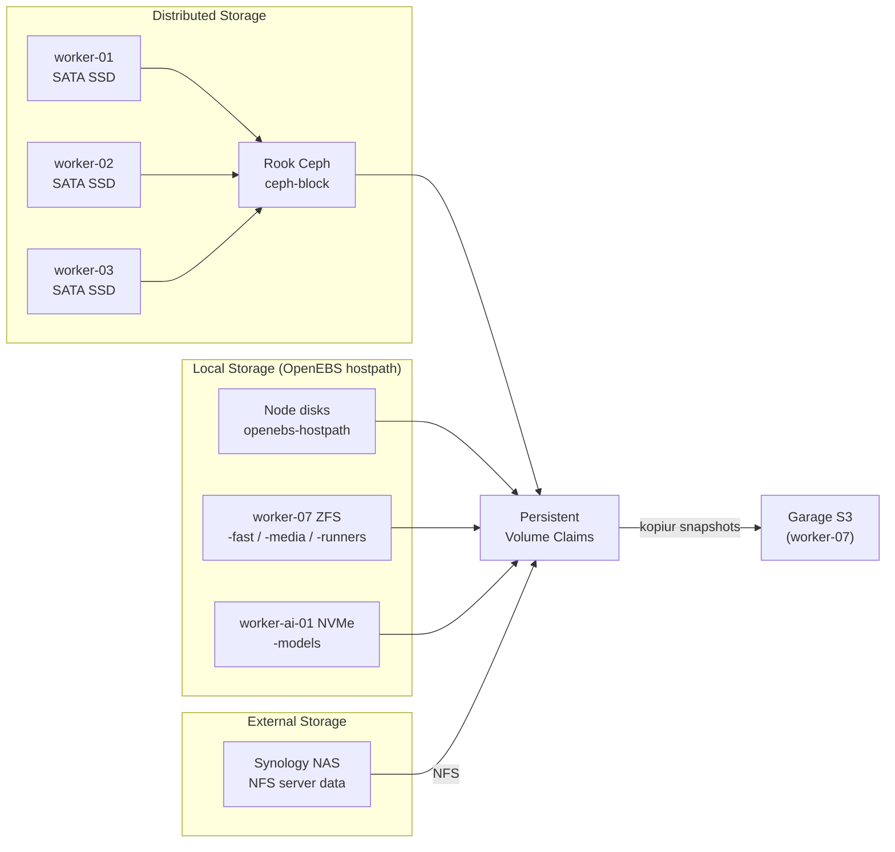

# Architecture Overview

This page describes the full architecture of the cluster, from physical hardware through to application deployment. Two key diagrams illustrate the infrastructure stack and the network traffic flows.

---

## Infrastructure Stack

The cluster is built in layers, each managed declaratively through code in this repository.

```mermaid
flowchart TB
    subgraph Hardware["Hardware Layer"]
        direction LR
        AMD["AMD mini PCs\nworker-01..03"]
        Intel["Intel nodes\nworker-04..06"]
        R630["Dell R630\nworker-07"]
        RPi["Raspberry Pi 4\nworker-08..10"]
        GPU["GPU node\nworker-ai-01"]
    end

    subgraph OS["Operating System"]
        Talos["Talos Linux v1.14.0\nmanaged with topf"]
    end

    subgraph K8s["Kubernetes Layer (v1.36.1)"]
        direction LR
        Cilium["Cilium CNI\neBPF / L2 / BGP"]
        Multus["Multus\nsecondary NICs"]
        CoreDNS["CoreDNS"]
    end

    subgraph GitOps["GitOps Layer"]
        direction LR
        ArgoCD["ArgoCD"]
        AppSet["ApplicationSet\npitower"]
    end

    subgraph Apps["Applications"]
        direction LR
        Cat["kubernetes/apps/pitower/\n{category}/{app}"]
    end

    Hardware --> OS
    OS --> K8s
    K8s --> GitOps
    GitOps --> Apps
```

### Layer Descriptions

#### Hardware Layer

The cluster runs on 11 nodes, all on VLAN 20 (`10.20.10.1` - `10.20.10.11`). Three AMD Ryzen mini PCs (worker-01..03) are the control planes and also run workloads; each carries a SATA SSD for Rook Ceph. Three Intel nodes (worker-04..06) provide Intel iGPUs. worker-07 is a bare-metal Dell R630 with two ZFS pools that back the OpenEBS hostpath classes and Garage S3, and hosts the self-hosted CI runners. Three Raspberry Pi 4s (worker-08..10) are arm64 workers, and worker-ai-01 is a GPU workstation with an RTX 3090 Ti. See [Hardware](../infrastructure/hardware.md).

#### Operating System

All nodes run [Talos Linux](https://www.talos.dev/) v1.14.0, an immutable, minimal Linux distribution purpose-built for Kubernetes. There is no SSH access, no shell, and no package manager. Machine configs are rendered and applied by [topf](https://github.com/postfinance/topf) from `talos/pitower/topf.yaml` and the layered patches in `all/`, `control-plane/`, and `node/<host>/`. A GitHub Actions workflow runs `topf apply` on every merge to `main` that touches `talos/`. See [Talos Linux](../infrastructure/talos-linux.md).

#### Kubernetes Layer

The cluster is dual-stack (IPv4 primary). [Cilium](https://cilium.io/) is the CNI and fully replaces kube-proxy. It is configured with:

- **Native routing** (no tunnel); each node's pod CIDR is advertised to the gateway over BGP, so pods are routable from the LAN
- **LoadBalancer IPs** from the pool `10.20.10.128` - `10.20.10.255`, announced over L2 (ARP) and BGP to the UniFi gateway
- **Maglev** consistent hashing for load balancing

[Multus](https://github.com/k8snetworkplumbingwg/multus-cni) adds secondary macvlan interfaces where a pod needs a presence on another network (for example netboot on the untagged LAN). CoreDNS is deployed by its Helm chart rather than by Talos, and Metrics Server provides resource utilization data.

#### GitOps Layer

[ArgoCD](https://argoproj.github.io/cd/) is the sole deployment mechanism. A single ApplicationSet (`kubernetes/argocd/clusters/pitower.yaml`) uses a Git directory generator over `kubernetes/apps/pitower/*/*`. Each `{category}/{app}` directory becomes an Application named `pitower-{category}-{app}`, deployed into a namespace named after the category. Adding a new app is as simple as creating a new directory.

ArgoCD manages its own installation through the `argocd-bootstrap` Application, which points at `kubernetes/bootstrap/`.

#### Application Layer

Applications are organized into 31 categories. The main ones:

| Category | Example Applications |
|:---------|:--------------------|
| `ai` | agentgateway, Open WebUI, ToolHive, ComfyUI, MLflow, llmkube, agent-sandbox |
| `banking` | Actual, Firefly III, Ghostfolio, Paperless-ngx |
| `database` | CloudNativePG operator and clusters, Dragonfly operator, ClickHouse operator |
| `dev` | Forgejo, dev-desktop, herdr, propagit |
| `home-automation` | Home Assistant (proxied to HAOS), Frigate |
| `kopiur-system` | kopiur operator and the Garage-backed repository |
| `kube-system` | Cilium, CoreDNS, metrics-server, Multus |
| `kubevirt` / `vms` | KubeVirt, CDI, and the VirtualMachines themselves |
| `media` | Jellyfin, Immich, Sonarr, Radarr, Prowlarr, qBittorrent, SABnzbd, Autobrr |
| `monitoring` | kube-prometheus-stack, Grafana Operator, VictoriaMetrics, VictoriaLogs, Fluent Bit, Tempo, Gatus, ntfy |
| `networking` | Envoy Gateway, external-dns (Cloudflare and UniFi), towonel-agent, Tailscale, netboot |
| `rook-ceph` / `openebs` | Distributed and local storage |
| `security` | Kanidm, External Secrets, CrowdSec, RBAC |
| `selfhosted` | Homepage, Glance, Miniflux, Mealie, n8n, Excalidraw, Atuin, and more |
| `system` | Garage, Reloader, KEDA, Headlamp, Spegel, NVIDIA DRA driver, Intel device plugins |

See the [App Catalog](../reference/app-catalog.md) for the complete list.

---

## Network Architecture

Traffic reaches the cluster through two distinct paths depending on the source and intended audience.

```mermaid
flowchart TB
    subgraph External["External Traffic Path"]
        direction LR
        Internet1((Internet))
        CF["Cloudflare DNS\n(unproxied)"]
        Hub["towonel hub\novh-vps"]
        Agent["towonel-agent\npods"]
        EnvoyExt["Envoy External\n10.20.10.239"]
    end

    subgraph Internal["Internal / VPN Traffic Path"]
        direction LR
        User((User))
        TS["Tailscale\nsubnet router"]
        LAN["Home network"]
        EnvoyInt["Envoy Internal\n10.20.10.238"]
    end

    AppPods["Application Pods"]

    Internet1 -->|"*.wibrow.dev"| CF
    CF -->|CNAME tunnel.wibrow.dev| Hub
    Hub -->|outbound tunnel| Agent
    Agent --> EnvoyExt
    EnvoyExt --> AppPods

    User -->|Remote| TS
    TS --> EnvoyInt
    User -->|Local| LAN
    LAN --> EnvoyInt
    EnvoyInt --> AppPods
```

### External Traffic (towonel Tunnel)

Public-facing services are exposed through a self-hosted [towonel](../networking/towonel-tunnel.md) tunnel. DNS records for `*.wibrow.dev` are unproxied CNAMEs to the towonel hub on a VPS (`tunnel.wibrow.dev`), which SNI-routes the connection over an outbound tunnel to the `towonel-agent` pods in the cluster; those proxy to the `envoy-external` gateway. TLS is terminated in-cluster.

> [!NOTE]
> **No port forwarding required**
>
> The agent dials out to the hub, so no inbound firewall rules or port forwarding are needed on the home router, and the home IP stays unpublished.

### Internal / VPN Traffic

Internal services are reached from the home network or remotely through [Tailscale](https://tailscale.com/). Both paths route to the `envoy-internal` gateway at `10.20.10.238`; app hostnames CNAME to `internal.wibrow.dev`, an A record pointing at that private address. These services are never exposed to the public internet.

---

## Gateway Architecture

The two Envoy Gateway instances serve different audiences:

| Gateway | IP Address | DNS Target | Audience |
|:--------|:-----------|:-----------|:---------|
| `envoy-external` | `10.20.10.239` | `external.wibrow.dev` (CNAME to `tunnel.wibrow.dev`) | Public (via towonel) |
| `envoy-internal` | `10.20.10.238` | `internal.wibrow.dev` (A record, unproxied) | Home network and Tailscale users |

Cilium advertises the gateway IPs over L2 and BGP. The `external-dns` controller watches HTTPRoutes attached to Gateways labelled `external-dns.alpha.kubernetes.io/enabled=true` and creates the matching records in Cloudflare.

> [!NOTE]
> **Routing an app to a specific gateway**
>
> Set the HTTPRoute `parentRefs` to `envoy-external` (public) or `envoy-internal` (internal-only), namespace `networking`, sectionName `https`.

---

## Storage Architecture

```mermaid
flowchart LR
    subgraph Distributed["Distributed Storage"]
        SSD1["worker-01\nSATA SSD"]
        SSD2["worker-02\nSATA SSD"]
        SSD3["worker-03\nSATA SSD"]
        Ceph["Rook Ceph\nceph-block"]
        SSD1 --> Ceph
        SSD2 --> Ceph
        SSD3 --> Ceph
    end

    subgraph Local["Local Storage (OpenEBS hostpath)"]
        Boot["Node disks\nopenebs-hostpath"]
        ZFS["worker-07 ZFS\n-fast / -media / -runners"]
        Models["worker-ai-01 NVMe\n-models"]
    end

    subgraph External["External Storage"]
        Synology["Synology NAS\nNFS server data"]
    end

    Garage["Garage S3\n(worker-07)"]
    PVC["Persistent\nVolume Claims"]
    Ceph --> PVC
    Boot --> PVC
    ZFS --> PVC
    Models --> PVC
    Synology -->|NFS| PVC
    PVC -->|kopiur snapshots| Garage
```

- **Rook Ceph** provides replicated block storage (`ceph-block`, the default StorageClass) from one SATA SSD on each control plane node. Most PVCs use it.
- **OpenEBS** provides local hostpath volumes: `openebs-hostpath` on the node disks, `-fast`, `-media`, and `-runners` on worker-07's ZFS pools, and `-models` on worker-ai-01's model NVMe.
- **Synology NAS** provides NFS volumes (server `data`) for media and bulk data.
- **Garage** is an S3 store on worker-07. kopiur backs up PVCs to it with Kopia, and CNPG writes base backups and WAL to it through the Barman Cloud plugin.
