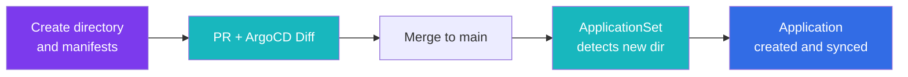

# Adding a New Application

Adding an application needs no ArgoCD configuration. Thanks to the [ApplicationSet](application-sets.md), creating a directory in the right place is all it takes. This page covers the GitOps side; the manifests themselves (app-template values, PVCs, backups, databases, secrets) are covered in [Development > Adding Apps](../development/adding-apps.md).

---

## Quick Start

1. Pick a category (or create a new one).
2. Create `kubernetes/apps/pitower/<category>/<app>/` with a `kustomization.yaml` (and usually a `values.yaml`).
3. Open a PR. The [ArgoCD Diff](../ci-cd/github-actions.md#argocd-diff) workflow posts the rendered diff.
4. Merge to `main`.
5. ArgoCD creates `pitower-<category>-<app>` and syncs it into the `<category>` namespace.



---

## Categories

The category is both the directory and the namespace. Current categories under `kubernetes/apps/pitower/`:

| Category | Examples |
|:---------|:---------|
| `ai` | open-webui, comfyui, llmkube, agentgateway, toolhive, searxng |
| `analytics` | rybbit |
| `arc` | GitHub Actions Runner Controller and runner scale sets |
| `banking` | actual, firefly, firefly-importer, ghostfolio, paperless |
| `cert-manager` | cert-manager, issuers |
| `database` | CNPG operator and clusters, tenants, dragonfly-operator, clickhouse-operator |
| `dev` | forgejo, dev-desktop, herdr, propagit |
| `home-automation` | frigate, home-assistant (proxy to an external HAOS host) |
| `kopiur-system` | kopiur operator and the `garage` ClusterRepository |
| `kube-system` | cilium, coredns, metrics-server, multus |
| `kubevirt` | kubevirt, cdi |
| `media` | jellyfin, immich, sonarr, radarr, prowlarr, autobrr, qbittorrent, sabnzbd |
| `monitoring` | kube-prometheus-stack, victoria-metrics, victoria-logs, grafana-operator, gatus, ntfy |
| `networking` | envoy-gateway, external-dns, tailscale, towonel-agent, netboot |
| `openebs` | openebs |
| `renovate` | renovate-operator |
| `rook-ceph` | operator, cluster, csi-drivers, add-ons |
| `second-brain` | affine, couchdb |
| `security` | external-secrets, kanidm, crowdsec, aws-identity-webhook, rbac |
| `selfhosted` | homepage, miniflux, mealie, n8n, atuin, it-tools |
| `system` | reloader, keda, spegel, node-feature-discovery, intel-device-plugins, garage |
| `vms` | KubeVirt VMs (dev, omarchy, debian-test) |
| `workflows` | argo-workflows, argo-events |
| `workshop` | bambuddy |

Single-app categories also exist for standalone projects (`flickerd`, `garrison`, `goat`, `pantry-system`, `rackrat`, `trade-ops`, `trade-ops-dev`).

> [!TIP]
> **When in Doubt**
>
> `selfhosted` is the default for general-purpose applications.

The directory name becomes the app name in ArgoCD: lowercase, hyphen-separated (`echo-server`, not `echoServer`).

---

## Verify

```bash
# The generated Application
kubectl get applications.argoproj.io -n argocd pitower-<category>-<app>

# Everything in a category
kubectl get applications.argoproj.io -n argocd -l home-ops/category=<category>

# Workloads
kubectl get pods -n <category> -l app.kubernetes.io/name=<app>
```

> [!NOTE]
> **Full resource name**
>
> Use `applications.argoproj.io`, not `app`: the short name resolves to a different CRD in this cluster.

---

## Variations

### Apps Without Helm

Plain manifests work too; `home-assistant` is just a Service and an HTTPRoute:

```yaml
apiVersion: kustomize.config.k8s.io/v1beta1
kind: Kustomization
namespace: <category>
resources:
  - service.yaml
  - httproute.yaml
```

### Other Helm Charts

Any chart can be inflated with `helmCharts`, not just app-template. For example, `arc/runners` renders `gha-runner-scale-set` once per repository with `valuesInline` overrides.

### Shared Components

`kubernetes/components/` holds kustomize components (`pvc`, `kopiur`, `cnpg-db-shared`) referenced as `../../../../components/<name>`. ArgoCD builds with `--load-restrictor LoadRestrictionsNone` so these paths outside the app directory resolve.

---

## Removing an Application

1. Delete `kubernetes/apps/pitower/<category>/<app>/` and merge to `main`.
2. The ApplicationSet deletes the Application.
3. The `resources-finalizer.argocd.argoproj.io` finalizer deletes everything it managed, **including PVCs**. Take a backup first if the data matters.
