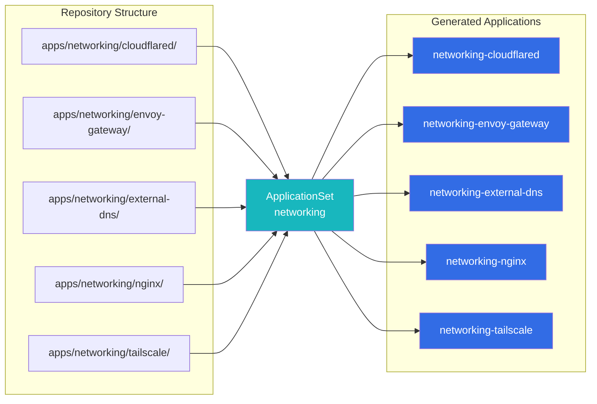

# ApplicationSets

ApplicationSets are the core mechanism that makes the GitOps workflow scalable. Instead of writing individual Application resources for each app, a single ApplicationSet per category automatically generates Applications based on the repository directory structure.

---

## Overview

The cluster uses **15 ApplicationSets**, one per application category:

| ApplicationSet | Directory Scanned | Example Apps |
|:---------------|:------------------|:-------------|
| `ai` | `pitower/kubernetes/apps/ai/*` | AI/ML workloads |
| `banking` | `pitower/kubernetes/apps/banking/*` | Financial tools |
| `cert-manager` | `pitower/kubernetes/apps/cert-manager/*` | TLS certificate automation |
| `cloudnative-pg` | `pitower/kubernetes/apps/cloudnative-pg/*` | PostgreSQL operator and clusters |
| `home-automation` | `pitower/kubernetes/apps/home-automation/*` | Home Assistant, Zigbee2MQTT, Mosquitto |
| `kube-system` | `pitower/kubernetes/apps/kube-system/*` | Core cluster components |
| `media` | `pitower/kubernetes/apps/media/*` | Jellyfin, *arr stack, downloaders |
| `monitoring` | `pitower/kubernetes/apps/monitoring/*` | Prometheus, Grafana, Loki |
| `networking` | `pitower/kubernetes/apps/networking/*` | Envoy Gateway, Cilium, external-dns |
| `openebs` | `pitower/kubernetes/apps/openebs/*` | Local PV storage |
| `rook-ceph` | `pitower/kubernetes/apps/rook-ceph/*` | Distributed block storage |
| `security` | `pitower/kubernetes/apps/security/*` | Authelia, LLDAP, External Secrets |
| `selfhosted` | `pitower/kubernetes/apps/selfhosted/*` | Miniflux, Tandoor, Glance, and more |
| `system` | `pitower/kubernetes/apps/system/*` | System-level utilities |

---

## Git Directory Generator

Each ApplicationSet uses the **Git directory generator**, which scans a specific path in the repository for subdirectories. Every subdirectory it finds becomes an ArgoCD Application.



The generator configuration:

```yaml
generators:
  - git:
      repoURL: https://github.com/swibrow/home-ops
      revision: main
      directories:
        - path: pitower/kubernetes/apps/networking/*
```

This produces the following template variables for each matched directory:

| Variable | Example Value | Description |
|:---------|:-------------|:------------|
| `{{.path.path}}` | `pitower/kubernetes/apps/networking/envoy-gateway` | Full path to the directory |
| `{{.path.basename}}` | `envoy-gateway` | Directory name (last segment) |
| `{{index .path.segments 0}}` | `pitower` | First path segment |
| `{{index .path.segments 3}}` | `networking` | Fourth segment (the category) |

---

## Go Template Usage

ApplicationSets use Go templates with `missingkey=error` to ensure all template variables are resolved. If a variable is missing, the ApplicationSet controller raises an error instead of silently producing empty strings.

```yaml
spec:
  goTemplate: true
  goTemplateOptions: ["missingkey=error"]
```

### Naming Convention

Application names follow the pattern `<category>-<app-name>`:

```yaml
name: "{{index .path.segments 3}}-{{.path.basename}}"
```

| Directory Path | Generated Application Name |
|:---------------|:--------------------------|
| `apps/networking/envoy-gateway` | `networking-envoy-gateway` |
| `apps/media/jellyfin` | `media-jellyfin` |
| `apps/security/authelia` | `security-authelia` |
| `apps/selfhosted/miniflux` | `selfhosted-miniflux` |

### Namespace Derivation

The target namespace is derived from the category segment of the path:

```yaml
destination:
  namespace: "{{index .path.segments 3}}"
```

This means all apps in `apps/networking/*` deploy to the `networking` namespace, all apps in `apps/media/*` deploy to the `media` namespace, and so on.

!!! tip "Namespace = Category"
    The namespace matches the category directory name. This convention keeps things predictable -- if an app is in the `selfhosted` category, its resources land in the `selfhosted` namespace.

### Labels

Each generated Application receives three standard labels:

```yaml
labels:
  app.kubernetes.io/category: "{{index .path.segments 3}}"
  app.kubernetes.io/name: "{{.path.basename}}"
  app.kubernetes.io/instance: "{{.path.basename}}"
```

These labels enable filtering in the ArgoCD UI and CLI. For example, to list all networking applications:

```bash
argocd app list -l app.kubernetes.io/category=networking
```

---

## Full Example: appset-networking.yaml

```yaml
apiVersion: argoproj.io/v1alpha1
kind: ApplicationSet
metadata:
  name: networking
  namespace: argocd
spec:
  goTemplate: true
  goTemplateOptions: ["missingkey=error"]
  generators:
    - git:
        repoURL: https://github.com/swibrow/home-ops
        revision: main
        directories:
          - path: pitower/kubernetes/apps/networking/*
  template:
    metadata:
      name: "{{index .path.segments 3}}-{{.path.basename}}"
      namespace: argocd
      labels:
        app.kubernetes.io/category: "{{index .path.segments 3}}"
        app.kubernetes.io/name: "{{.path.basename}}"
        app.kubernetes.io/instance: "{{.path.basename}}"
      finalizers:
        - resources-finalizer.argocd.argoproj.io
    spec:
      project: apps
      source:
        repoURL: https://github.com/swibrow/home-ops
        targetRevision: main
        path: "{{.path.path}}"
      destination:
        server: https://kubernetes.default.svc
        namespace: "{{index .path.segments 3}}"
      syncPolicy:
        automated:
          prune: true
          selfHeal: false
          allowEmpty: true
        syncOptions:
          - CreateNamespace=true
          - ServerSideApply=true
          - SkipDryRunOnMissingResource=true
          - ApplyOutOfSyncOnly=true
        retry:
          limit: 5
          backoff:
            duration: 5s
            factor: 2
            maxDuration: 3m
      revisionHistoryLimit: 3
```

---

## Finalizers

Every generated Application includes the `resources-finalizer.argocd.argoproj.io` finalizer:

```yaml
finalizers:
  - resources-finalizer.argocd.argoproj.io
```

This ensures that when an Application is deleted (for example, by removing its directory from the repository), ArgoCD cleans up all Kubernetes resources that the Application managed. Without the finalizer, deleting the Application would leave orphaned resources in the cluster.

---

## Auto-Discovery in Action

The power of this pattern is that **adding a new app requires zero ArgoCD configuration**. The ApplicationSet does all the work:

1. Create a new directory: `pitower/kubernetes/apps/networking/my-new-app/`
2. Add a `kustomization.yaml` and `values.yaml` inside it.
3. Push to `main`.
4. The Git directory generator detects the new directory.
5. A new Application named `networking-my-new-app` is created automatically.
6. ArgoCD syncs the new Application to the cluster.

Removing an app is equally simple -- delete the directory and push. The finalizer ensures all resources are cleaned up.

!!! info "No ApplicationSet Changes Needed"
    You never need to modify an ApplicationSet to add or remove an app. The directory structure is the only thing that matters.

---

## Creating a New ApplicationSet

If you need a new category (rare), create a new ApplicationSet in `pitower/kubernetes/argocd/`:

```yaml
# pitower/kubernetes/argocd/appset-<category>.yaml
apiVersion: argoproj.io/v1alpha1
kind: ApplicationSet
metadata:
  name: <category>
  namespace: argocd
spec:
  goTemplate: true
  goTemplateOptions: ["missingkey=error"]
  generators:
    - git:
        repoURL: https://github.com/swibrow/home-ops
        revision: main
        directories:
          - path: pitower/kubernetes/apps/<category>/*
  template:
    metadata:
      name: "{{index .path.segments 3}}-{{.path.basename}}"
      # ... (same template as above)
```

Then create the corresponding directory under `pitower/kubernetes/apps/<category>/` and add your first app inside it.
