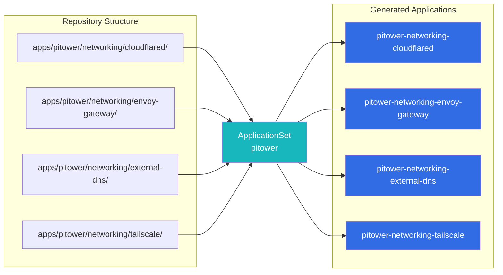

# ApplicationSets

ApplicationSets are the core mechanism that makes the GitOps workflow scalable. Instead of writing individual Application resources for each app, a single ApplicationSet per cluster automatically generates Applications based on the repository directory structure.

---

## Overview

The cluster uses **one ApplicationSet per cluster**, stored in `kubernetes/argocd/clusters/` and applied manually with `kubectl apply -f`:

| ApplicationSet | Directory Scanned | Cluster |
|:---------------|:------------------|:--------|
| `pitower` | `kubernetes/apps/pitower/*/*` | pitower (primary) |

These are **not** managed by ArgoCD (no nesting) -- they are applied directly to the cluster.

---

## Git Directory Generator

The ApplicationSet uses the **Git directory generator**, which scans a specific path in the repository for subdirectories. Every subdirectory it finds becomes an ArgoCD Application.


```mermaid
flowchart LR
    subgraph "Repository Structure"
        dir1["apps/pitower/networking/cloudflared/"]
        dir2["apps/pitower/networking/envoy-gateway/"]
        dir3["apps/pitower/networking/external-dns/"]
        dir4["apps/pitower/networking/tailscale/"]
    end

    AS[ApplicationSet\npitower]

    subgraph "Generated Applications"
        app1["pitower-networking-cloudflared"]
        app2["pitower-networking-envoy-gateway"]
        app3["pitower-networking-external-dns"]
        app4["pitower-networking-tailscale"]
    end

    dir1 & dir2 & dir3 & dir4 --> AS
    AS --> app1 & app2 & app3 & app4

    style AS fill:#18b7be,color:#fff
    style app1 fill:#326ce5,color:#fff
    style app2 fill:#326ce5,color:#fff
    style app3 fill:#326ce5,color:#fff
    style app4 fill:#326ce5,color:#fff
```

The generator configuration:

```yaml
generators:
  - git:
      repoURL: https://github.com/swibrow/home-ops
      revision: main
      directories:
        - path: kubernetes/apps/pitower/*/*
```

This produces the following template variables for each matched directory:

| Variable | Example Value | Description |
|:---------|:-------------|:------------|
| `{{.path.path}}` | `kubernetes/apps/pitower/networking/envoy-gateway` | Full path to the directory |
| `{{.path.basename}}` | `envoy-gateway` | Directory name (last segment) |
| `{{index .path.segments 2}}` | `pitower` | Cluster name |
| `{{index .path.segments 3}}` | `networking` | Category (also the namespace) |
| `{{index .path.segments 4}}` | `envoy-gateway` | App name |

---

## Go Template Usage

ApplicationSets use Go templates with `missingkey=error` to ensure all template variables are resolved. If a variable is missing, the ApplicationSet controller raises an error instead of silently producing empty strings.

```yaml
spec:
  goTemplate: true
  goTemplateOptions: ["missingkey=error"]
```

### Naming Convention

Application names follow the pattern `<cluster>-<category>-<app-name>`:

```yaml
name: "pitower-{{index .path.segments 3}}-{{index .path.segments 4}}"
```

| Directory Path | Generated Application Name |
|:---------------|:--------------------------|
| `kubernetes/apps/pitower/networking/envoy-gateway` | `pitower-networking-envoy-gateway` |
| `kubernetes/apps/pitower/media/jellyfin` | `pitower-media-jellyfin` |
| `kubernetes/apps/pitower/security/authelia` | `pitower-security-authelia` |

### Namespace Derivation

The target namespace is derived from the category segment of the path:

```yaml
destination:
  namespace: "{{index .path.segments 3}}"
```

This means all apps in `kubernetes/apps/pitower/networking/*` deploy to the `networking` namespace, all apps in `kubernetes/apps/pitower/media/*` deploy to the `media` namespace, and so on.

!!! tip "Namespace = Category"
    The namespace matches the category directory name. This convention keeps things predictable -- if an app is in the `selfhosted` category, its resources land in the `selfhosted` namespace.

### Labels

Each generated Application receives labels for filtering:

```yaml
labels:
  app.kubernetes.io/name: "{{index .path.segments 4}}"
  app.kubernetes.io/instance: "pitower-{{index .path.segments 3}}-{{index .path.segments 4}}"
  app.kubernetes.io/component: "{{index .path.segments 3}}"
  app.kubernetes.io/part-of: pitower
  app.kubernetes.io/managed-by: argocd
  home-ops/cluster: pitower
  home-ops/category: "{{index .path.segments 3}}"
  home-ops/namespace: "{{index .path.segments 3}}"
```

These labels enable filtering in the ArgoCD UI and CLI:

```bash
# All media apps
kubectl get app -n argocd -l home-ops/category=media

# Specific app
kubectl get app -n argocd -l app.kubernetes.io/name=jellyfin

# All apps on pitower
kubectl get app -n argocd -l home-ops/cluster=pitower

# Combine filters
kubectl get app -n argocd -l home-ops/cluster=pitower,home-ops/category=networking
```

---

## Full Example: pitower.yaml

```yaml title="kubernetes/argocd/clusters/pitower.yaml"
apiVersion: argoproj.io/v1alpha1
kind: ApplicationSet
metadata:
  name: pitower
  namespace: argocd
spec:
  goTemplate: true
  goTemplateOptions: ["missingkey=error"]
  generators:
    - git:
        repoURL: https://github.com/swibrow/home-ops
        revision: main
        directories:
          - path: kubernetes/apps/pitower/*/*
  syncPolicy:
    preserveResourcesOnDeletion: true
  template:
    metadata:
      name: "pitower-{{index .path.segments 3}}-{{index .path.segments 4}}"
      namespace: argocd
      labels:
        app.kubernetes.io/name: "{{index .path.segments 4}}"
        app.kubernetes.io/instance: "pitower-{{index .path.segments 3}}-{{index .path.segments 4}}"
        app.kubernetes.io/component: "{{index .path.segments 3}}"
        app.kubernetes.io/part-of: pitower
        app.kubernetes.io/managed-by: argocd
        home-ops/cluster: pitower
        home-ops/category: "{{index .path.segments 3}}"
        home-ops/namespace: "{{index .path.segments 3}}"
      finalizers:
        - resources-finalizer.argocd.argoproj.io
    spec:
      project: apps
      source:
        repoURL: https://github.com/swibrow/home-ops
        targetRevision: main
        path: "{{.path.path}}"
      destination:
        server: https://kubernetes.default.svc
        namespace: "{{index .path.segments 3}}"
      syncPolicy:
        automated:
          prune: true
          selfHeal: false
        managedNamespaceMetadata:
          labels:
            pod-security.kubernetes.io/enforce: privileged
            pod-security.kubernetes.io/audit: privileged
            pod-security.kubernetes.io/warn: privileged
        syncOptions:
          - CreateNamespace=true
          - ServerSideApply=true
          - SkipDryRunOnMissingResource=true
          - ApplyOutOfSyncOnly=true
        retry:
          limit: 5
          backoff:
            duration: 5s
            factor: 2
            maxDuration: 3m
      revisionHistoryLimit: 3
```

---

## Key Design Decisions

### preserveResourcesOnDeletion

```yaml
syncPolicy:
  preserveResourcesOnDeletion: true
```

When an ApplicationSet is deleted, the generated Applications are preserved (not deleted). This prevents accidental cascade deletion of all workloads during migrations or AppSet changes.

### Finalizers

```yaml
finalizers:
  - resources-finalizer.argocd.argoproj.io
```

Each generated Application includes the resources finalizer. When an Application is deleted (e.g. by removing its directory), ArgoCD cleans up all managed Kubernetes resources. Without the finalizer, deleting the Application would leave orphaned resources.

### No selfHeal

```yaml
automated:
  prune: true
  selfHeal: false
```

Self-heal is disabled to allow manual changes in the cluster (e.g. scaling down for maintenance, restore operations) without ArgoCD reverting them. Apps still auto-sync on git changes.

### Not Managed by ArgoCD

The ApplicationSet files live in `kubernetes/argocd/clusters/` and are applied manually with `kubectl apply -f`. This avoids nesting (an ArgoCD Application managing the ApplicationSet that manages other Applications) and makes it easy to modify the AppSet without triggering cascading changes.

---

## Auto-Discovery in Action

**Adding a new app requires zero ArgoCD configuration.** The ApplicationSet does all the work:

1. Create a new directory: `kubernetes/apps/pitower/networking/my-new-app/`
2. Add a `kustomization.yaml` and `values.yaml` inside it.
3. Push to `main`.
4. The Git directory generator detects the new directory.
5. A new Application named `pitower-networking-my-new-app` is created automatically.
6. ArgoCD syncs the new Application to the cluster.

Removing an app is equally simple -- delete the directory and push. The finalizer ensures all resources are cleaned up.

!!! info "No ApplicationSet Changes Needed"
    You never need to modify the ApplicationSet to add or remove an app. The directory structure is the only thing that matters.

---

## Adding a New Cluster

To add a new cluster (e.g. `pistack`):

1. Create the ApplicationSet at `kubernetes/argocd/clusters/pistack.yaml`
2. Create the app directory structure at `kubernetes/apps/pistack/`
3. Add a cluster secret in `kubernetes/bootstrap/` pointing to the remote cluster
4. Apply the ApplicationSet: `kubectl apply -f kubernetes/argocd/clusters/pistack.yaml`
