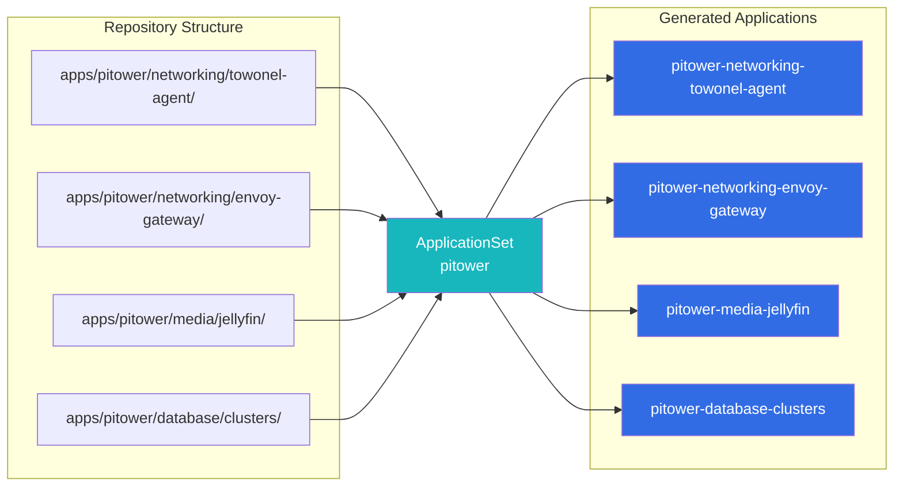

# ApplicationSets

ApplicationSets make the GitOps workflow scale. Instead of one Application manifest per app, a single ApplicationSet per cluster generates Applications from the repository directory structure.

---

## Overview

The ApplicationSets live in `kubernetes/argocd/` and are applied manually with `kubectl apply -f`:

| ApplicationSet | File | Generator | Generates |
|:---------------|:-----|:----------|:----------|
| `pitower` | `kubernetes/argocd/clusters/pitower.yaml` | Git directories `kubernetes/apps/pitower/*/*` | One Application per app directory |
| `ack` | `kubernetes/argocd/ack-applicationset.yaml` | Clusters with label `home-ops/cluster: pitower` | `pitower-ack` (AWS Controllers for Kubernetes) |

They are **not** managed by ArgoCD (no nesting). After editing one, re-apply it.

> [!NOTE]
> **Why ACK has its own ApplicationSet**
>
> The umbrella `ack-chart` ships the same common CRDs once per enabled subchart, and `kustomize build --enable-helm` hard-errors on the duplicate resource IDs. The `ack` ApplicationSet uses ArgoCD's native Helm source (`public.ecr.aws/aws-controllers-k8s/ack-chart`) with ServerSideApply instead. Its chart version is baked into the template, so a version bump only reaches the cluster when the file is re-applied.

The live cluster also runs a `cloudsnacks` ApplicationSet in the `cloudsnacks` project, sourced from a separate repository; it is not defined here.

---

## Git Directory Generator

The `pitower` ApplicationSet scans `kubernetes/apps/pitower/*/*`. Every directory at that depth becomes an Application.


```mermaid
flowchart LR
    subgraph "Repository Structure"
        dir1["apps/pitower/networking/towonel-agent/"]
        dir2["apps/pitower/networking/envoy-gateway/"]
        dir3["apps/pitower/media/jellyfin/"]
        dir4["apps/pitower/database/clusters/"]
    end

    AS[ApplicationSet\npitower]

    subgraph "Generated Applications"
        app1["pitower-networking-towonel-agent"]
        app2["pitower-networking-envoy-gateway"]
        app3["pitower-media-jellyfin"]
        app4["pitower-database-clusters"]
    end

    dir1 & dir2 & dir3 & dir4 --> AS
    AS --> app1 & app2 & app3 & app4

    style AS fill:#18b7be,color:#fff
    style app1 fill:#326ce5,color:#fff
    style app2 fill:#326ce5,color:#fff
    style app3 fill:#326ce5,color:#fff
    style app4 fill:#326ce5,color:#fff
```

```yaml
generators:
  - git:
      repoURL: https://github.com/swibrow/home-ops
      revision: main
      directories:
        - path: kubernetes/apps/pitower/*/*
```

Template variables for each matched directory:

| Variable | Example Value | Description |
|:---------|:-------------|:------------|
| `{{.path.path}}` | `kubernetes/apps/pitower/networking/envoy-gateway` | Full path to the directory |
| `{{index .path.segments 2}}` | `pitower` | Cluster name |
| `{{index .path.segments 3}}` | `networking` | Category (also the namespace) |
| `{{index .path.segments 4}}` | `envoy-gateway` | App name |

---

## Go Template Usage

```yaml
spec:
  goTemplate: true
  goTemplateOptions: ["missingkey=error"]
```

`missingkey=error` makes the controller fail on an unresolved variable instead of silently rendering an empty string.

### Naming Convention

Application names follow `<cluster>-<category>-<app>`:

```yaml
name: "pitower-{{index .path.segments 3}}-{{index .path.segments 4}}"
```

| Directory Path | Generated Application Name |
|:---------------|:--------------------------|
| `kubernetes/apps/pitower/networking/envoy-gateway` | `pitower-networking-envoy-gateway` |
| `kubernetes/apps/pitower/media/jellyfin` | `pitower-media-jellyfin` |
| `kubernetes/apps/pitower/security/kanidm` | `pitower-security-kanidm` |

### Namespace Derivation

```yaml
destination:
  namespace: "{{index .path.segments 3}}"
```

Everything in `kubernetes/apps/pitower/media/*` deploys to the `media` namespace, and so on. Some apps also ship a `namespace.yaml` to set extra labels, but the destination namespace is always the category.

### Labels

```yaml
labels:
  app.kubernetes.io/name: "{{index .path.segments 4}}"
  app.kubernetes.io/instance: "pitower-{{index .path.segments 3}}-{{index .path.segments 4}}"
  app.kubernetes.io/component: "{{index .path.segments 3}}"
  app.kubernetes.io/part-of: pitower
  app.kubernetes.io/managed-by: argocd
  home-ops/cluster: pitower
  home-ops/category: "{{index .path.segments 3}}"
  home-ops/namespace: "{{index .path.segments 3}}"
```

Filter with them in the CLI. Use the full resource name: the `app` short name collides with another CRD in this cluster.

```bash
# All media apps
kubectl get applications.argoproj.io -n argocd -l home-ops/category=media

# Specific app
kubectl get applications.argoproj.io -n argocd -l app.kubernetes.io/name=jellyfin

# Combine filters
kubectl get applications.argoproj.io -n argocd -l home-ops/cluster=pitower,home-ops/category=networking
```

---

## Full Example: pitower.yaml

```yaml title="kubernetes/argocd/clusters/pitower.yaml"
apiVersion: argoproj.io/v1alpha1
kind: ApplicationSet
metadata:
  name: pitower
  namespace: argocd
spec:
  goTemplate: true
  goTemplateOptions: ["missingkey=error"]
  generators:
    - git:
        repoURL: https://github.com/swibrow/home-ops
        revision: main
        directories:
          - path: kubernetes/apps/pitower/*/*
  template:
    metadata:
      name: "pitower-{{index .path.segments 3}}-{{index .path.segments 4}}"
      namespace: argocd
      labels:
        # ... see Labels above
      finalizers:
        - resources-finalizer.argocd.argoproj.io
    spec:
      project: apps
      source:
        repoURL: https://github.com/swibrow/home-ops
        targetRevision: main
        path: "{{.path.path}}"
      destination:
        server: https://kubernetes.default.svc
        namespace: "{{index .path.segments 3}}"
      syncPolicy:
        automated:
          prune: true
          selfHeal: false
        managedNamespaceMetadata:
          labels:
            pod-security.kubernetes.io/enforce: privileged
            pod-security.kubernetes.io/audit: privileged
            pod-security.kubernetes.io/warn: privileged
        syncOptions:
          - CreateNamespace=true
          - ServerSideApply=true
          - SkipDryRunOnMissingResource=true
          - ApplyOutOfSyncOnly=true
          - Timeout=600
        retry:
          limit: 5
          backoff:
            duration: 5s
            factor: 2
            maxDuration: 3m
      revisionHistoryLimit: 3
```

---

## Key Design Decisions

### Finalizers

```yaml
finalizers:
  - resources-finalizer.argocd.argoproj.io
```

When an Application is deleted (for example because its directory was removed), ArgoCD deletes all the resources it managed. Without the finalizer they would be orphaned.

> [!CAUTION]
> **Deleting a directory deletes its data**
>
> Removing an app directory prunes its PVCs too. Move PVC declarations carefully; see the comment in `kubernetes/components/pvc/kustomization.yaml`.

### No selfHeal

```yaml
automated:
  prune: true
  selfHeal: false
```

Manual changes in the cluster (scaling down for maintenance, restore operations) are not reverted. Apps still auto-sync on Git changes.

### Managed Namespace Metadata

Namespaces created by ArgoCD get privileged Pod Security labels, since many workloads (CNI, storage, GPU, runners) need host access.

---

## Auto-Discovery in Action

1. Create `kubernetes/apps/pitower/<category>/<app>/` with a `kustomization.yaml`.
2. Merge to `main`.
3. The generator detects the new directory and creates `pitower-<category>-<app>`.
4. ArgoCD syncs it into the `<category>` namespace.

Removing an app is the reverse: delete the directory and merge. You never need to edit the ApplicationSet to add or remove an app.

---

## Adding a New Cluster

The layout supports more clusters, though only `pitower` exists today:

1. Create `kubernetes/argocd/clusters/<cluster>.yaml`, copying `pitower.yaml` and replacing the cluster name and path.
2. Create `kubernetes/apps/<cluster>/`.
3. Add a cluster Secret in `kubernetes/bootstrap/` if it is a remote cluster.
4. `kubectl apply -f kubernetes/argocd/clusters/<cluster>.yaml`.
