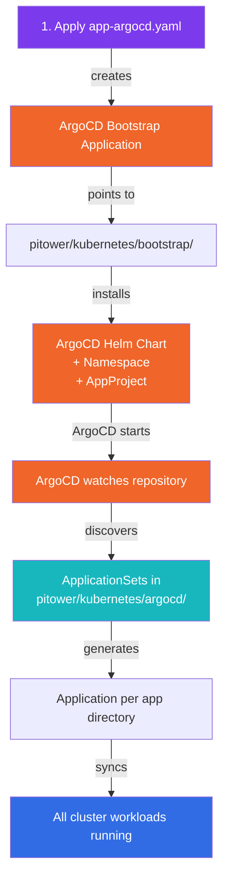
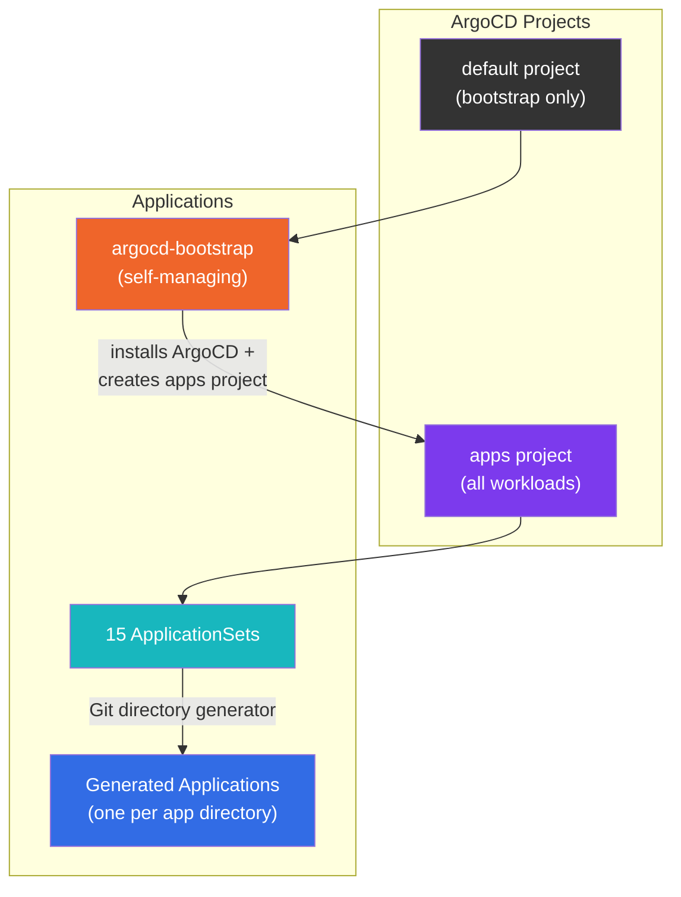

# ArgoCD Setup

ArgoCD is the GitOps engine that drives the cluster. It is installed via Helm, bootstrapped with a single `kubectl apply`, and then manages itself going forward.

---

## Bootstrap Process

The bootstrap follows a three-step process that takes the cluster from a bare Kubernetes installation to a fully self-managing GitOps platform.



### Step 1: Apply the Bootstrap Application

The only manual `kubectl` command needed to bring up the entire cluster:

```bash
kubectl apply -f pitower/kubernetes/argocd/app-argocd.yaml
```

This creates the `argocd-bootstrap` Application resource, which tells ArgoCD to look at the `pitower/kubernetes/bootstrap/` directory for its own installation manifests.

### Step 2: ArgoCD Installs Itself

The bootstrap Application points to a Kustomization that includes:

| Resource | Purpose |
|:---------|:--------|
| `namespace.yaml` | Creates the `argocd` namespace |
| `appproject.yaml` | Creates the `apps` AppProject with admin RBAC |
| `argocd-values.yaml` | Helm values for the ArgoCD chart |
| `kustomization.yaml` | Ties everything together with HelmChartInflationGenerator |

The `kustomization.yaml` uses the `helmCharts` field to install ArgoCD from the official Helm chart:

```yaml
apiVersion: kustomize.config.k8s.io/v1beta1
kind: Kustomization
resources:
  - namespace.yaml
  - appproject.yaml

helmCharts:
  - name: argo-cd
    version: 9.4.2
    repo: https://argoproj.github.io/argo-helm
    releaseName: argocd
    namespace: argocd
    valuesFile: argocd-values.yaml
```

### Step 3: ArgoCD Discovers Everything Else

Once ArgoCD is running, it picks up the ApplicationSets defined in `pitower/kubernetes/argocd/`. Each ApplicationSet scans a category directory and generates Applications for every subdirectory it finds.

!!! success "Self-Managing"
    After the initial `kubectl apply`, ArgoCD manages its own upgrades. Changing the Helm chart version in `kustomization.yaml` and pushing to `main` triggers ArgoCD to upgrade itself.

---

## Bootstrap Application

The `app-argocd.yaml` is the single entry point for the entire cluster:

```yaml
apiVersion: argoproj.io/v1alpha1
kind: Application
metadata:
  name: argocd-bootstrap
  namespace: argocd
spec:
  project: default
  source:
    repoURL: 'https://github.com/swibrow/home-ops.git'
    targetRevision: main
    path: pitower/kubernetes/bootstrap
  destination:
    server: 'https://kubernetes.default.svc'
    namespace: argocd
  syncPolicy:
    automated:
      prune: true
      selfHeal: true
      allowEmpty: true
    syncOptions:
      - CreateNamespace=true
      - ServerSideApply=true
```

!!! note "selfHeal is enabled here"
    Unlike the ApplicationSets for workloads (which disable selfHeal), the bootstrap Application **does** enable selfHeal. ArgoCD must always match the desired state to keep the cluster operational. If someone accidentally modifies ArgoCD's own resources, it will self-correct.

---

## AppProject: `apps`

The bootstrap process creates an AppProject named `apps` that all ApplicationSet-generated Applications belong to. This project defines the security boundary for workload applications.

```yaml
apiVersion: argoproj.io/v1alpha1
kind: AppProject
metadata:
  name: apps
  namespace: argocd
spec:
  description: Apps
  sourceRepos:
    - https://github.com/swibrow/home-ops
  destinations:
    - namespace: "*"
      name: "*"
  clusterResourceWhitelist:
    - group: "*"
      kind: "*"
```

Key properties of the `apps` project:

| Property | Value | Reason |
|:---------|:------|:-------|
| `sourceRepos` | `home-ops` only | Applications can only pull from the home-ops repository |
| `destinations` | All namespaces, all clusters | Apps can deploy to any namespace on the local cluster |
| `clusterResourceWhitelist` | All groups, all kinds | Apps can create cluster-scoped resources (CRDs, ClusterRoles, etc.) |

!!! warning "Broad Permissions"
    The `apps` project grants wide permissions because this is a single-tenant home lab. In a multi-team environment, you would scope `destinations` and `clusterResourceWhitelist` per project.

---

## Project Structure Summary



- The `argocd-bootstrap` Application lives in the **default** project (ArgoCD's built-in project).
- All workload Applications generated by ApplicationSets live in the **apps** project.
- The bootstrap Application is the only resource that needs to be applied manually. Everything else is discovered and managed automatically.
