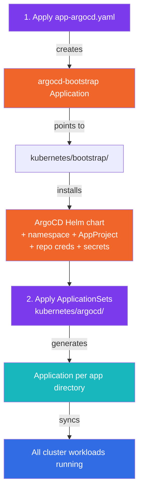
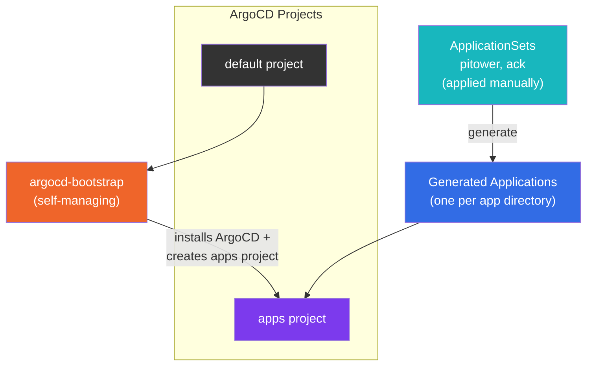

# ArgoCD Setup

ArgoCD is the GitOps engine that drives the cluster. It is installed from the official Helm chart via kustomize, bootstrapped with a single `kubectl apply`, and then manages itself.

---

## Bootstrap Process


```mermaid
flowchart TD
    A[1. Apply app-argocd.yaml] -->|creates| B[argocd-bootstrap Application]
    B -->|points to| C[kubernetes/bootstrap/]
    C -->|installs| D[ArgoCD Helm chart\n+ namespace + AppProject\n+ repo creds + secrets]
    D --> E[2. Apply ApplicationSets\nkubernetes/argocd/]
    E -->|generates| G[Application per app directory]
    G -->|syncs| H[All cluster workloads running]

    style A fill:#7c3aed,color:#fff
    style B fill:#ef652a,color:#fff
    style D fill:#ef652a,color:#fff
    style E fill:#7c3aed,color:#fff
    style G fill:#18b7be,color:#fff
    style H fill:#326ce5,color:#fff
```

### Step 1: Apply the Bootstrap Application

```bash
kubectl apply -f kubernetes/bootstrap/app-argocd.yaml
```

This creates the `argocd-bootstrap` Application, which points ArgoCD at `kubernetes/bootstrap/` for its own installation manifests.

### Step 2: ArgoCD Installs Itself

`kubernetes/bootstrap/kustomization.yaml` contains:

| Resource | Purpose |
|:---------|:--------|
| `namespace.yaml` | `argocd` namespace (privileged Pod Security labels) |
| `appproject.yaml` | `apps` AppProject used by all generated Applications |
| `externalsecret.yaml`, `externalsecret-custom.yaml` | ArgoCD secrets from Infisical (Dex GitHub OAuth, GitHub App for notifications) |
| `pitower-cluster-secret.yaml` | Cluster Secret labelled `home-ops/cluster: pitower`, used by the ACK ApplicationSet's cluster generator |
| `repo-creds-github.yaml`, `repo-creds-ghcr.yaml` | Repository credentials |
| `argocd-values.yaml` | Helm values for the ArgoCD chart |

```yaml title="kubernetes/bootstrap/kustomization.yaml"
helmCharts:
  - name: argo-cd
    version: 10.9.6
    repo: https://argoproj.github.io/argo-helm
    releaseName: argocd
    namespace: argocd
    valuesFile: argocd-values.yaml
```

> [!TIP]
> **Self-Managing**
>
> After bootstrap, ArgoCD manages its own upgrades. Renovate bumps the chart version in `kustomization.yaml`, and merging to `main` upgrades ArgoCD.

### Step 3: Apply the ApplicationSets

The ApplicationSets are **not** managed by ArgoCD. Apply them by hand, and re-apply after editing:

```bash
kubectl apply -f kubernetes/argocd/clusters/pitower.yaml
kubectl apply -f kubernetes/argocd/ack-applicationset.yaml
```

See [ApplicationSets](application-sets.md) for what they generate.

---

## Bootstrap Application

```yaml title="kubernetes/bootstrap/app-argocd.yaml"
apiVersion: argoproj.io/v1alpha1
kind: Application
metadata:
  name: argocd-bootstrap
  namespace: argocd
spec:
  project: default
  source:
    repoURL: 'https://github.com/swibrow/home-ops.git'
    targetRevision: main
    path: kubernetes/bootstrap
  destination:
    server: 'https://kubernetes.default.svc'
    namespace: argocd
  ignoreDifferences:
    - group: ""
      kind: Secret
      name: argocd-secret
      namespace: argocd
      jsonPointers:
        - /data
  syncPolicy:
    automated:
      prune: true
      selfHeal: true
      allowEmpty: true
    syncOptions:
      - CreateNamespace=true
      - ServerSideApply=true
      - RespectIgnoreDifferences=true
```

> [!NOTE]
> **selfHeal is enabled here**
>
> Unlike the generated workload Applications, the bootstrap Application enables selfHeal so ArgoCD's own resources always match Git.

---

## Notable Configuration

Key settings from `argocd-values.yaml`:

| Setting | Value | Why |
|:--------|:------|:----|
| `global.domain` | `argocd.wibrow.dev` | Served via an HTTPRoute on `envoy-external` |
| `timeout.reconciliation` | `1800s` (+`300s` jitter) | Webhooks trigger syncs; polling is only a fallback |
| `kustomize.buildOptions` | `--enable-helm --load-restrictor LoadRestrictionsNone` | Lets apps inflate Helm charts and reference `kubernetes/components` |
| `admin.enabled` | `false` | Login is SSO only, via Dex with the GitHub connector |
| `rbac.policy.default` | `role:readonly` | Admin is granted explicitly in `policy.csv` |
| `accounts.mcp` | `apiKey` | Read-only API account for the ToolHive ArgoCD MCP server |
| `controller.diff.server.side` | `true` | Server-side diff |
| `applicationsetcontroller.enable.progressive.syncs` | `true` | Progressive sync support |

Notifications use a GitHub App (`service.github`); the default trigger is `on-sync-status-unknown`.

---

## AppProject: `apps`

All ApplicationSet-generated Applications belong to the `apps` project:

```yaml
apiVersion: argoproj.io/v1alpha1
kind: AppProject
metadata:
  name: apps
  namespace: argocd
spec:
  description: Apps
  sourceRepos:
    - https://github.com/swibrow/home-ops
    - public.ecr.aws/aws-controllers-k8s
  destinations:
    - namespace: "*"
      name: "*"
  clusterResourceWhitelist:
    - group: "*"
      kind: "*"
```

| Property | Value | Reason |
|:---------|:------|:-------|
| `sourceRepos` | `home-ops` and the ACK OCI registry | Workloads come from this repo; ACK uses a native Helm source |
| `destinations` | All namespaces, all clusters | Apps can deploy anywhere |
| `clusterResourceWhitelist` | All groups, all kinds | Apps can create cluster-scoped resources (CRDs, ClusterRoles, etc.) |

> [!WARNING]
> **Broad Permissions**
>
> The `apps` project grants wide permissions because this is a single-tenant home lab.

---

## Project Structure Summary


```mermaid
flowchart TD
    subgraph "ArgoCD Projects"
        Default["default project"]
        AppsProj["apps project"]
    end

    Bootstrap["argocd-bootstrap\n(self-managing)"]
    AppSets["ApplicationSets\npitower, ack\n(applied manually)"]
    GenApps["Generated Applications\n(one per app directory)"]

    Default --> Bootstrap
    Bootstrap -->|installs ArgoCD +\ncreates apps project| AppsProj
    AppSets -->|generate| GenApps
    GenApps --> AppsProj

    style Default fill:#333,color:#fff
    style AppsProj fill:#7c3aed,color:#fff
    style Bootstrap fill:#ef652a,color:#fff
    style AppSets fill:#18b7be,color:#fff
    style GenApps fill:#326ce5,color:#fff
```

- `argocd-bootstrap` lives in the built-in **default** project.
- Applications generated by the `pitower` and `ack` ApplicationSets live in the **apps** project.
