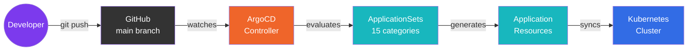

# GitOps

The cluster is managed entirely through GitOps using [ArgoCD](https://argoproj.github.io/cd/). Every application, infrastructure component, and configuration change flows through a single Git repository. ArgoCD continuously watches the repository and reconciles the cluster state to match what is declared in code.

---

## How It Works

The GitOps workflow follows a simple, predictable loop:

1. A developer pushes a change to the `main` branch of the [home-ops](https://github.com/swibrow/home-ops) repository.
2. ArgoCD detects the new commit on `main`.
3. ApplicationSets evaluate the repository directory structure and generate Application resources for each discovered app.
4. Each Application syncs its manifests to the cluster, creating or updating Kubernetes resources as needed.



---

## Key Principles

| Principle | Implementation |
|:----------|:---------------|
| **Single source of truth** | All cluster state is declared in the `home-ops` Git repository |
| **Declarative configuration** | Kubernetes manifests and Helm values define desired state, not imperative scripts |
| **Automated reconciliation** | ArgoCD continuously syncs changes from Git to the cluster |
| **Pull-based delivery** | The cluster pulls its own state from Git -- no external CI pushing to the cluster |
| **Auditability** | Every change is a Git commit with full history and attribution |

---

## Repository Layout

ArgoCD manages the cluster through three key directories:

```
pitower/kubernetes/
├── argocd/              # ArgoCD Application + ApplicationSet definitions
│   ├── app-argocd.yaml  # Bootstrap Application (self-managing)
│   ├── appset-networking.yaml
│   ├── appset-media.yaml
│   ├── appset-security.yaml
│   └── ...              # 15 ApplicationSets total
├── bootstrap/           # Initial cluster resources (ArgoCD Helm chart, project, namespace)
│   ├── kustomization.yaml
│   ├── appproject.yaml
│   ├── namespace.yaml
│   └── argocd-values.yaml
└── apps/                # Application manifests organized by category
    ├── ai/
    ├── banking/
    ├── cert-manager/
    ├── cloudnative-pg/
    ├── home-automation/
    ├── kube-system/
    ├── media/
    ├── monitoring/
    ├── networking/
    ├── openebs/
    ├── rook-ceph/
    ├── security/
    ├── selfhosted/
    └── system/
```

!!! info "15 Application Categories"
    Each category directory under `apps/` has a corresponding ApplicationSet in `argocd/`. When you add a new subdirectory to any category, ArgoCD automatically creates and syncs a new Application for it.

---

## Sections

| Page | Description |
|:-----|:------------|
| [ArgoCD Setup](argocd-setup.md) | Bootstrap process, self-managing Application, project configuration |
| [ApplicationSets](application-sets.md) | Git directory generator pattern, Go templates, naming conventions |
| [Sync Policies](sync-policies.md) | Automated sync, prune, selfHeal, retry strategy, and syncOptions |
| [Adding Apps](adding-apps.md) | Step-by-step guide to deploying a new application through GitOps |

---

## Design Decisions

- **ArgoCD over Flux** -- ArgoCD was chosen for its mature UI, ApplicationSet pattern, and straightforward Helm/Kustomize integration.
- **ApplicationSets over individual Applications** -- A single ApplicationSet per category eliminates boilerplate. Adding a new app is as simple as creating a directory.
- **Git directory generator** -- Directory structure drives application discovery. No manual Application YAML is needed for each app.
- **selfHeal disabled** -- Manual intervention is preferred over automatic drift correction, giving operators time to investigate before changes are reverted. See [Sync Policies](sync-policies.md) for the rationale.
- **Kustomize with HelmChartInflationGenerator** -- Most apps use `kustomization.yaml` to inflate Helm charts with local `values.yaml` files, combining the flexibility of Helm with the composability of Kustomize.
