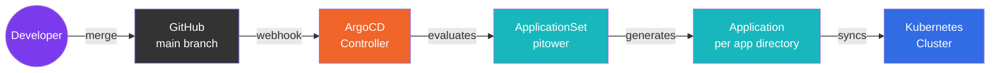

# GitOps

The cluster is managed through GitOps using [ArgoCD](https://argoproj.github.io/cd/). Every application, infrastructure component, and configuration change flows through the [home-ops](https://github.com/swibrow/home-ops) repository. ArgoCD watches the `main` branch and reconciles the cluster to match what is declared in code.

---

## How It Works

1. A change is merged to the `main` branch.
2. A GitHub webhook tells ArgoCD about the new commit. Polling every 30 minutes (`timeout.reconciliation: 1800s`, plus up to 5 minutes jitter) is only a drift-detection fallback.
3. The `pitower` ApplicationSet evaluates the directory structure under `kubernetes/apps/pitower/` and generates one Application per app directory.
4. Each Application renders its `kustomization.yaml` (with Helm inflation) and syncs the result to the cluster.


```mermaid
flowchart LR
    Dev((Developer)) -->|merge| GH[GitHub\nmain branch]
    GH -->|webhook| ArgoCD[ArgoCD\nController]
    ArgoCD -->|evaluates| AppSet[ApplicationSet\npitower]
    AppSet -->|generates| Apps[Application\nper app directory]
    Apps -->|syncs| Cluster[Kubernetes\nCluster]

    style Dev fill:#7c3aed,color:#fff
    style GH fill:#333,color:#fff
    style ArgoCD fill:#ef652a,color:#fff
    style AppSet fill:#18b7be,color:#fff
    style Apps fill:#18b7be,color:#fff
    style Cluster fill:#326ce5,color:#fff
```

---

## Key Principles

| Principle | Implementation |
|:----------|:---------------|
| **Single source of truth** | All cluster state is declared in the `home-ops` Git repository |
| **Declarative configuration** | Kustomize and Helm values define desired state, not imperative scripts |
| **Automated reconciliation** | ArgoCD syncs changes from Git to the cluster automatically |
| **Pull-based delivery** | The cluster pulls its own state from Git; CI never applies Kubernetes manifests |
| **Auditability** | Every change is a Git commit with full history and attribution |

---

## Repository Layout

```
kubernetes/
├── argocd/                    # ApplicationSets (applied manually, not managed by ArgoCD)
│   ├── clusters/
│   │   └── pitower.yaml       # Git directory generator over apps/pitower/*/*
│   └── ack-applicationset.yaml  # AWS Controllers for Kubernetes (native Helm source)
├── bootstrap/                 # ArgoCD itself: Helm chart, AppProject, repo creds, secrets
│   ├── app-argocd.yaml        # Self-managing bootstrap Application
│   ├── kustomization.yaml
│   └── argocd-values.yaml
├── components/                # Reusable kustomize components (pvc, kopiur, cnpg-db-shared)
└── apps/
    └── pitower/               # One directory per category, one subdirectory per app
        ├── ai/
        ├── analytics/
        ├── banking/
        ├── database/
        ├── media/
        ├── ...
        └── workshop/
```

Each category directory becomes a namespace, and each subdirectory inside it becomes an ArgoCD Application named `pitower-<category>-<app>`. There is no per-category ApplicationSet; adding a new category is just a new directory.

---

## Sections

| Page | Description |
|:-----|:------------|
| [ArgoCD Setup](argocd-setup.md) | Bootstrap process, self-managing Application, project configuration |
| [ApplicationSets](application-sets.md) | Git directory generator pattern, Go templates, naming conventions |
| [Sync Policies](sync-policies.md) | Automated sync, prune, selfHeal, retry strategy, and syncOptions |
| [Adding Apps](adding-apps.md) | How a new directory becomes a running Application |

---

## Design Decisions

- **ArgoCD over Flux**: ArgoCD was chosen for its UI, the ApplicationSet pattern, and straightforward Helm/Kustomize integration.
- **One ApplicationSet per cluster**: a single Git directory generator over `kubernetes/apps/pitower/*/*` removes per-app and per-category boilerplate.
- **selfHeal disabled for workloads**: drift is surfaced as OutOfSync rather than reverted, so live debugging and restores are not undone. See [Sync Policies](sync-policies.md).
- **Kustomize with `helmCharts`**: most apps inflate the bjw-s app-template chart from a local `values.yaml` via kustomize's Helm generator (`kustomize.buildOptions: --enable-helm --load-restrictor LoadRestrictionsNone`), which also lets them pull in shared components.
- **PR previews**: the [ArgoCD Diff](../ci-cd/github-actions.md#argocd-diff) workflow renders and diffs changed apps on every pull request that touches `kubernetes/**`.
