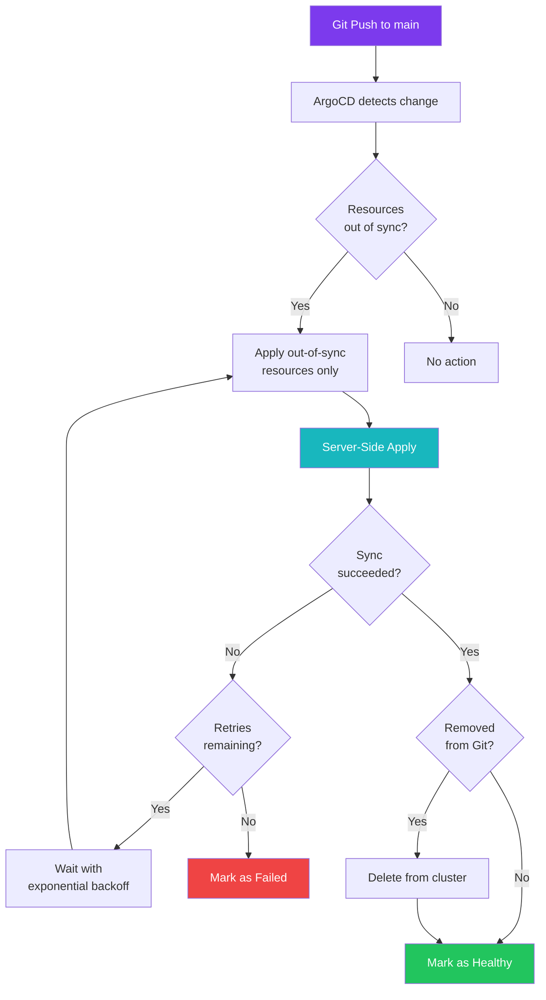

# Sync Policies

Every Application generated by the ApplicationSets shares a common sync policy. This page explains each setting, why it was chosen, and how it affects day-to-day operations.

---

## Policy Overview

```yaml
syncPolicy:
  automated:
    prune: true
    selfHeal: false
    allowEmpty: true
  syncOptions:
    - CreateNamespace=true
    - ServerSideApply=true
    - SkipDryRunOnMissingResource=true
    - ApplyOutOfSyncOnly=true
  retry:
    limit: 5
    backoff:
      duration: 5s
      factor: 2
      maxDuration: 3m
revisionHistoryLimit: 3
```

---

## Automated Sync

| Setting | Value | Description |
|:--------|:------|:------------|
| `prune` | `true` | Resources removed from Git are deleted from the cluster |
| `selfHeal` | `false` | Manual changes in the cluster are **not** automatically reverted |
| `allowEmpty` | `true` | Applications with no manifests are still considered healthy |

### Why `prune: true`

When a resource is removed from the Git repository, ArgoCD should remove it from the cluster. This keeps the cluster in sync with Git and prevents orphaned resources from accumulating over time.

!!! example "Prune in Practice"
    If you delete a ConfigMap from `values.yaml` and push to `main`, ArgoCD will delete that ConfigMap from the cluster on the next sync cycle. Without prune, the ConfigMap would remain in the cluster indefinitely.

### Why `selfHeal: false`

This is a deliberate choice. In many production environments, `selfHeal: true` is the default -- ArgoCD detects drift from the desired state and automatically reverts the cluster to match Git. In the cluster, this is **disabled** for workload applications.

The reasoning:

- **Debugging** -- When troubleshooting a live issue, you may need to temporarily patch a Deployment (e.g., increase replicas, add debug flags). With selfHeal enabled, ArgoCD would immediately revert those changes.
- **Intentional overrides** -- Occasionally, a quick manual fix is needed before a proper Git commit can be made. Disabling selfHeal gives the operator breathing room.
- **Visibility** -- When drift occurs, ArgoCD marks the Application as "OutOfSync" in the UI. This makes drift visible without automatically acting on it, giving the operator a chance to investigate.

!!! warning "Drift Will Persist"
    Because selfHeal is disabled, any manual changes to cluster resources will persist until the next Git push triggers a sync. Always commit your changes to Git when you are done troubleshooting.

!!! note "Bootstrap Exception"
    The `argocd-bootstrap` Application **does** enable `selfHeal: true`. ArgoCD's own resources must always match the desired state to keep the GitOps platform operational.

### Why `allowEmpty: true`

Some applications may temporarily have no manifests (e.g., during migration or when a Kustomization is being restructured). Without `allowEmpty`, ArgoCD would mark these Applications as errored. Enabling it ensures they stay healthy even when empty.

---

## Sync Options

### `CreateNamespace=true`

ArgoCD will create the target namespace if it does not already exist. Since namespace names are derived from the category directory (`networking`, `media`, `security`, etc.), this ensures namespaces are created on first deployment without requiring a separate resource.

### `ServerSideApply=true`

Server-Side Apply (SSA) is used instead of the default client-side `kubectl apply`. SSA offers several advantages:

| Benefit | Explanation |
|:--------|:------------|
| **Field ownership tracking** | Kubernetes tracks which controller owns each field, reducing conflicts |
| **Larger resource support** | SSA avoids the `last-applied-configuration` annotation, which can exceed the 262 KB annotation limit on large resources like CRDs |
| **Better conflict detection** | Conflicts between different managers are surfaced explicitly |
| **CRD compatibility** | Many modern CRDs (e.g., Cilium, Envoy Gateway) are large and work best with SSA |

!!! tip "SSA is Recommended"
    Server-Side Apply is the recommended approach for ArgoCD in clusters that use CRDs heavily. The cluster uses Cilium, Envoy Gateway, Rook Ceph, and other operators that ship large CRDs -- SSA prevents annotation overflow issues.

### `SkipDryRunOnMissingResource=true`

During initial deployment, some resources depend on CRDs that have not yet been installed. For example, an `HTTPRoute` resource depends on the Gateway API CRDs, which may not exist until Envoy Gateway is installed.

Without this option, ArgoCD's dry-run phase would fail because it cannot validate resources against missing CRDs. Skipping the dry run for missing resource types allows the sync to proceed -- the resources will be applied once their CRDs are available.

!!! example "Common Scenario"
    When bootstrapping the cluster from scratch, CRDs for Prometheus (`ServiceMonitor`), Envoy Gateway (`HTTPRoute`), and Ceph (`CephCluster`) may not exist yet. This option prevents sync failures during the initial rollout.

### `ApplyOutOfSyncOnly=true`

ArgoCD only applies resources that are detected as out of sync, rather than re-applying all resources on every sync cycle. This reduces API server load and speeds up sync operations, especially for large Applications with many resources.

---

## Retry Strategy

```yaml
retry:
  limit: 5
  backoff:
    duration: 5s
    factor: 2
    maxDuration: 3m
```

When a sync fails (due to transient errors, resource conflicts, or dependency ordering), ArgoCD retries with exponential backoff:

| Attempt | Wait Time | Cumulative |
|:--------|:----------|:-----------|
| 1st retry | 5s | 5s |
| 2nd retry | 10s | 15s |
| 3rd retry | 20s | 35s |
| 4th retry | 40s | 1m 15s |
| 5th retry | 80s (capped at 3m) | 2m 35s |

After 5 failed attempts, ArgoCD stops retrying and marks the Application as failed. This is usually enough to handle:

- **CRD ordering** -- A resource fails because its CRD is not installed yet, but another Application installs the CRD within the retry window.
- **Dependency chains** -- A Secret or ConfigMap referenced by a Deployment is not yet created.
- **Transient API errors** -- Brief API server unavailability during cluster operations.

---

## Revision History Limit

```yaml
revisionHistoryLimit: 3
```

ArgoCD keeps the last 3 sync revisions per Application. Older history is pruned to reduce etcd storage consumption. In a home lab with frequent pushes, keeping unlimited history would bloat the ArgoCD Application resources over time.

---

## Summary


