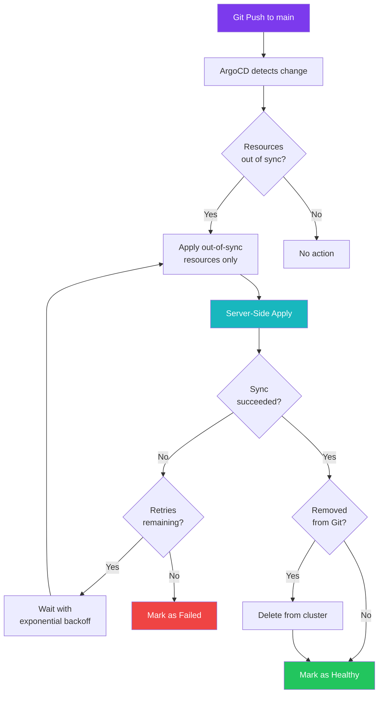

# Sync Policies

Every Application generated by the `pitower` ApplicationSet shares a common sync policy, defined once in `kubernetes/argocd/clusters/pitower.yaml`. This page explains each setting, why it was chosen, and how it affects day-to-day operations.

---

## Policy Overview

```yaml
syncPolicy:
  automated:
    prune: true
    selfHeal: false
  managedNamespaceMetadata:
    labels:
      pod-security.kubernetes.io/enforce: privileged
      pod-security.kubernetes.io/audit: privileged
      pod-security.kubernetes.io/warn: privileged
  syncOptions:
    - CreateNamespace=true
    - ServerSideApply=true
    - SkipDryRunOnMissingResource=true
    - ApplyOutOfSyncOnly=true
    - Timeout=600
  retry:
    limit: 5
    backoff:
      duration: 5s
      factor: 2
      maxDuration: 3m
revisionHistoryLimit: 3
```

---

## Automated Sync

| Setting | Value | Description |
|:--------|:------|:------------|
| `prune` | `true` | Resources removed from Git are deleted from the cluster |
| `selfHeal` | `false` | Manual changes in the cluster are **not** automatically reverted |

### Why `prune: true`

When a resource is removed from the Git repository, ArgoCD should remove it from the cluster. This keeps the cluster in sync with Git and prevents orphaned resources from accumulating over time.

> [!NOTE]
> **Prune in Practice**
>
> If you delete a ConfigMap from `values.yaml` and merge to `main`, ArgoCD deletes that ConfigMap from the cluster on the next sync. Without prune, the ConfigMap would remain in the cluster indefinitely.

### Why `selfHeal: false`

This is a deliberate choice. Many setups enable `selfHeal` so ArgoCD reverts drift automatically; here it is **disabled** for workload applications.

The reasoning:

- **Debugging**: When troubleshooting a live issue, you may need to temporarily patch a Deployment (e.g., increase replicas, add debug flags). With selfHeal enabled, ArgoCD would immediately revert those changes.
- **Intentional overrides**: Occasionally, a quick manual fix is needed before a proper Git commit can be made. Disabling selfHeal gives the operator breathing room.
- **Visibility**: When drift occurs, ArgoCD marks the Application as "OutOfSync" in the UI. This makes drift visible without automatically acting on it, giving the operator a chance to investigate.

> [!WARNING]
> **Drift Will Persist**
>
> Because selfHeal is disabled, manual changes persist until a Git change to that app triggers a sync (`ApplyOutOfSyncOnly` means even then only out-of-sync resources are re-applied). Commit the fix to Git when you are done troubleshooting.

> [!NOTE]
> **Bootstrap Exception**
>
> The `argocd-bootstrap` Application **does** enable `selfHeal: true`. ArgoCD's own resources must always match the desired state to keep the GitOps platform operational.

> [!NOTE]
> **No `allowEmpty`**
>
> Generated Applications do not set `allowEmpty`, so automated sync refuses to prune an Application down to zero resources. Only `argocd-bootstrap` sets `allowEmpty: true`.

---

## Sync Options

### `CreateNamespace=true`

ArgoCD creates the target namespace if it does not exist. Since namespace names are derived from the category directory (`networking`, `media`, `security`, etc.), a new category needs no separate Namespace manifest. `managedNamespaceMetadata` labels those namespaces with the `privileged` Pod Security level.

### `ServerSideApply=true`

Server-Side Apply (SSA) is used instead of the default client-side `kubectl apply`. SSA offers several advantages:

| Benefit | Explanation |
|:--------|:------------|
| **Field ownership tracking** | Kubernetes tracks which controller owns each field, reducing conflicts |
| **Larger resource support** | SSA avoids the `last-applied-configuration` annotation, which can exceed the 262 KB annotation limit on large resources like CRDs |
| **Better conflict detection** | Conflicts between different managers are surfaced explicitly |
| **CRD compatibility** | Many modern CRDs (e.g., Cilium, Envoy Gateway) are large and work best with SSA |

> [!TIP]
> **SSA is Recommended**
>
> The cluster runs Cilium, Envoy Gateway, Rook Ceph, KubeVirt and other operators that ship large CRDs; SSA prevents annotation overflow. ArgoCD also diffs server-side (`controller.diff.server.side: "true"`).

### `SkipDryRunOnMissingResource=true`

During initial deployment, some resources depend on CRDs that have not yet been installed. For example, an `HTTPRoute` resource depends on the Gateway API CRDs, which may not exist until Envoy Gateway is installed.

Without this option, ArgoCD's dry-run phase would fail because it cannot validate resources against missing CRDs. Skipping the dry run for missing resource types allows the sync to proceed; the resources will be applied once their CRDs are available.

> [!NOTE]
> **Common Scenario**
>
> When bootstrapping the cluster from scratch, CRDs for Prometheus (`ServiceMonitor`), Envoy Gateway (`HTTPRoute`), and Ceph (`CephCluster`) may not exist yet. This option prevents sync failures during the initial rollout.

### `ApplyOutOfSyncOnly=true`

ArgoCD only applies resources that are detected as out of sync, rather than re-applying everything on every sync. This reduces API server load, especially for large Applications.

### `Timeout=600`

Caps a sync operation at 600 seconds so a stuck sync cannot run indefinitely. The repo server has a matching render timeout (`reposerver.timeout.seconds: "300"` in `argocd-values.yaml`).

---

## Retry Strategy

```yaml
retry:
  limit: 5
  backoff:
    duration: 5s
    factor: 2
    maxDuration: 3m
```

When a sync fails (due to transient errors, resource conflicts, or dependency ordering), ArgoCD retries with exponential backoff:

| Attempt | Wait Time | Cumulative |
|:--------|:----------|:-----------|
| 1st retry | 5s | 5s |
| 2nd retry | 10s | 15s |
| 3rd retry | 20s | 35s |
| 4th retry | 40s | 1m 15s |
| 5th retry | 80s (capped at 3m) | 2m 35s |

After 5 failed attempts, ArgoCD stops retrying and marks the Application as failed. This is usually enough to handle:

- **CRD ordering**: A resource fails because its CRD is not installed yet, but another Application installs the CRD within the retry window.
- **Dependency chains**: A Secret or ConfigMap referenced by a Deployment is not yet created.
- **Transient API errors**: Brief API server unavailability during cluster operations.

---

## Revision History Limit

```yaml
revisionHistoryLimit: 3
```

ArgoCD keeps the last 3 sync revisions per Application. Older history is pruned to reduce etcd storage consumption. In a home lab with frequent pushes, keeping unlimited history would bloat the ArgoCD Application resources over time.

---

## Summary


```mermaid
flowchart TD
    Push[Git Push to main] --> Detect[ArgoCD detects change]
    Detect --> Diff{Resources\nout of sync?}
    Diff -->|Yes| Apply[Apply out-of-sync\nresources only]
    Diff -->|No| Done[No action]
    Apply --> SSA[Server-Side Apply]
    SSA --> Success{Sync\nsucceeded?}
    Success -->|Yes| Prune{Removed\nfrom Git?}
    Success -->|No| Retry{Retries\nremaining?}
    Retry -->|Yes| Backoff[Wait with\nexponential backoff]
    Backoff --> Apply
    Retry -->|No| Failed[Mark as Failed]
    Prune -->|Yes| Delete[Delete from cluster]
    Prune -->|No| Healthy[Mark as Healthy]
    Delete --> Healthy

    style Push fill:#7c3aed,color:#fff
    style SSA fill:#18b7be,color:#fff
    style Healthy fill:#22c55e,color:#fff
    style Failed fill:#ef4444,color:#fff
```
