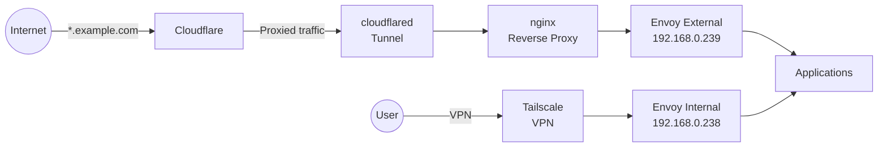

# Home Lab

Welcome to the documentation for the cluster, a Kubernetes home lab built on [Talos Linux](https://www.talos.dev/) and managed entirely through GitOps with [ArgoCD](https://argoproj.github.io/cd/). This repository defines the complete infrastructure-as-code for a mixed-architecture cluster running on Raspberry Pi, Lenovo ThinkPad, and Acemagician mini-PC hardware.

!!! tip "Quick Start"
    New here? Head to the [Getting Started](getting-started/index.md) guide to understand the repository layout and dive into the architecture.

---

## Architecture Overview



---

## Documentation Sections

| Section | Description |
|:--------|:------------|
| [Getting Started](getting-started/index.md) | Repository overview, prerequisites, and architecture |
| [Infrastructure](infrastructure/index.md) | Hardware, Talos Linux, cluster bootstrap, node management |
| [Networking](networking/index.md) | Cilium CNI, Envoy Gateway, DNS, Cloudflare Tunnel, Tailscale |
| [GitOps](gitops/index.md) | ArgoCD setup, ApplicationSets, sync policies |
| [Storage](storage/index.md) | Rook Ceph, OpenEBS, backup and restore |
| [Security](security/index.md) | Authelia, LLDAP, External Secrets, SOPS, cert-manager |
| [Monitoring](monitoring/index.md) | Prometheus, Grafana, Loki, Fluent Bit |
| [Applications](applications/index.md) | Media stack, home automation, self-hosted apps, databases |
| [Operations](operations/index.md) | Justfile recipes, Talos commands, troubleshooting, upgrades |
| [CI/CD](ci-cd/index.md) | GitHub Actions, Docker builds, Renovate |
| [Development](development/index.md) | App template patterns, adding new apps |
| [Reference](reference/index.md) | IP allocation table, full app catalog |

---

## Hardware Summary

### Compute

| Device | Quantity | Role | Architecture |
|:-------|:--------:|:-----|:-------------|
| Raspberry Pi 4 | 4 | Control plane / workers | ARM64 |
| Lenovo ThinkPad T440p | 2 | Workers | AMD64 |
| Acemagician AM06 | 3 | Workers (NVMe / Ceph) | AMD64 |
| Raspberry Pi 3B+ | 1 | Worker | ARM64 |
| Raspberry Pi 2B+ | 4 | Auxiliary / monitoring | ARMv7 |

### Storage

| Device | Details |
|:-------|:--------|
| Synology NAS | 4-bay, 8 TB total |
| Boot drives | 128 GB SSD per node |
| Ceph OSD drives | 512 GB NVMe x3 (Acemagician nodes) |

### Network & Power

| Device | Details |
|:-------|:--------|
| TP-Link 24-port PoE switch | Core switch, powers Pi nodes via PoE |
| NanoPi R5C | Network appliance / router helper |
| Ubiquiti U7-Pro | Primary Wi-Fi access point |
| Ubiquiti U6-Lite | Secondary Wi-Fi access point |
| Eaton 500VA UPS | Battery backup for core infrastructure |

### Other

| Device | Details |
|:-------|:--------|
| BambuLab A1 Combo | 3D printer for cases, mounts, and brackets |

---

## Key Technologies

| Layer | Technology | Purpose |
|:------|:-----------|:--------|
| Operating System | Talos Linux v1.12.4 | Immutable, API-driven Kubernetes OS |
| GitOps | ArgoCD | Declarative continuous delivery |
| CNI | Cilium | eBPF networking with L2 announcements, DSR, Maglev |
| Ingress | Envoy Gateway | Two-gateway architecture (external, internal) |
| DNS | Cloudflare + external-dns | Automated DNS record management |
| Tunnel | cloudflared | Secure external access without port forwarding |
| VPN | Tailscale | Remote access to internal services |
| Storage | Rook Ceph + OpenEBS | Distributed and local persistent storage |
| Secrets | SOPS + age + 1Password Connect | Encrypted secrets in Git, synced via External Secrets |
| Auth | Authelia + LLDAP | SSO and lightweight LDAP directory |
| Monitoring | Prometheus + Grafana + Loki | Metrics, dashboards, and log aggregation |
| Domain | example.com | Managed via Cloudflare |

---

## Repository Structure

```
home-ops/
├── pitower/
│   ├── kubernetes/
│   │   ├── apps/           # Application manifests by category
│   │   │   ├── ai/
│   │   │   ├── banking/
│   │   │   ├── cert-manager/
│   │   │   ├── cloudnative-pg/
│   │   │   ├── home-automation/
│   │   │   ├── kube-system/
│   │   │   ├── media/
│   │   │   ├── monitoring/
│   │   │   ├── networking/
│   │   │   ├── openebs/
│   │   │   ├── rook-ceph/
│   │   │   ├── security/
│   │   │   ├── selfhosted/
│   │   │   └── system/
│   │   ├── argocd/         # ArgoCD app and ApplicationSet definitions
│   │   └── bootstrap/      # Cluster bootstrap resources
│   └── talos/
│       ├── clusterconfig/  # Generated Talos machine configs
│       ├── extensions/     # Talos system extension definitions
│       ├── patches/        # Machine config patches (general + per-node)
│       └── justfile        # Task runner recipes for cluster operations
└── docs/                   # This documentation site
```
