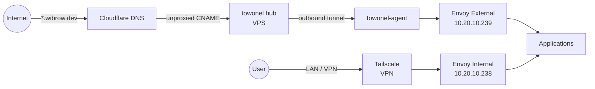

# Home Lab

Welcome to the documentation for `pitower`, a Kubernetes home lab built on [Talos Linux](https://www.talos.dev/) and managed entirely through GitOps with [ArgoCD](https://argoproj.github.io/cd/). This repository defines the complete infrastructure-as-code for an 11-node, mixed-architecture cluster: AMD and Intel mini PCs, a Dell R630, a GPU workstation and Raspberry Pis.

> [!TIP]
> **Quick Start**
>
> New here? Head to the [Getting Started](getting-started/index.md) guide to understand the repository layout and dive into the architecture.

---

## Architecture Overview


```mermaid
flowchart LR
    Internet((Internet))
    CF[Cloudflare DNS]
    Hub[towonel hub\nVPS]
    Agent[towonel-agent]
    EE[Envoy External\n10.20.10.239]
    EI[Envoy Internal\n10.20.10.238]
    Apps[Applications]
    TS[Tailscale\nVPN]
    User((User))

    Internet -->|"*.wibrow.dev"| CF
    CF -->|unproxied CNAME| Hub
    Hub -->|outbound tunnel| Agent
    Agent --> EE
    EE --> Apps

    User -->|LAN / VPN| TS
    TS --> EI
    EI --> Apps
```

---

## Documentation Sections

| Section | Description |
|:--------|:------------|
| [Getting Started](getting-started/index.md) | Repository overview, prerequisites, and architecture |
| [Infrastructure](infrastructure/index.md) | Hardware, Talos Linux, cluster bootstrap, node management |
| [Networking](networking/index.md) | Cilium CNI, Envoy Gateway, DNS, towonel tunnel, Tailscale |
| [GitOps](gitops/index.md) | ArgoCD setup, ApplicationSets, sync policies |
| [Storage](storage/index.md) | Rook Ceph, OpenEBS, Garage S3, backup and restore |
| [Security](security/index.md) | Kanidm, External Secrets, SOPS, cert-manager |
| [Monitoring](monitoring/index.md) | Prometheus, Grafana, VictoriaMetrics, VictoriaLogs, Fluent Bit |
| [Applications](applications/index.md) | Media stack, home automation, self-hosted apps, databases |
| [Operations](operations/index.md) | Justfile recipes, Talos commands, troubleshooting, upgrades |
| [CI/CD](ci-cd/index.md) | GitHub Actions, Docker builds, Renovate |
| [Development](development/index.md) | App template patterns, adding new apps |
| [Reference](reference/index.md) | IP allocation table, full app catalog |

---

## Hardware Summary

### Compute

| Nodes | Hardware | Role | Architecture |
|:------|:---------|:-----|:-------------|
| worker-01..03 | AMD Ryzen mini PCs (16 threads) | Control plane + workloads, Ceph OSDs | AMD64 |
| worker-04..06 | Intel nodes (4 cores, 8 GB) | Workers, Intel iGPU | AMD64 |
| worker-07 | Dell R630 (48 threads, ~755 GiB RAM) | Worker, ZFS storage, Garage S3, CI runners | AMD64 |
| worker-08..10 | Raspberry Pi 4 (4 GB) | Workers | ARM64 |
| worker-ai-01 | ASUS ProArt B850 + RTX 3090 Ti (16 threads, 64 GB) | GPU worker | AMD64 |

### Storage

| Device | Details |
|:-------|:--------|
| Rook Ceph | One SATA SSD per control plane node (worker-01..03), `ceph-block` default StorageClass |
| worker-07 ZFS | `fast` (4 SSDs, two mirrors) and `hdd` (4x 10K SAS, raidz1) pools behind OpenEBS hostpath classes and Garage |
| worker-ai-01 | 2 TB NVMe `models` volume for LLM weights |
| Synology NAS | NFS server `data` for media and bulk data |

### Network & Power

| Device | Details |
|:-------|:--------|
| UniFi Cloud Gateway Fiber | Router, VLANs, DHCP, BGP peer for LoadBalancer and pod routes |
| TP-Link PoE switch | Powers the Raspberry Pi nodes |
| UniFi access points | Wi-Fi |
| PowerWalker UPS | Battery backup in the rack |

The hardware lives in an open-frame 12U rack with a patch panel and PDU. See [Hardware](infrastructure/hardware.md) for the full inventory.

---

## Key Technologies

| Layer | Technology | Purpose |
|:------|:-----------|:--------|
| Operating System | Talos Linux v1.14.0 | Immutable, API-driven Kubernetes OS, lifecycle managed with [topf](https://github.com/postfinance/topf) |
| Kubernetes | v1.36.1 | Dual-stack (IPv4 primary) |
| GitOps | ArgoCD (chart 10.9.6) | One ApplicationSet with a Git directory generator |
| CNI | Cilium 1.20.2 | eBPF, kube-proxy replacement, native routing, L2 + BGP announcements; Multus for secondary interfaces |
| Ingress | Envoy Gateway | Gateway API, `envoy-external` and `envoy-internal` gateways |
| DNS | Cloudflare + external-dns | Automated DNS record management (Cloudflare and UniFi) |
| Tunnel | towonel | Self-hosted tunnel for public ingress, no port forwarding |
| VPN | Tailscale | Remote access via a subnet router |
| Storage | Rook Ceph + OpenEBS + Garage | Distributed block, local hostpath, and S3 |
| Backups | kopiur (Kopia) | PVC snapshots to Garage S3; CNPG via the Barman Cloud plugin |
| Databases | CloudNativePG, Dragonfly, ClickHouse | PostgreSQL clusters, Redis-compatible cache, analytics |
| Secrets | External Secrets + Infisical, SOPS + age | Secrets synced from Infisical; bootstrap and Talos secrets encrypted in Git |
| Auth | Kanidm | OIDC / OAuth2 identity provider (+ LDAP) |
| Monitoring | kube-prometheus-stack, Grafana Operator, VictoriaMetrics, VictoriaLogs, Fluent Bit, Tempo, Gatus | Metrics, dashboards, logs, traces, and uptime |
| VMs | KubeVirt + CDI | Virtual machines on the AMD64 nodes |
| Domain | wibrow.dev | Managed via Cloudflare |

---

## Repository Structure

```
home-ops/
├── .github/workflows/   # CI/CD pipelines
├── .justfiles/          # just modules (docs, k8s, kanidm, sops, terraform, vm, ...)
├── ansible/             # Host provisioning (NUT, towonel hub, ...)
├── docs/                # These pages (Markdown)
├── kubernetes/
│   ├── apps/pitower/    # Application manifests: {category}/{app}
│   ├── argocd/          # ApplicationSets (applied manually)
│   ├── bootstrap/       # ArgoCD install, self-managed after bootstrap
│   └── components/      # Reusable kustomize components (kopiur, pvc, cnpg-db-shared)
├── talos/
│   └── pitower/         # topf.yaml, patches (all/, control-plane/, node/<host>/), extensions, addons
├── site/                # Astro project that builds docs/ into this site
├── terraform/           # AWS, Cloudflare, UniFi, and more
├── justfile             # Root task runner (imports the modules above)
└── mise.toml            # Tool versions and environment (KUBECONFIG, SOPS_AGE_KEY_FILE)
```
