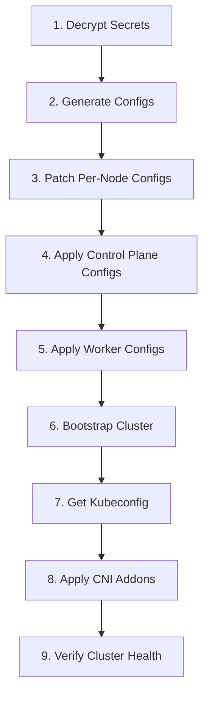

# Cluster Bootstrap

This page documents the full process of bootstrapping the cluster from scratch. All steps use `just` recipes defined in `pitower/talos/justfile`.

## Prerequisites

Before starting, ensure the following are available:

- [x] **talosctl** installed (matching Talos v1.12.4)
- [x] **kubectl** installed
- [x] **just** command runner installed
- [x] **sops** installed and configured with the correct age key or GPG key
- [x] **kustomize** installed (for building CNI addons)
- [x] All nodes are powered on and booted into Talos maintenance mode
- [x] Network connectivity between your workstation and all node IPs
- [x] `secrets.sops.yaml` present in `pitower/talos/`

!!! warning "SOPS Key Required"
    The `secrets.sops.yaml` file contains the cluster secrets (CA certs, tokens, encryption keys). You must have the corresponding SOPS decryption key (age or GPG) available in your environment.

## Bootstrap Steps

### Overview



### Step 1: Generate Base Machine Configs

```bash
cd pitower/talos
just config
```

This recipe:

1. Decrypts `secrets.sops.yaml` to `secrets.yaml` using SOPS
2. Runs `talosctl gen config` with:
    - Cluster name: `home-ops`
    - Endpoint: `https://192.168.0.200:6443`
    - Global patch: `patches/general.patch`
    - Control plane patch: `patches/controlplane.patch`
3. Outputs `controlplane.yaml` and `worker.yaml` into `clusterconfig/`

!!! info "The decrypted `secrets.yaml` is written to disk temporarily. It is not committed to Git."

### Step 2: Apply Per-Node Patches

```bash
just patch
```

This applies node-specific patches from `patches/nodes/` to create individual config files:

| Base Config | Node Patches Applied |
|-------------|---------------------|
| `controlplane.yaml` | `worker-01.patch`, `worker-02.patch`, `worker-03.patch` |
| `worker.yaml` | `worker-04.patch`, `worker-05.patch`, `worker-06.patch` |
| `worker.yaml` | `worker-pi-01.patch`, `worker-pi-02.patch`, `worker-pi-03.patch` |

Output files are written to `clusterconfig/` (e.g., `worker-01.yaml`, `worker-pi-02.yaml`).

### Step 3: Apply Configs to Control Plane Nodes

```bash
just apply-controlplanes
```

Applies the generated configs to the three control plane nodes:

| Node | IP | Config File |
|------|-----|-------------|
| worker-01 | 192.168.0.201 | `worker-01.yaml` |
| worker-02 | 192.168.0.202 | `worker-02.yaml` |
| worker-03 | 192.168.0.203 | `worker-03.yaml` |

!!! tip "Apply Order"
    Control plane configs must be applied before workers. The control plane nodes form the etcd cluster that workers will join.

### Step 4: Apply Configs to Worker Nodes

```bash
just apply-workers
```

Applies configs to the worker nodes:

| Node | IP | Config File |
|------|-----|-------------|
| worker-04 | 192.168.0.204 | `worker-04.yaml` |
| worker-pi-01 | 192.168.0.211 | `worker-pi-01.yaml` |
| worker-pi-02 | 192.168.0.212 | `worker-pi-02.yaml` |
| worker-pi-03 | 192.168.0.213 | `worker-pi-03.yaml` |

### Step 5: Bootstrap the Cluster

```bash
just bootstrap
```

This recipe:

1. **Bootstraps etcd** on the first control plane node (`192.168.0.201`)
2. **Retrieves kubeconfig** from the VIP (`192.168.0.200`)

```bash
talosctl bootstrap --nodes 192.168.0.201
talosctl kubeconfig --nodes 192.168.0.200
```

!!! danger "Bootstrap is a one-time operation"
    The `bootstrap` command should only be run **once** during initial cluster creation. Running it again on an existing cluster can corrupt etcd.

### Step 6: Verify Talos Node Health

Before applying addons, confirm all nodes are up:

```bash
talosctl get members
```

Expected output should show all nodes with their IPs and roles.

## Post-Bootstrap

### Apply CNI and Addons

The cluster starts with no CNI (`cni.name: none`) and no kube-proxy (`proxy.disabled: true`). Cilium and the kubelet CSR approver must be installed as the first addons:

```bash
just addons
```

This runs:

```bash
kustomize build ./addons --enable-helm | kubectl apply -f -
```

The addons kustomization includes:

| Addon | Namespace | Purpose |
|-------|-----------|---------|
| **Cilium** (v1.18.7) | `kube-system` | CNI, kube-proxy replacement, network policies |
| **kubelet-csr-approver** (v1.2.13) | `system-controllers` | Auto-approves kubelet certificate signing requests |

!!! warning "Cilium Must Be Applied First"
    Pods will remain in `Pending` state until Cilium is installed because there is no CNI to assign pod IPs. The `just addons` step is critical and must be run immediately after bootstrap.

### Verify Cluster Health

After addons are applied, verify the cluster is healthy:

=== "Check Node Status"

    ```bash
    kubectl get nodes -o wide
    ```

    All nodes should show `Ready` status.

=== "Check Cilium Status"

    ```bash
    kubectl -n kube-system get pods -l app.kubernetes.io/name=cilium
    ```

    All Cilium agent pods should be `Running`.

=== "Check System Pods"

    ```bash
    kubectl get pods -A
    ```

    Core system pods (kube-apiserver, kube-controller-manager, kube-scheduler, etcd) should be `Running` on control plane nodes.

=== "Talos Health"

    ```bash
    talosctl health --nodes 192.168.0.201
    ```

    Should report all checks passing.

## Troubleshooting

??? failure "Nodes not appearing after bootstrap"
    - Verify network connectivity: `talosctl get addresses -n <node-ip>`
    - Check if the node received its config: `talosctl get machineconfig -n <node-ip>`
    - Ensure the bootstrap node (192.168.0.201) completed etcd initialization

??? failure "Pods stuck in Pending after bootstrap"
    This is expected until Cilium is installed. Run `just addons` to install the CNI.

??? failure "Certificate errors after bootstrap"
    The kubelet CSR approver handles automatic certificate approval. If nodes show certificate errors:

    ```bash
    kubectl get csr
    kubectl certificate approve <csr-name>
    ```

    Once the kubelet-csr-approver is running, future CSRs are approved automatically.

??? failure "SOPS decryption fails"
    Ensure your SOPS key is available:

    - **age**: Set `SOPS_AGE_KEY_FILE` environment variable
    - **GPG**: Ensure the GPG key is in your keyring
