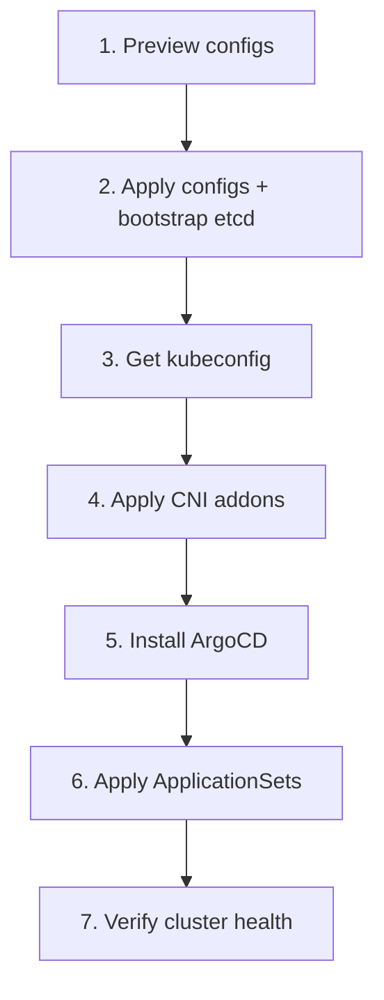

# Cluster Bootstrap

This page documents bootstrapping the cluster from scratch. Talos steps use the `just talos pitower <recipe>` recipes (defined in `talos/talos.justfile` and `talos/pitower/justfile`), which wrap [topf](https://github.com/postfinance/topf). Run them from the repository root so `mise.toml` sets `KUBECONFIG` and `SOPS_AGE_KEY_FILE`.

## Prerequisites

- [x] **topf**, **sops**, **kubectl**, **kustomize**, **helm**, and **just** installed (see [Prerequisites](../getting-started/prerequisites.md))
- [x] The age key available via `SOPS_AGE_KEY_FILE`, so topf can decrypt `talos/pitower/secrets.sops.yaml`
- [x] Every schematic in `talos/pitower/extensions/` submitted to the Image Factory (see [Talos Linux](talos-linux.md#factory-schematics))
- [x] All nodes booted into Talos maintenance mode and holding their VLAN 20 DHCP reservations (`terraform/unifi/reservations.tf`)
- [x] Network connectivity from your workstation to `10.20.10.0/24`

> [!WARNING]
> **SOPS Key Required**
>
> `secrets.sops.yaml` holds the cluster secrets (CA certs, tokens, encryption keys). Without the age key topf cannot render any machine config.

## Bootstrap Steps

### Overview


```mermaid
flowchart TD
    A[1. Preview configs] --> B[2. Apply configs + bootstrap etcd]
    B --> C[3. Get kubeconfig]
    C --> D[4. Apply CNI addons]
    D --> E[5. Install ArgoCD]
    E --> F[6. Apply ApplicationSets]
    F --> G[7. Verify cluster health]
```

### Step 1: Preview the Machine Configs

```bash
just talos pitower render   # writes full configs to talos/pitower/output/
```

topf generates base configs from `topf.yaml` and the secrets, then layers `all/`, `control-plane/`, and `node/<host>/` patches per node. Review the output before touching any node. `output/` is not committed.

### Step 2: Apply Configs and Bootstrap

```bash
just talos pitower bootstrap
```

This runs `topf apply --auto-bootstrap`: it pushes each node's config while the nodes are in maintenance mode, then bootstraps etcd on the first control plane once. The control planes come up behind the VIP `10.20.10.0`, and workers join through it.

> [!CAUTION]
> **Bootstrap is a one-time operation**
>
> Only run this when creating a new cluster. For an existing cluster use `just talos pitower apply`.

### Step 3: Get a Kubeconfig

```bash
just talos pitower kubeconfig
```

This writes a short-lived (12h) admin kubeconfig to `talos/pitower/output/kubeconfig` and prints the `export KUBECONFIG=...` line. The long-lived kubeconfig used day to day is `~/.kube/pitower.yaml`.

## Post-Bootstrap

### Step 4: Apply CNI and Addons

The cluster starts with no CNI (Flannel is deleted) and no kube-proxy. Install Cilium and the kubelet CSR approver first:

```bash
just talos pitower addons
```

This runs `kustomize build ./addons --enable-helm | kubectl apply -f -` in `talos/pitower`:

| Addon | Namespace | Purpose |
|-------|-----------|---------|
| **Cilium** (1.20.2) | `kube-system` | CNI, kube-proxy replacement |
| **kubelet-csr-approver** (1.2.15) | `system-controllers` | Approves kubelet serving certificate CSRs |

> [!WARNING]
> **Cilium Must Be Applied First**
>
> Pods stay `Pending` until Cilium is installed, because nothing assigns pod IPs. Once ArgoCD is up, `kube-system/cilium` and `system/kubelet-csr-approver` take these over with the full configuration (BGP, L2, IPv6).

### Step 5: Install ArgoCD

ArgoCD installs itself from `kubernetes/bootstrap/` (the `argo-cd` Helm chart 10.9.6 plus namespace, AppProject, repo credentials, and ExternalSecrets). The SOPS-encrypted secrets in that directory (`secrets.sops.yaml`, `age-key.sops.yaml`) are not part of the kustomization and are applied by hand with `sops -d ... | kubectl apply -f -`; they include the Infisical machine identity (`security/universal-auth-credentials`) that External Secrets needs.

Then apply the self-managing bootstrap Application:

```bash
kubectl apply -f kubernetes/bootstrap/app-argocd.yaml
```

See [ArgoCD Setup](../gitops/argocd-setup.md) for details.

### Step 6: Apply the ApplicationSets

ApplicationSets are applied manually and are not managed by ArgoCD:

```bash
kubectl apply -f kubernetes/argocd/clusters/pitower.yaml
kubectl apply -f kubernetes/argocd/ack-applicationset.yaml
```

The `pitower` ApplicationSet discovers every `kubernetes/apps/pitower/{category}/{app}` directory and creates `pitower-{category}-{app}` Applications.

> [!NOTE]
> **Ordering**
>
> Many apps depend on External Secrets, the `infisical` ClusterSecretStore, Rook Ceph, and CNPG. Until those are healthy, dependent Applications retry and may show `Degraded`. ArgoCD's retry policy usually settles this without intervention.

### Step 7: Verify Cluster Health

#### Nodes

```bash
kubectl get nodes -o wide
```

All 11 nodes should be `Ready`.

#### Cilium

```bash
kubectl -n kube-system get pods -l app.kubernetes.io/name=cilium-agent
```

One agent per node, all `Running`.

#### ArgoCD

```bash
kubectl -n argocd get applications
```

Applications should converge to `Synced` / `Healthy`.

#### Talos

```bash
just talos pitower talosconfig
just talos pitower health
```

Should report all checks passing.

## Troubleshooting

<details>
<summary>Nodes not appearing after bootstrap</summary>

- Check the node holds its VLAN 20 address: `talosctl -n <node-ip> get addresses`
- Check the node received its config: `talosctl -n <node-ip> get machineconfig`
- Confirm the schematic was submitted to the Image Factory; an unknown schematic makes the installer image 404

</details>

<details>
<summary>Pods stuck in Pending after bootstrap</summary>

Expected until Cilium is installed. Run `just talos pitower addons`.

</details>

<details>
<summary>Kubelet serving certificate CSRs pending</summary>

kubelet-csr-approver approves them once it runs. It resolves the node name and denies the CSR unless the name resolves to the node's VLAN 20 IP. Approve manually in the meantime:

```bash
kubectl get csr
kubectl certificate approve <csr-name>
```

</details>

<details>
<summary>SOPS decryption fails</summary>

Make sure `SOPS_AGE_KEY_FILE` points at the age key. `mise.toml` sets it to `~/.config/mise/age.txt`; the Talos justfile falls back to `age.key` at the repository root.

</details>
