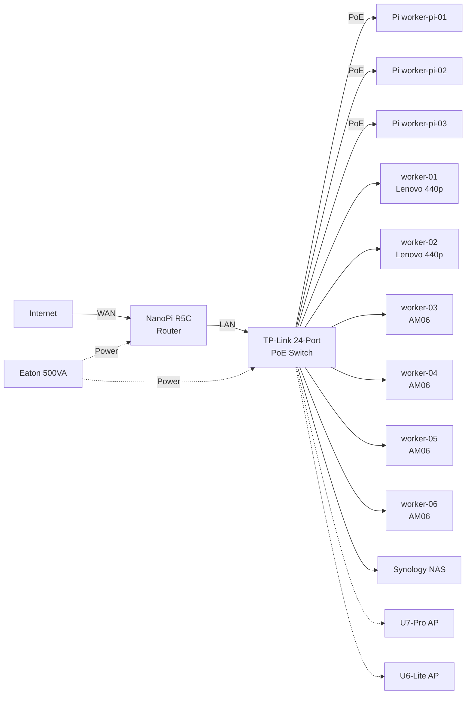

# Hardware Inventory

The cluster is built from a mix of ARM and x86 hardware. Raspberry Pi 4 nodes handle lightweight workloads and control plane duties, while Acemagician AM06 mini PCs provide Intel GPUs and NVMe storage for Ceph.

## Compute Nodes

### Control Plane + Workers

These nodes run control plane components **and** schedule workloads (`allowSchedulingOnControlPlanes: true`). The VIP `192.168.0.200` floats across all three for API server high availability.

| Hostname | Hardware | IP | Role | CPU | RAM | Storage | Image Schematic |
|----------|----------|----|------|-----|-----|---------|-----------------|
| worker-01 | Lenovo 440p | 192.168.0.201 | Control Plane + Worker | AMD | -- | -- | `amd` |
| worker-02 | Lenovo 440p | 192.168.0.202 | Control Plane + Worker | AMD | -- | -- | `amd` |
| worker-03 | Acemagician AM06 | 192.168.0.203 | Control Plane + Worker | AMD | -- | NVMe (Ceph) | `amd` |

!!! info "VIP for API Server"
    All control plane nodes share the virtual IP `192.168.0.200` for the Kubernetes API endpoint (`https://192.168.0.200:6443`).

### Worker Nodes (Intel)

| Hostname | Hardware | IP | Role | CPU | RAM | Storage | Image Schematic |
|----------|----------|----|------|-----|-----|---------|-----------------|
| worker-04 | Acemagician AM06 | 192.168.0.204 | Worker | Intel | -- | eMMC + NVMe (Ceph) | `intel` |
| worker-05 | Acemagician AM06 | -- | Worker | Intel | -- | NVMe (Ceph) | `intel` |
| worker-06 | Acemagician AM06 | -- | Worker | Intel | -- | NVMe (Ceph) | `intel` |

!!! note "Intel GPU Workloads"
    The Acemagician AM06 nodes include Intel integrated GPUs (i915) with firmware loaded via Talos extensions. These are used for hardware transcoding in applications like Jellyfin.

### Worker Nodes (Raspberry Pi)

| Hostname | Hardware | IP | Role | Image Schematic |
|----------|----------|----|------|-----------------|
| worker-pi-01 | Raspberry Pi 4 | 192.168.0.211 | Worker | `rpi-poe` |
| worker-pi-02 | Raspberry Pi 4 | 192.168.0.212 | Worker | `rpi-poe` |
| worker-pi-03 | Raspberry Pi 4 | 192.168.0.213 | Worker | `rpi-poe` |

!!! tip "PoE Hat Fan Control"
    The Raspberry Pi nodes use PoE hats for power delivery. Fan speed thresholds are configured in the Talos overlay:

    ```
    dtparam=poe_fan_temp0=50000   # 50C
    dtparam=poe_fan_temp1=60000   # 60C
    dtparam=poe_fan_temp2=70000   # 70C
    dtparam=poe_fan_temp3=80000   # 80C
    ```

### Other Raspberry Pis (Not in cluster)

| Quantity | Model | Use |
|----------|-------|-----|
| 4 | Raspberry Pi 2B+ | Spare / other projects |
| 1 | Raspberry Pi 3B+ | Spare / other projects |

## Network Equipment

| Device | Model | Purpose |
|--------|-------|---------|
| Switch | TP-Link 24-Port PoE | Core network switch, powers Pi nodes via PoE |
| Router | NanoPi R5C | Primary router |
| Access Point | Ubiquiti U7-Pro | Wi-Fi 7 AP |
| Access Point | Ubiquiti U6-Lite | Wi-Fi 6 AP |

## Storage

| Device | Capacity | Purpose |
|--------|----------|---------|
| Synology 4-Bay NAS | 8 TB | Bulk storage (NFS) |
| 128 GB SSD | x3 | Boot drives |
| 512 GB NVMe | x3 | Ceph OSD storage (on Acemagician AM06 nodes) |

!!! info "Ceph Storage"
    The three 512 GB NVMe drives in the Acemagician AM06 nodes form a Rook-Ceph cluster, providing replicated block storage for persistent volumes.

## Power

| Device | Model | Capacity |
|--------|-------|----------|
| UPS | Eaton 500VA | Protects switch, router, and critical nodes |

## Network Topology


