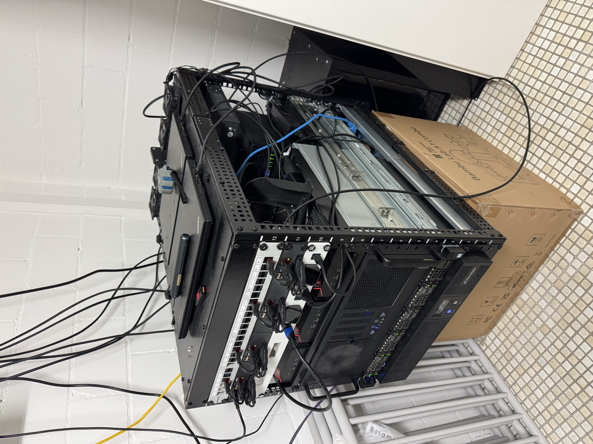
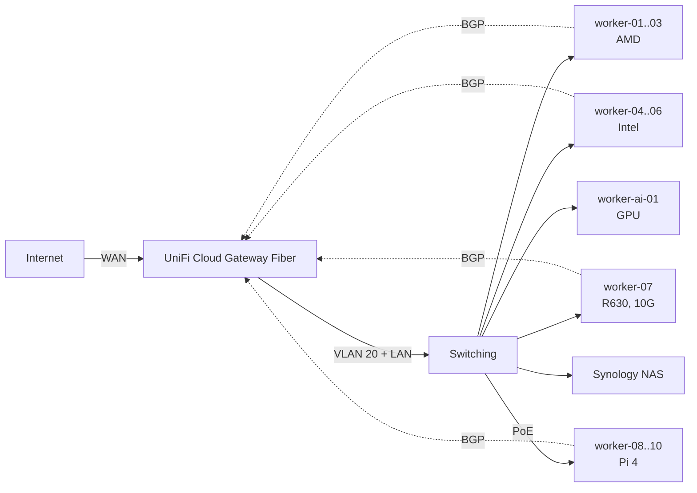

# Hardware Inventory

The cluster is built from a mix of x86 and ARM hardware, mounted in an open-frame 12U rack together with a patch panel, a PDU, and a UPS. AMD mini PCs run the control plane and Ceph, a Dell R630 provides bulk compute and ZFS storage, a GPU workstation runs AI workloads, and Intel nodes and Raspberry Pis fill out the worker pool.

All nodes are on VLAN 20 with static DHCP reservations (`terraform/unifi/reservations.tf`). CPU and memory figures below are what Kubernetes reports.

## Compute Nodes

### Control Plane + Workers

These nodes run the control plane **and** schedule workloads: the control-plane taint is removed in `talos/pitower/control-plane/01-cluster.yaml`, with `systemReserved`/`kubeReserved` set so app load cannot starve the API server. The VIP `10.20.10.0` floats across all three (`https://10.20.10.0:6443`).

| Hostname | Hardware | IP | CPU | RAM | Storage | Schematic |
|----------|----------|----|-----|-----|---------|-----------|
| worker-01 | AMD Ryzen mini PC | 10.20.10.1 | 16 threads | 16 GB | NVMe boot + SATA SSD (Ceph OSD) | `amd` |
| worker-02 | AMD Ryzen mini PC | 10.20.10.2 | 16 threads | 32 GB | NVMe boot + SATA SSD (Ceph OSD) | `amd` |
| worker-03 | AMD Ryzen mini PC | 10.20.10.3 | 16 threads | 32 GB | NVMe boot + SATA SSD (Ceph OSD) | `amd` |

> [!NOTE]
> **AMD iGPU and uinput**
>
> The `amd` schematic adds the `amdgpu` driver and firmware, and `uinput` for the Sunshine-based `dev/dev-desktop` (control-plane only).

### Intel Workers

| Hostname | IP | CPU | RAM | Boot disk | Notes | Schematic |
|----------|----|-----|-----|-----------|-------|-----------|
| worker-04 | 10.20.10.4 | 4 cores | 8 GB | eMMC | `dedicated=media-home` taint | `intel` |
| worker-05 | 10.20.10.5 | 4 cores | 8 GB | Samsung SSD | Also on the untagged LAN (`networking/lan`); no VT-x | `intel` |
| worker-06 | 10.20.10.6 | 4 cores | 8 GB | Samsung SSD | Also on the untagged LAN (`networking/lan`); no VT-x | `intel` |

> [!NOTE]
> **Intel GPU Workloads**
>
> These nodes have Intel integrated GPUs (firmware via the `i915-ucode` extension), exposed through `system/intel-device-plugins` for hardware transcoding. worker-05/06 have VT-x disabled in the BIOS, so KubeVirt cannot run VMs there.

### worker-07 (Dell R630)

A bare-metal Dell R630 (ex `proxmox-01`, see the [migration record](proxmox-01-migration.md)) at `10.20.10.7`, on a 10G Intel X710 port.

| Property | Value |
|----------|-------|
| CPU | 48 threads |
| RAM | ~755 GiB usable (ZFS ARC capped at 64 GiB) |
| Disks | Six 745 GiB SAS SSDs and four ~600 GB 10K SAS HDDs behind the PERC in HBA mode |
| Talos system disk | md RAID1 across two SSDs (`RAIDArrayConfig`, selected by WWID) |
| ZFS `fast` | Four SSDs as two mirrors: `/var/mnt/extra`, `/var/mnt/runners`, Garage metadata |
| ZFS `hdd` | Four HDDs as raidz1: `/var/mnt/media`, Garage blocks |
| Schematic | `r630` (adds the `zfs` extension) |

The OpenEBS classes `openebs-hostpath-fast`, `-runners`, and `-media` only provision here, and the self-hosted `home-ops` CI runners are pinned to it. It also runs Garage S3. ZFS is administered from a privileged `hostPID` pod with `nsenter`, since Talos has no shell; `system/zfs-scrub` scrubs both pools monthly.

### worker-ai-01 (GPU)

A bare-metal ASUS ProArt B850 board with an NVIDIA RTX 3090 Ti at `10.20.10.11`, dual-booted with Bazzite.

| Property | Value |
|----------|-------|
| CPU | AMD, 16 threads |
| RAM | 64 GB |
| System disk | 1 TB Kingston NV3 (shared with Bazzite; Talos EPHEMERAL capped at 200 GiB) |
| Models disk | 2 TB Samsung 9100 Pro, Talos user volume `models` at `/var/mnt/models` (`openebs-hostpath-models`) |
| Schematic | `nvidia` (open GPU kernel modules + container toolkit) |
| Taint | `dedicated=gpu:NoSchedule` |

The GPU is shared through the NVIDIA DRA driver (`system/dra-driver-nvidia-gpu`) and can be passed through to a KubeVirt VM with `vfio-pci`. `system/nvidia-power-limit` caps it at 300 W. Because it is often booted into Bazzite, it is excluded from Cilium's L2 and BGP announcements.

### Raspberry Pi Workers

| Hostname | IP | Model | RAM | Boot disk | Schematic |
|----------|----|-------|-----|-----------|-----------|
| worker-08 | 10.20.10.8 | Raspberry Pi 4 (PoE HAT) | 4 GB | 128 GB USB SSD | `rpi-poe` |
| worker-09 | 10.20.10.9 | Raspberry Pi 4 (PoE HAT) | 4 GB | 128 GB USB SSD | `rpi-poe` |
| worker-10 | 10.20.10.10 | Raspberry Pi 4 (PoE HAT) | 4 GB | 128 GB USB SSD | `rpi-poe` |

The `rpi-poe` schematic uses the `sbc-raspberrypi` overlay and sets PoE HAT fan thresholds. KubeVirt workloads are kept off these arm64 nodes.

## Network Equipment

| Device | Purpose |
|--------|---------|
| UniFi Cloud Gateway Fiber | Router, VLANs, DHCP, BGP peer (ASN 64512) for LoadBalancer and pod routes |
| TP-Link PoE switch | Powers the Raspberry Pi nodes |
| UniFi access points | Wi-Fi |
| Patch panel | Front of the rack |

Networks (`terraform/unifi/networks.tf`):

| Network | VLAN | Subnet |
|---------|------|--------|
| Default | untagged | `192.168.0.0/24` |
| home | 10 | `10.10.0.0/16` |
| servers | 20 | `10.20.0.0/16` |
| management | 50 | `10.50.0.0/24` |
| iot | 101 | `10.101.0.0/16` |

## Storage

| Device | Purpose |
|--------|---------|
| Ceph OSDs | One SATA SSD (~500 GB) on each of worker-01..03, `ceph-block` default StorageClass |
| worker-07 ZFS | `fast` and `hdd` pools, OpenEBS hostpath classes and Garage S3 |
| worker-ai-01 NVMe | 2 TB `models` volume |
| Synology NAS (`data`, `10.20.10.100`) | NFS for media and bulk data |

## Power

| Device | Purpose |
|--------|---------|
| PowerWalker UPS | In the rack |
| PDU | Power distribution in the rack |
| Eaton 5S, CyberPower PR1500LCDRT2U | UPSes served by the NUT host (`nut`, Ansible role `nut`) and scraped by `monitoring/nut-exporter` |

## Network Topology

```mermaid
graph LR
    Internet -->|WAN| GW[UniFi Cloud Gateway Fiber]
    GW -->|VLAN 20 + LAN| SW[Switching]

    SW --> CP[worker-01..03<br/>AMD]
    SW --> IN[worker-04..06<br/>Intel]
    SW --> R630[worker-07<br/>R630, 10G]
    SW -->|PoE| PI[worker-08..10<br/>Pi 4]
    SW --> AI[worker-ai-01<br/>GPU]
    SW --> NAS[Synology NAS]

    CP & IN & R630 & PI -.->|BGP| GW
```
