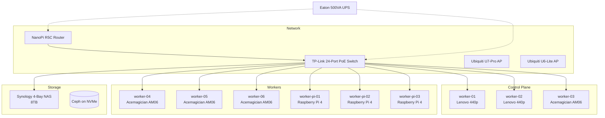

# Infrastructure

The cluster runs on a mix of ARM and x86 hardware, managed entirely through [Talos Linux](https://www.talos.dev/) -- an immutable, API-driven Kubernetes OS. This section covers the physical and logical layers that make up the cluster.

## Overview

## Sections

| Page | Description |
|------|-------------|
| [Hardware](hardware.md) | Full hardware inventory -- compute nodes, network gear, and storage |
| [Talos Linux](talos-linux.md) | Talos OS configuration, factory images, extensions, and patches |
| [Cluster Bootstrap](cluster-bootstrap.md) | Step-by-step guide to bootstrapping the cluster from scratch |
| [Node Management](node-management.md) | Day-2 operations: applying configs, rebooting, resetting, and upgrading nodes |

## Key Design Decisions

- **Talos Linux** was chosen over traditional distributions for its immutability, minimal attack surface, and fully API-driven management (no SSH, no shell).
- **Mixed architecture** (ARM + x86) is supported through Talos factory images with per-node schematics and extensions.
- **Control plane nodes also run workloads** (`allowSchedulingOnControlPlanes: true`) to maximize resource utilization.
- **Cilium** replaces kube-proxy entirely and serves as the CNI, configured at bootstrap time via kustomize addons.
- **PoE** powers the Raspberry Pi nodes directly from the switch, reducing cable clutter.
