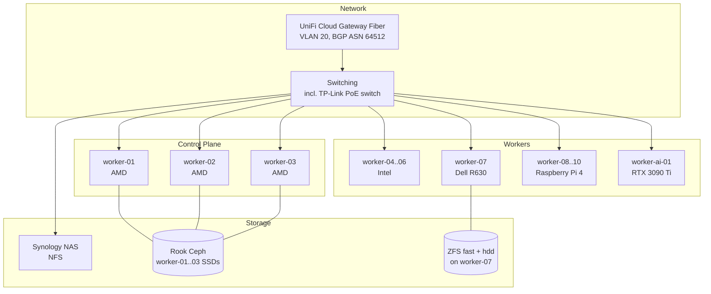

# Infrastructure

The cluster runs on a mix of x86 and ARM hardware, managed entirely through [Talos Linux](https://www.talos.dev/), an immutable, API-driven Kubernetes OS, with its lifecycle driven by [topf](https://github.com/postfinance/topf). This section covers the physical and logical layers that make up the cluster.

## Overview

```mermaid
graph TD
    subgraph Network
        GW[UniFi Cloud Gateway Fiber<br/>VLAN 20, BGP ASN 64512]
        SW[Switching<br/>incl. TP-Link PoE switch]
    end

    subgraph Control Plane
        CP1[worker-01<br/>AMD]
        CP2[worker-02<br/>AMD]
        CP3[worker-03<br/>AMD]
    end

    subgraph Workers
        W46[worker-04..06<br/>Intel]
        W7[worker-07<br/>Dell R630]
        W810[worker-08..10<br/>Raspberry Pi 4]
        AI[worker-ai-01<br/>RTX 3090 Ti]
    end

    subgraph Storage
        SYN[Synology NAS<br/>NFS]
        CEPH[(Rook Ceph<br/>worker-01..03 SSDs)]
        ZFS[(ZFS fast + hdd<br/>on worker-07)]
    end

    GW --> SW
    SW --> CP1 & CP2 & CP3
    SW --> W46 & W7 & W810 & AI
    SW --> SYN
    CP1 & CP2 & CP3 --- CEPH
    W7 --- ZFS
```

## Sections

| Page | Description |
|------|-------------|
| [Hardware](hardware.md) | Hardware inventory: compute nodes, storage, network, and power |
| [Talos Linux](talos-linux.md) | Talos configuration with topf, factory schematics, extensions, and patches |
| [Cluster Bootstrap](cluster-bootstrap.md) | Bootstrapping the cluster from scratch |
| [Node Management](node-management.md) | Day-2 operations: applying configs, rebooting, resetting, and upgrading nodes |
| [proxmox-01 Migration](proxmox-01-migration.md) | Historical record of turning the Proxmox host into worker-07 |

## Key Design Decisions

- **Talos Linux** was chosen over traditional distributions for its immutability, minimal attack surface, and fully API-driven management (no SSH, no shell).
- **topf** owns the Talos lifecycle: one `topf.yaml` lists every node, and patches are layered from `all/`, `control-plane/`, and `node/<host>/`. CI applies them on merge to `main`.
- **Mixed architecture** (amd64 + arm64) is handled with per-node-type Image Factory schematics (`amd`, `intel`, `r630`, `rpi-poe`, `nvidia`).
- **Control plane nodes also run workloads**: the control-plane taint is removed, with system and kube reserved resources carved out so app spikes cannot starve the API server.
- **Cilium** replaces kube-proxy entirely and is installed as a bootstrap addon, then handed over to ArgoCD.
- **Everything rides VLAN 20**: nodes have static DHCP reservations in `terraform/unifi`, and the control planes share the API VIP `10.20.10.0`.
- **PoE** powers the Raspberry Pi nodes directly from the switch.
