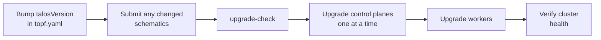

# Node Management

Day-to-day operations for managing Talos nodes in the cluster. Lifecycle changes go through [topf](https://github.com/postfinance/topf) via `just talos pitower <recipe>` (recipes in `talos/talos.justfile` and `talos/pitower/justfile`); `talosctl` is for diagnostics. Run recipes from the repository root so `mise.toml` sets `SOPS_AGE_KEY_FILE` and `KUBECONFIG`.

> [!WARNING]
> **Silence alerts first**
>
> Before draining, rebooting, or upgrading nodes, add a scoped Alertmanager silence and expire it once the work is verified (see `AGENTS.md`).

## Applying Configuration Changes

### Through CI

The **Talos Apply** GitHub Actions workflow runs `topf apply` for the whole cluster on every merge to `main` that touches `talos/`. It runs on the self-hosted `home-ops` runners, which are pinned to worker-07: while worker-07 is drained or down the job queues, so apply locally instead. A change that reboots worker-07 also kills the job mid-run; finish it with a local apply.

### Locally

```bash
just talos pitower diff                     # pending changes (topf apply --dry-run)
just talos pitower apply                    # apply to all nodes
just talos pitower apply 'worker-0[12]'     # apply to a regex subset
just talos pitower apply-workers            # worker-04..10 and worker-ai-01
```

topf applies to control planes one at a time and waits for each node to stabilize before moving on. The justfile sets `TOPF_CONFIRM=false`, so recipes do not prompt; running `topf` directly from `talos/pitower` prompts y/n per node unless you pass `--confirm=false`.

> [!TIP]
> **Config apply is non-disruptive (usually)**
>
> topf's default `--mode auto` applies most changes live and reboots only when Talos requires it. Changes such as the containerd `discard_unpacked_layers` setting reboot every node, so roll them deliberately.

## Rebooting Nodes

> [!CAUTION]
> **Reboot order matters**
>
> Reboot nodes **sequentially** and wait for each to return. Never reboot all control plane nodes at once.

```bash
just talos pitower reboot-controlplanes   # 10.20.10.1-3, one at a time with --wait
just talos pitower reboot-workers         # 10.20.10.4-11, one at a time with --wait
```

These call `talosctl reboot --wait` with the talosconfig from `just talos pitower talosconfig`. To reboot one node:

```bash
talosctl --talosconfig talos/pitower/output/talosconfig -n 10.20.10.7 reboot --wait
```

## Resetting Nodes

To wipe and reset a node (for reprovisioning or troubleshooting):

```bash
just talos pitower reset worker-05
```

This runs `topf reset --nodes-filter '^worker-05$' --full=false`, which wipes the STATE and EPHEMERAL partitions on the install disk and reboots the node into maintenance mode. topf's default graceful reset cordons and drains the node and leaves etcd first (for control planes). Data on other disks, such as worker-07's ZFS pools or worker-ai-01's `models` volume, is not touched.

> [!CAUTION]
> **Destructive operation**
>
> The node returns to maintenance mode and needs `just talos pitower apply '^worker-05$'` to rejoin. For a control plane, make sure the other two are healthy so etcd keeps quorum.

## Upgrading Nodes

Upgrades swap the Talos OS image atomically. topf upgrades each node to the `talosVersion` in `topf.yaml` with that node's schematic, cordoning and draining it first and uncordoning once it is Ready again.

### Upgrade Flow



```bash
just talos pitower upgrade-check           # preview (exit 2 = upgrades due)
just talos pitower upgrade-controlplanes   # worker-01..03
just talos pitower upgrade-workers         # worker-04..10, worker-ai-01
just talos pitower upgrade                 # everything, or pass a regex filter
```

> [!NOTE]
> **Kubernetes version**
>
> `kubernetesVersion` in `topf.yaml` sets the Kubernetes version in the rendered configs. Both versions in `topf.yaml` are bumped by hand.

## Image Management

```bash
just talos pitower image-list 10.20.10.1   # images on a node, sorted by size
just talos pitower image-usage             # image count and containerd disk usage per node
```

Image garbage collection is configured in `all/01-general.yaml`: usage thresholds of 60% / 50% plus `imageMaximumGCAge: 168h`, so unused images are evicted after a week regardless of disk size.

## Node-Specific Patches

Each node has a directory under `talos/pitower/node/`:

```
talos/pitower/node/
  worker-01/01-install.yaml      # AMD control plane
  worker-02/01-install.yaml      # AMD control plane
  worker-03/01-install.yaml      # AMD control plane
  worker-04/01-install.yaml      # Intel, eMMC, media-home taint
  worker-05/01-install.yaml      # Intel
  worker-06/01-install.yaml      # Intel
  worker-07/01-install.yaml      # Dell R630: RAID1 boot, ZFS
  worker-08/01-install.yaml      # Raspberry Pi 4
  worker-09/01-install.yaml      # Raspberry Pi 4
  worker-10/01-install.yaml      # Raspberry Pi 4
  worker-ai-01/01-install.yaml   # GPU node: NVIDIA/VFIO modules, gpu taint
  worker-ai-01/02-models.yaml    # models user volume
  worker-ai-01/03-network.yaml   # ignore the Bazzite NIC
```

The hostname, MAC address, VLAN 20 interface, and VIP come from `topf.yaml` through the `all/*.tpl` templates, so node patches only hold what is unique to that machine. See [Talos Linux](talos-linux.md#per-node-patches) for what each one sets.

### Adding or Renumbering a Node

1. Add a DHCP reservation in `terraform/unifi/reservations.tf`.
2. Add the node to `nodes:` in `talos/pitower/topf.yaml` (and a `node/<host>/` directory if it needs one).
3. Add its IP to the BGP neighbor list in `terraform/unifi/frr-bgp.conf` and push it with `mise run unifi:bgp-upload` from `terraform/`.
4. Add the IP to `nodes` in `talos/pitower/justfile` (used by the diagnostics recipes).
5. Boot the node into maintenance mode and run `just talos pitower apply '^<host>$'`.

## Quick Reference

| Operation | Command |
|-----------|---------|
| Node state | `just talos pitower status` |
| Render configs | `just talos pitower render` |
| Preview changes | `just talos pitower diff` |
| Apply to all / subset | `just talos pitower apply [regex]` |
| Apply to workers | `just talos pitower apply-workers` |
| Reboot control planes | `just talos pitower reboot-controlplanes` |
| Reboot workers | `just talos pitower reboot-workers` |
| Reset a node | `just talos pitower reset <name>` |
| Preview upgrades | `just talos pitower upgrade-check` |
| Upgrade all / subset | `just talos pitower upgrade [regex]` |
| Upgrade control planes | `just talos pitower upgrade-controlplanes` |
| Upgrade workers | `just talos pitower upgrade-workers` |
| Admin kubeconfig (12h) | `just talos pitower kubeconfig` |
| Generate talosconfig | `just talos pitower talosconfig` |
| Schematic IDs | `just talos pitower schematic-ids` |
| Bootstrap addons | `just talos pitower addons` |
| Images on a node | `just talos pitower image-list <node-ip>` |
| Image usage summary | `just talos pitower image-usage` |
| Node uptime | `just talos pitower uptime` |
| Cluster health | `just talos pitower health` |
