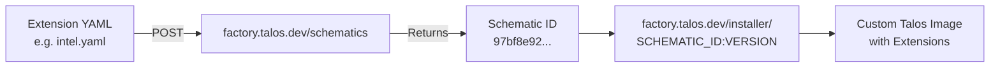
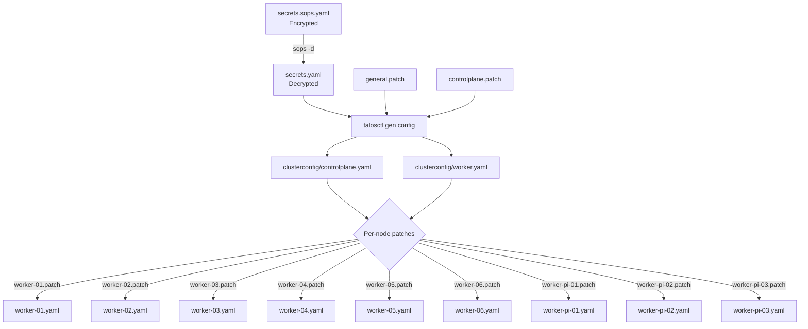

# Talos Linux

The cluster runs [Talos Linux](https://www.talos.dev/) v1.12.4 -- a purpose-built, immutable operating system for Kubernetes. Talos has no shell, no SSH, and no package manager. All management is done through a gRPC API via `talosctl`.

## Why Talos

| Property | Benefit |
|----------|---------|
| **Immutable** | The OS is read-only. No drift, no manual changes, no configuration surprises. |
| **API-driven** | All operations go through `talosctl`. Infrastructure is code, not a series of SSH commands. |
| **Minimal attack surface** | No shell, no SSH, no unnecessary services. The only way in is the API. |
| **Declarative** | Machine configs are YAML documents that describe the desired state of each node. |
| **Atomic upgrades** | Upgrades swap the entire OS image atomically. Rollback is automatic on failure. |

## Talos Version and Factory Images

The cluster uses **Talos v1.12.4** with custom factory images from `factory.talos.dev`. Each node type has a different image built from a **schematic** -- a YAML file that declares which system extensions and overlays to include.

### How Factory Images Work



The schematic ID is embedded in the installer image URL used by each node. For example:

```
factory.talos.dev/installer/97bf8e92fc6bba0f03928b859c08295d7615737b29db06a97be51dc63004e403:v1.12.4
```

### Image Definitions

The justfile defines four image variables, one per node type:

```just
cp_image     := "factory.talos.dev/installer/de94b242...:v1.12.4"  # RPi (control plane)
cp_amd_image := "factory.talos.dev/installer/f19ad7b4...:v1.12.4"  # AMD (control plane)
worker_intel_image := "factory.talos.dev/installer/97bf8e92...:v1.12.4"  # Intel workers
worker_rpi_image   := "factory.talos.dev/installer/a862538d...:v1.12.4"  # RPi workers
```

To regenerate schematic IDs after changing extensions:

```bash
just image-id
```

This POSTs each extension YAML to `factory.talos.dev/schematics` and prints the resulting IDs.

## Extensions per Node Type

=== "Intel Workers"

    ```yaml title="extensions/intel.yaml"
    customization:
      systemExtensions:
        officialExtensions:
          - siderolabs/util-linux-tools
          - siderolabs/i915-ucode
          - siderolabs/intel-ucode
    ```

    Extensions provide Intel GPU firmware (`i915-ucode`), CPU microcode updates (`intel-ucode`), and additional userspace utilities (`util-linux-tools`).

=== "AMD Nodes"

    ```yaml title="extensions/amd.yaml"
    customization:
      systemExtensions:
        officialExtensions:
          - siderolabs/util-linux-tools
          - siderolabs/amd-ucode
          - siderolabs/amdgpu-firmware
    ```

    Extensions provide AMD CPU microcode and GPU firmware for the Lenovo 440p and Acemagician AM06 nodes running AMD processors.

=== "Raspberry Pi (PoE)"

    ```yaml title="extensions/rpi-poe.yaml"
    overlay:
      image: siderolabs/sbc-raspberrypi
      name: rpi_generic
      options:
        configTxtAppend: |-
          # PoE Hat Fan Speeds
          dtoverlay=rpi-poe
          dtparam=poe_fan_temp0=50000
          dtparam=poe_fan_temp1=60000
          dtparam=poe_fan_temp2=70000
          dtparam=poe_fan_temp3=80000
    customization:
      systemExtensions:
        officialExtensions:
          - siderolabs/util-linux-tools
    ```

    Uses the `sbc-raspberrypi` overlay with PoE hat fan speed thresholds configured via device tree parameters.

## Configuration Generation Flow

All Talos configuration is generated and applied through `just` recipes defined in `pitower/talos/justfile`.



### Step 1: Generate Base Configs

```bash
just config
```

This decrypts `secrets.sops.yaml` and runs `talosctl gen config` with two global patches:

- `patches/general.patch` -- applied to **all** nodes
- `patches/controlplane.patch` -- applied to **control plane** nodes only

Output goes to `clusterconfig/controlplane.yaml` and `clusterconfig/worker.yaml`.

### Step 2: Apply Per-Node Patches

```bash
just patch
```

Each node gets its own patch applied on top of the base config, setting hostname, install image, network interfaces, and VIP assignments. The patched configs are written to `clusterconfig/worker-XX.yaml`.

!!! warning "Control Plane Nodes Use controlplane.yaml as Base"
    worker-01, worker-02, and worker-03 are control plane nodes despite their naming. Their per-node patches are applied on top of `controlplane.yaml`, not `worker.yaml`.

## Key Patches

### General Patch (all nodes)

```yaml title="patches/general.patch"
machine:
  kubelet:
    extraArgs:
      rotate-server-certificates: true
    extraConfig:
      imageGCHighThresholdPercent: 60
      imageGCLowThresholdPercent: 50
    extraMounts:
      - destination: /var/mnt/extra
        type: bind
        source: /var/mnt/extra
        options:
          - rbind
          - rshared
          - rw
  features:
    hostDNS:
      enabled: true
      forwardKubeDNSToHost: false
      resolveMemberNames: true
cluster:
  network:
    cni:
      name: none
  proxy:
    disabled: true
```

| Setting | Purpose |
|---------|---------|
| `rotate-server-certificates` | Enables automatic kubelet server certificate rotation |
| `imageGCHighThresholdPercent: 60` | Triggers image garbage collection when disk usage exceeds 60% |
| `imageGCLowThresholdPercent: 50` | Stops GC when disk usage drops below 50% |
| Extra mount `/var/mnt/extra` | Provides a writable bind mount for workloads that need host-level storage |
| `hostDNS.enabled` | Enables Talos host-level DNS resolution |
| `resolveMemberNames` | Allows resolving cluster member names via host DNS |
| `cni.name: none` | Disables default CNI -- Cilium is installed as a post-bootstrap addon |
| `proxy.disabled: true` | Disables kube-proxy -- Cilium operates in kube-proxy replacement mode |

### Control Plane Patch

```yaml title="patches/controlplane.patch"
cluster:
  allowSchedulingOnControlPlanes: true
  coreDNS:
    disabled: true
  apiServer:
    certSANs:
      - 127.0.0.1
    extraArgs:
      service-account-issuer: https://raw.githubusercontent.com/swibrow/home-ops/main/pitower/kubernetes
      service-account-jwks-uri: https://k8s.cluster.internal:6443/openid/v1/jwks
```

| Setting | Purpose |
|---------|---------|
| `allowSchedulingOnControlPlanes` | Permits workloads on control plane nodes to maximize resource use |
| `coreDNS.disabled` | Disables built-in CoreDNS -- DNS is handled by Cilium or an alternative |
| `certSANs: [127.0.0.1]` | Adds localhost to the API server certificate SANs |
| `service-account-issuer` | Sets the OIDC issuer URL for service account tokens to a GitHub-hosted endpoint |
| `service-account-jwks-uri` | JWKS endpoint for verifying service account tokens |

### Per-Node Patches

Each node has a patch under `patches/nodes/` that sets:

- **Hostname** (e.g., `worker-01`)
- **Install image** (factory image URL with schematic ID and Talos version)
- **Network interfaces** (DHCP, VIP assignment for control plane nodes)
- **Install disk** (where applicable, e.g., `/dev/mmcblk0` for eMMC)

Example control plane node patch:

```yaml title="patches/nodes/worker-01.patch"
machine:
  install:
    image: factory.talos.dev/installer/f19ad7b4...:v1.12.4
  network:
    hostname: worker-01
    interfaces:
      - deviceSelector:
          physical: true
        dhcp: true
        vip:
          ip: 192.168.0.200
```

Example Raspberry Pi worker patch:

```yaml title="patches/nodes/worker-pi-01.patch"
machine:
  network:
    hostname: worker-pi-01
    interfaces:
      - deviceSelector:
          physical: true
        dhcp: true
  install:
    image: factory.talos.dev/installer/de94b242...:v1.12.4
    extraKernelArgs:
      - initcall_blacklist=sensors_nct6683_init
```

!!! note "Extra Kernel Args"
    The Raspberry Pi workers include `initcall_blacklist=sensors_nct6683_init` to prevent a kernel module from causing issues on ARM hardware.
