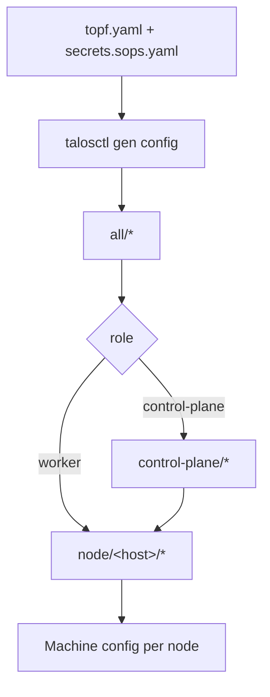

# Talos Linux

The cluster runs [Talos Linux](https://www.talos.dev/) v1.14.0 with Kubernetes v1.36.1. Talos is a purpose-built, immutable operating system for Kubernetes: it has no shell, no SSH, and no package manager, and all management goes through its gRPC API.

The node lifecycle (render, apply, upgrade, reset, bootstrap) is managed with [topf](https://github.com/postfinance/topf). `talosctl` is only used for read-only diagnostics.

## Why Talos

| Property | Benefit |
|----------|---------|
| **Immutable** | The OS is read-only. No drift, no manual changes, no configuration surprises. |
| **API-driven** | All operations go through the Talos API. Infrastructure is code, not a series of SSH commands. |
| **Minimal attack surface** | No shell, no SSH, no unnecessary services. The only way in is the API. |
| **Declarative** | Machine configs are YAML documents that describe the desired state of each node. |
| **Atomic upgrades** | Upgrades swap the entire OS image atomically. Rollback is automatic on failure. |

## Layout

Everything for the cluster lives in `talos/pitower/`:

```
talos/pitower/
├── topf.yaml            # cluster name, endpoint, versions, schematic, node list
├── secrets.sops.yaml    # cluster secrets (CA, tokens), SOPS + age
├── all/                 # patches for every node
│   ├── 01-general.yaml        # kubelet, containerd, host DNS, sysctls
│   ├── 02-hostname.yaml.tpl   # hostname from topf.yaml
│   └── 03-network.yaml.tpl    # VLAN 20, VIP, dual-stack subnets
├── control-plane/       # patches for worker-01..03
│   ├── 01-cluster.yaml        # etcd, API server, reserved resources, CNI/kube-proxy off
│   └── 02-uinput.yaml         # /dev/uinput for Sunshine
├── node/<host>/         # per-node patches (install disk, labels, taints, volumes)
├── extensions/          # Image Factory schematics
├── addons/              # Cilium + kubelet-csr-approver, applied at bootstrap
└── justfile             # recipes, imported from ../talos.justfile
```

### topf.yaml

`topf.yaml` is the single source for the cluster definition:

```yaml title="talos/pitower/topf.yaml (excerpt)"
clusterName: pitower
clusterEndpoint: https://10.20.10.0:6443
kubernetesVersion: 1.36.1
talosVersion: 1.14.0
schematicId: "@extensions/amd.yaml"
secretsPath: secrets.sops.yaml

nodes:
  - host: worker-01
    ip: 10.20.10.1
    role: control-plane
    data:
      mac: "1c:83:41:40:88:41"
      lanLinks: [enp4s0]
  - host: worker-04
    ip: 10.20.10.4
    role: worker
    schematicId: "@extensions/intel.yaml"
    ...
```

Each node has a host name, IP, role, an optional `schematicId` override, and free-form `data` (MAC address, untagged-LAN links, `untagged: true` for worker-07) that the `.tpl` patches read. topf decrypts `secrets.sops.yaml` itself through sops, using `SOPS_AGE_KEY_FILE`.

## Factory Schematics

Each node type boots a custom image from the [Image Factory](https://factory.talos.dev). The schematic YAML in `extensions/` declares the system extensions and overlays; topf resolves `@extensions/<file>.yaml` to a schematic ID locally.

| Schematic | Nodes | Contents |
|-----------|-------|----------|
| `amd.yaml` (cluster default) | worker-01..03 | `util-linux-tools`, `amd-ucode`, `amdgpu-firmware`, `amdgpu`, `uinput` |
| `intel.yaml` | worker-04..06 | `util-linux-tools`, `i915-ucode`, `intel-ucode` |
| `r630.yaml` | worker-07 | `util-linux-tools`, `intel-ucode`, `zfs` |
| `rpi-poe.yaml` | worker-08..10 | `sbc-raspberrypi` overlay (`rpi_generic`) with PoE HAT fan settings, `util-linux-tools` |
| `nvidia.yaml` | worker-ai-01 | `util-linux-tools`, `amd-ucode`, `nvidia-open-gpu-kernel-modules-production`, `nvidia-container-toolkit-production` |

> [!WARNING]
> **Submit new schematics before installing**
>
> topf only computes the ID; it does not register the schematic. Before a node installs or upgrades to a new or changed schematic, submit it, or the installer image returns 404:
>
> ```bash
> curl -X POST --data-binary @extensions/<schematic>.yaml https://factory.talos.dev/schematics
> ```
>
> topf's global `--submit-to-factory` flag submits them instead of computing the IDs locally. `just talos pitower schematic-ids` prints the resolved ID for every node.

## Patch Layering

Talos 1.14 uses multi-document machine configs. topf runs `talosctl gen config` against each node's running version, then layers the patches in order: `all/`, then `control-plane/` (control planes only), then `node/<host>/`. Files ending in `.tpl` are Go templates rendered with the node's entry from `topf.yaml`.


```mermaid
flowchart TD
    A[topf.yaml + secrets.sops.yaml] --> B[talosctl gen config]
    B --> C[all/*]
    C --> D{role}
    D -->|control-plane| E[control-plane/*]
    D -->|worker| F[node/&lt;host&gt;/*]
    E --> F
    F --> G[Machine config per node]
```

To inspect the result without applying anything:

```bash
just talos pitower render   # full configs to output/
just talos pitower diff     # pending changes per node (topf apply --dry-run)
```

## Key Patches

### All Nodes (`all/`)

| Document | Setting | Purpose |
|----------|---------|---------|
| `KubeletConfig` | `rotate-server-certificates` | Kubelet serving certs, approved by kubelet-csr-approver |
| `KubeletConfig` | Image GC at 60% / 50%, `imageMaximumGCAge: 168h` | Bounds the image cache by age as well as disk usage |
| `CRICustomizationConfig` | `discard_unpacked_layers`, unprivileged ports/ICMP, device ownership from security context | Halves image storage; changing it reboots every node |
| `ResolverConfig` | `hostDNS` with `resolveMemberNames` | Talos host DNS; CoreDNS does not forward to it |
| `SysctlConfig` | `net.ipv6.conf.all.forwarding: 1` | IPv6 forwarding for dual-stack pod traffic |
| `SecurityProfileConfig` | `workloadIsolation: false` | Opts out of 1.14 workload isolation until host-reaching workloads are verified |
| `HostnameConfig` | `hostname: {{ .Node.Host }}` | Hostname from `topf.yaml` |
| `machine.network.interfaces` | VLAN 20 subinterface with DHCP, VIP `10.20.10.0` on control planes | worker-07 (`untagged: true`) takes DHCP on the parent link instead |
| `KubeNodeConfig` | `validSubnets: 10.20.0.0/16, 2a02:16a:2a0a:2::/64` | Picks the VLAN 20 addresses as node IPs |
| `KubeNetworkConfig` | Pods `10.244.0.0/16` + `fd10:244::/56`, services `10.96.0.0/12` + `fd10:96::/112` | Dual-stack, IPv4 first |
| `SysctlConfig` | `disable_ipv6` on `lanLinks` | Stops a second IPv6 default route via the untagged LAN |

### Control Plane (`control-plane/`)

| Document | Setting | Purpose |
|----------|---------|---------|
| `cluster.etcd` | `listen-metrics-urls: http://0.0.0.0:2381` | etcd metrics for kube-prometheus-stack |
| `KubeletConfig` | `systemReserved`, `kubeReserved`, `evictionHard` | Headroom so app spikes cannot starve the API server |
| `KubeNodeConfig` | Delete the `node-role.kubernetes.io/control-plane` taint | Control planes also run workloads |
| `KubeCoreDNSConfig` | `enabled: false` | CoreDNS is deployed by its Helm chart (`kube-system/coredns`) |
| `KubeTalosAPIAccessConfig` | `os:operator` for namespace `system` | Lets the `etcd-defrag` CronJob talk to the Talos API |
| `KubeAPIServerConfig` | Cert SANs `10.20.10.0`, `127.0.0.1`; service account issuer on GitHub | Service account OIDC discovery served from the repo (`pitower/kubernetes/openid`) |
| `KubeAuthenticationConfig` | JWT issuer `https://idm.wibrow.dev/oauth2/openid/headlamp` | Headlamp SSO via Kanidm |
| `KubeControllerManagerConfig`, `KubeSchedulerConfig` | `bind-address: 0.0.0.0` | Metrics scraping |
| `KubeFlannelCNIConfig`, `KubeProxyConfig` | Deleted / disabled | Cilium is the CNI and kube-proxy replacement |
| `KernelModuleConfig`, `UdevRulesConfig` | `uinput`, mode `0666` | Input devices for Sunshine in `dev/dev-desktop` |

### Per-Node Patches

Patches in `node/<host>/` apply to one node. Every node has an `UnattendedInstallConfig` selecting its install disk, plus whatever is specific to it:

| Node | Install disk | Extras |
|------|--------------|--------|
| worker-01..03 | NVMe (`disk.model` starts with `AirDisk`) | Label `feature.node.kubernetes.io/amd-gpu` |
| worker-04 | eMMC (`/dev/mmcblk0`) | Label `intel-gpu`, taint `dedicated=media-home:NoSchedule` |
| worker-05, worker-06 | `SAMSUNG` model | Label `intel-gpu` |
| worker-07 | md RAID1 `boot` (two SSDs by WWID) | `raid1` and `zfs` modules (ARC capped at 64 GiB), `maxPods: 250`, X710 ring sizes |
| worker-08..10 | Disk of 100 GB or more (the USB SSD, not the SD card) | None |
| worker-ai-01 | 1 TB NVMe | Label `nvidia-gpu`, EPHEMERAL capped at 200 GiB, NVIDIA and VFIO modules, `models` user volume, taint `dedicated=gpu:NoSchedule`, ignores the Bazzite NIC |

## Diagnostics

`talosctl` needs a talosconfig, which topf generates:

```bash
just talos pitower talosconfig         # writes talos/pitower/output/talosconfig
just talos pitower members             # cluster members
just talos pitower health              # talosctl health
just talos pitower services 10.20.10.7 # services on one node
```
