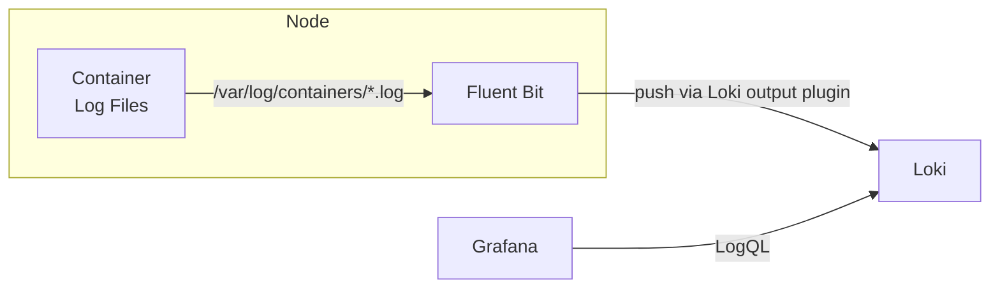
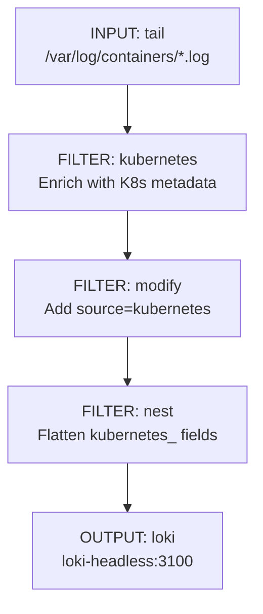

# Fluent Bit

[Fluent Bit](https://fluentbit.io/) is a lightweight log processor and forwarder that runs as a DaemonSet on every node in the cluster. It tails container log files, enriches them with Kubernetes metadata, and forwards them to Loki for storage and querying.

## Architecture



Fluent Bit runs as a DaemonSet, ensuring one instance per node. Each instance reads container logs from the node's filesystem and processes them through a pipeline of inputs, filters, and outputs.

## Pipeline Configuration

The Fluent Bit pipeline has four stages: service configuration, input, filters, and output.

### Service

```ini
[SERVICE]
    Daemon Off
    Flush 1
    Log_Level info
    Parsers_File /fluent-bit/etc/parsers.conf
    Parsers_File /fluent-bit/etc/conf/custom_parsers.conf
    HTTP_Server On
    HTTP_Listen 0.0.0.0
    HTTP_Port 2020
    Health_Check On
```

The HTTP server exposes metrics and a health check endpoint for Kubernetes liveness/readiness probes.

### Input

```ini
[INPUT]
    name tail
    alias kubernetes
    path /var/log/containers/*.log
    parser containerd
    tag kubernetes.*
```

| Setting | Value | Purpose |
|:--------|:------|:--------|
| Plugin | `tail` | Follows log files like `tail -f` |
| Path | `/var/log/containers/*.log` | All container log files on the node |
| Parser | `containerd` | Parses the containerd log format |
| Tag | `kubernetes.*` | Tags all records for downstream matching |

### Filters

Fluent Bit applies three filters to enrich and reshape log records:

#### 1. Kubernetes Metadata Enrichment

```ini
[FILTER]
    name kubernetes
    alias kubernetes
    match kubernetes.*
    buffer_size 0
    merge_log on
    kube_tag_prefix kubernetes.var.log.containers.
    k8s-logging.parser on
    k8s-logging.exclude on
    namespace_labels off
    annotations off
```

This filter queries the Kubernetes API to enrich each log record with metadata: pod name, namespace, container name, and labels. The `merge_log on` setting parses JSON-formatted log messages and merges their fields into the top-level record.

!!! info "k8s-logging annotations"
    When `k8s-logging.exclude` is enabled, pods with the annotation `fluentbit.io/exclude: "true"` will have their logs excluded from collection. Similarly, `k8s-logging.parser` allows pods to specify a custom parser via annotations.

#### 2. Source Label

```ini
[FILTER]
    name modify
    match kubernetes.*
    add source kubernetes
    remove logtag
```

Adds a `source=kubernetes` field to every record and removes the unnecessary `logtag` field.

#### 3. Metadata Flattening

```ini
[FILTER]
    name nest
    match *
    wildcard pod_name
    operation lift
    nested_under kubernetes
    add_prefix kubernetes_
```

Lifts Kubernetes metadata fields out of the nested `kubernetes` object and flattens them with a `kubernetes_` prefix. This makes fields like `kubernetes_namespace_name` and `kubernetes_pod_name` available as top-level labels in Loki.

### Output

```ini
[OUTPUT]
    Name loki
    Match kubernetes.*
    host loki-headless.monitoring.svc.cluster.local
    port 3100
    line_format json
    labels job=fluent-bit, cluster=home-ops, source=$source, namespace=$kubernetes_namespace_name
```

| Setting | Value | Purpose |
|:--------|:------|:--------|
| Plugin | `loki` | Native Loki output plugin |
| Host | `loki-headless.monitoring.svc.cluster.local` | Loki's headless service in the monitoring namespace |
| Port | `3100` | Loki's HTTP API port |
| Line format | `json` | Log lines are stored as JSON |
| Labels | `job`, `cluster`, `source`, `namespace` | Loki index labels for efficient querying |

!!! tip "Label Cardinality"
    The labels are kept intentionally minimal (`job`, `cluster`, `source`, `namespace`) to avoid high cardinality in Loki's index. Pod-level details are available in the log line itself and can be queried with LogQL's parser expressions rather than being stored as index labels.

## Pipeline Flow



## Querying Fluent Bit Logs in Grafana

Once logs reach Loki, they can be queried in Grafana using LogQL. The labels set by Fluent Bit's output plugin are available as selectors:

```logql
# All logs from the networking namespace
{job="fluent-bit", namespace="networking"}

# Logs from the cluster (useful in multi-cluster setups)
{cluster="home-ops"}

# Filter by source
{source="kubernetes"}
```

See the [Loki documentation](loki.md#querying-with-logql) for more LogQL query examples.

## Health and Metrics

Fluent Bit exposes an HTTP server on port 2020 that provides:

- `/api/v1/health` -- health check endpoint used by Kubernetes probes
- `/api/v1/metrics/prometheus` -- Prometheus-format metrics for monitoring Fluent Bit itself

## Helm Chart Reference

| Property | Value |
|:---------|:------|
| Chart | `fluent/fluent-bit` |
| Version | `0.55.0` |
| Namespace | `monitoring` |
| Deployment type | DaemonSet (one per node) |
| Manifest path | `pitower/kubernetes/apps/monitoring/fluent-bit/` |
