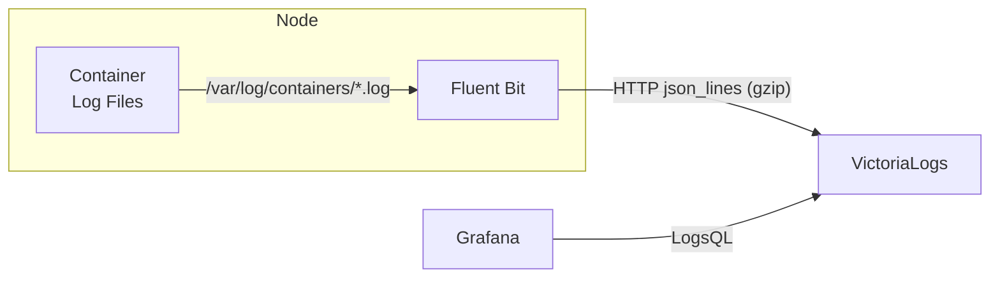
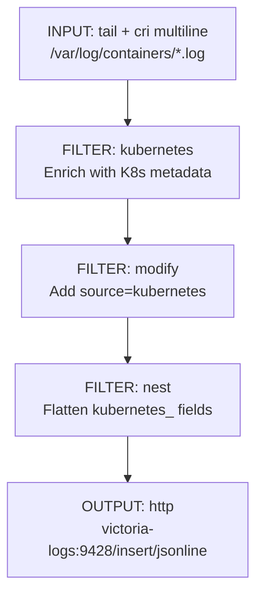

# Fluent Bit

[Fluent Bit](https://fluentbit.io/) is a lightweight log processor and forwarder that runs as a DaemonSet on every node in the cluster. It tails container log files, enriches them with Kubernetes metadata, and forwards them to [VictoriaLogs](victoria-logs.md) for storage and querying.

## Architecture


```mermaid
flowchart LR
    subgraph Node
        Containers[Container\nLog Files]
        FB[Fluent Bit]
    end

    VL[VictoriaLogs]
    Grafana[Grafana]

    Containers -->|"/var/log/containers/*.log"| FB
    FB -->|"HTTP json_lines (gzip)"| VL
    Grafana -->|LogsQL| VL
```

Fluent Bit runs as a DaemonSet, one instance per node. It tolerates every `dedicated=*` `NoSchedule` taint, so tainted nodes (worker-04, worker-ai-01) ship logs too.

## Pipeline Configuration

The pipeline has five parts: service configuration, a custom parser, input, filters, and output.

### Service

```ini
[SERVICE]
    Daemon Off
    Flush {{ .Values.flush }}
    Log_Level {{ .Values.logLevel }}
    Parsers_File /fluent-bit/etc/parsers.conf
    Parsers_File /fluent-bit/etc/conf/custom_parsers.conf
    HTTP_Server On
    HTTP_Listen 0.0.0.0
    HTTP_Port {{ .Values.metricsPort }}
    Health_Check On
```

The HTTP server exposes metrics and a health check endpoint for Kubernetes liveness/readiness probes.

### Input

```ini
[INPUT]
    name tail
    alias kubernetes
    path /var/log/containers/*.log
    parser cri-log
    tag kubernetes.*
    multiline.parser cri
```

| Setting | Value | Purpose |
|:--------|:------|:--------|
| Plugin | `tail` | Follows log files like `tail -f` |
| Path | `/var/log/containers/*.log` | All container log files on the node |
| `multiline.parser` | `cri` | Reassembles lines containerd split into partial (`P`) entries (over ~16KB) |
| Parser | `cri-log` | Custom regex that strips the CRI prefix into `time`, `stream`, `logtag`, `log` |
| Tag | `kubernetes.*` | Tags all records for downstream matching |

The custom `cri-log` parser is defined explicitly because the capture-group name of the built-in `cri` parser differs across images. It leaves the bare application line in `log`, so the kubernetes filter can JSON-decode it and VictoriaLogs can use it as the message.

### Filters

#### 1. Kubernetes Metadata Enrichment

```ini
[FILTER]
    name kubernetes
    alias kubernetes
    match kubernetes.*
    buffer_size 0
    merge_log on
    kube_tag_prefix kubernetes.var.log.containers.
    k8s-logging.parser on
    k8s-logging.exclude on
    namespace_labels off
    annotations off
```

Adds pod name, namespace, container name, and labels to each record. `merge_log on` parses JSON log lines (e.g. envoy access logs) and merges their fields into the record.

> [!NOTE]
> **k8s-logging annotations**
>
> With `k8s-logging.exclude` enabled, pods annotated `fluentbit.io/exclude: "true"` are not collected. `k8s-logging.parser` lets a pod pick a parser via annotation.

#### 2. Source Label

```ini
[FILTER]
    name modify
    match kubernetes.*
    add source kubernetes
    remove logtag
```

Adds `source=kubernetes` to every record and drops the CRI `logtag` field.

#### 3. Metadata Flattening

```ini
[FILTER]
    name nest
    match *
    wildcard pod_name
    operation lift
    nested_under kubernetes
    add_prefix kubernetes_
```

Lifts the nested `kubernetes` object into top-level `kubernetes_*` fields (`kubernetes_namespace_name`, `kubernetes_pod_name`, `kubernetes_container_name`, ...), which the output uses as stream fields.

### Output

```ini
[OUTPUT]
    Name              http
    Match             kubernetes.*
    Host              victoria-logs.monitoring.svc.cluster.local
    Port              9428
    URI               /insert/jsonline?_stream_fields=kubernetes_namespace_name,kubernetes_pod_name,kubernetes_container_name&_time_field=@timestamp&_msg_field=log
    Format            json_lines
    Compress          gzip
    json_date_key     @timestamp
    json_date_format  iso8601
```

| Setting | Value | Purpose |
|:--------|:------|:--------|
| Plugin | `http` | VictoriaLogs' JSON lines ingestion API |
| `_stream_fields` | namespace, pod, container | Defines log streams; keep this set small |
| `_time_field` | `@timestamp` | Set from the parsed CRI time |
| `_msg_field` | `log` | The application line becomes `_msg` |
| Compress | `gzip` | |

## Pipeline Flow


```mermaid
flowchart TD
    Input["INPUT: tail + cri multiline\n/var/log/containers/*.log"]
    F1["FILTER: kubernetes\nEnrich with K8s metadata"]
    F2["FILTER: modify\nAdd source=kubernetes"]
    F3["FILTER: nest\nFlatten kubernetes_ fields"]
    Output["OUTPUT: http\nvictoria-logs:9428/insert/jsonline"]

    Input --> F1 --> F2 --> F3 --> Output
```

## Querying

Logs are queried with LogsQL through Grafana's VictoriaLogs datasource:

```logsql
kubernetes_namespace_name:networking
kubernetes_namespace_name:monitoring kubernetes_container_name:fluent-bit
```

See [VictoriaLogs](victoria-logs.md#querying-with-logsql) for more examples.

## Health and Metrics

Fluent Bit exposes an HTTP server on port `2020` that provides:

- `/api/v1/health` -- health check endpoint used by Kubernetes probes
- `/api/v1/metrics/prometheus` -- Prometheus-format metrics for Fluent Bit itself

## Helm Chart Reference

| Property | Value |
|:---------|:------|
| Chart | `fluent/fluent-bit` |
| Version | `0.58.3` |
| Namespace | `monitoring` |
| Deployment type | DaemonSet (one per node) |
| Manifest path | `kubernetes/apps/pitower/monitoring/fluent-bit/` |
