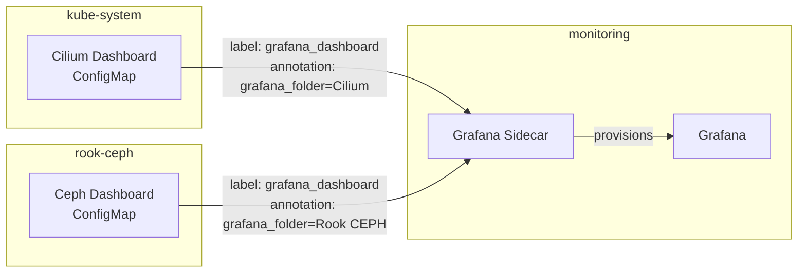

# Grafana

[Grafana](https://grafana.com/grafana/) serves as the central visualization layer for the cluster. It connects to Prometheus for metrics and Loki for logs, and auto-provisions dashboards from ConfigMaps across all namespaces. Authentication is handled via Authelia OIDC.

## Data Sources

Grafana is configured with four data sources, all provisioned declaratively through the Helm values:

| Data Source | Type | URL | Default |
|:------------|:-----|:----|:--------|
| Prometheus | `prometheus` | `http://kube-prometheus-stack-prometheus.monitoring.svc.cluster.local:9090` | Yes |
| Loki | `loki` | `http://loki-headless.monitoring.svc.cluster.local:3100` | No |
| Alertmanager | `alertmanager` | `http://alertmanager.monitoring.svc.cluster.local:9093` | No |
| GitHub | `grafana-github-datasource` | N/A (API-based) | No |

```yaml
datasources:
  datasources.yaml:
    apiVersion: 1
    datasources:
      - name: Prometheus
        type: prometheus
        uid: prometheus
        access: proxy
        url: http://kube-prometheus-stack-prometheus.monitoring.svc.cluster.local:9090
        isDefault: true
      - name: Loki
        type: loki
        access: proxy
        url: http://loki-headless.monitoring.svc.cluster.local:3100
```

## Dashboard Auto-Provisioning

Grafana uses two complementary mechanisms for dashboard management:

### 1. Sidecar Discovery (Cross-Namespace)

The Grafana sidecar watches **all namespaces** for ConfigMaps with the label `grafana_dashboard: "true"`. Dashboards are organized into folders using the `grafana_folder` annotation on the ConfigMap.

```yaml
sidecar:
  dashboards:
    enabled: true
    searchNamespace: ALL
    label: grafana_dashboard
    folderAnnotation: grafana_folder
    provider:
      disableDelete: true
      foldersFromFilesStructure: true
```

This allows any application to ship its own dashboard by creating a ConfigMap in its own namespace. For example, Cilium's Helm chart creates dashboard ConfigMaps with:

```yaml
dashboards:
  enabled: true
  annotations:
    grafana_folder: Cilium
```

Similarly, Rook Ceph dashboards use a Kustomize `configMapGenerator` with the appropriate labels and annotations:

```yaml
generatorOptions:
  annotations:
    grafana_folder: Rook CEPH
  labels:
    grafana_dashboard: "true"
```



### 2. Dashboard Providers (Grafana Values)

Dashboards can also be defined directly in the Grafana Helm values. These are organized into named providers, each mapping to a folder in Grafana:

| Provider | Folder | Dashboards |
|:---------|:-------|:-----------|
| `default` | (root) | Authelia, cloudflared, external-dns, external-secrets, cert-manager, node-exporter, CloudNativePG |
| `flux` | Flux | Flux cluster overview, control plane |
| `kubernetes` | Kubernetes | API server, CoreDNS, global views, namespaces, nodes, pods |
| `nginx` | Nginx | Request metrics, handling performance |
| `ceph` | Ceph | Cluster overview, OSD, pools |
| `github` | GitHub | Repository insights |

!!! tip "Dashboard Sources"
    Dashboards are loaded from three types of sources:

    - **Grafana.com** via `gnetId` -- e.g., Node Exporter Full (ID: 1860)
    - **Raw URLs** -- JSON files from upstream project repositories (e.g., Flux, Kubernetes, cert-manager)
    - **ConfigMaps** -- shipped by Helm charts (e.g., Cilium, Rook Ceph) via the sidecar

## Key Dashboard Categories

### Cilium and Hubble

Cilium and Hubble dashboards are provisioned via the sidecar into the **Cilium** folder. They cover:

- Cilium agent health and eBPF datapath metrics
- Cilium operator status and IPAM allocation
- Hubble network observability: DNS queries, TCP connections, HTTP requests, drops, ICMP, flow counts, and port distribution

### Kubernetes

The Kubernetes folder includes dashboards from the [dotdc/grafana-dashboards-kubernetes](https://github.com/dotdc/grafana-dashboards-kubernetes) project:

- API Server performance and request rates
- CoreDNS query metrics
- Global cluster resource utilization
- Per-namespace resource breakdown
- Per-node CPU, memory, and disk usage
- Per-pod resource consumption

### Node Health

The **Node Exporter Full** dashboard (Grafana.com ID: 1860) provides deep hardware-level visibility into each node: CPU, memory, disk I/O, network, filesystem usage, and system load.

### Storage

Ceph dashboards in the **Ceph** folder show cluster health, OSD performance, and pool utilization -- critical for monitoring the distributed block storage backing most PVCs.

### Networking

Nginx dashboards track request rates, latency distributions, and error rates for both the external and internal ingress controllers.

## Authentication

Grafana authenticates users via Authelia using OpenID Connect (OIDC). The configuration maps Authelia groups to Grafana roles:

```yaml
grafana.ini:
  auth.generic_oauth:
    enabled: true
    name: Authelia
    client_id: grafana
    scopes: openid profile email groups
    auth_url: https://auth.example.com/api/oidc/authorization
    token_url: https://auth.example.com/api/oidc/token
    api_url: https://auth.example.com/api/oidc/userinfo
    use_pkce: true
  auth.generic_oauth.group_mapping:
    role_attribute_path: |
      contains(groups[*], 'admins') && 'Admin' || contains(groups[*], 'people') && 'Viewer'
```

| Authelia Group | Grafana Role |
|:---------------|:-------------|
| `admins` | Admin |
| `people` | Viewer |

## Secrets Management

Grafana credentials are managed through two ExternalSecrets:

| Secret | Source | Contents |
|:-------|:-------|:---------|
| `grafana-admin-secret` | Infisical (`/monitoring/grafana/`) | `admin-user`, `admin-password` |
| `grafana-secrets` | 1Password Connect (`grafana`) | `GF_AUTH_GENERIC_OAUTH_CLIENT_SECRET` |

The deployment uses `reloader.stakater.com/auto: "true"` to automatically restart Grafana when secrets are updated.

## Plugins

The following Grafana plugins are installed:

| Plugin | Purpose |
|:-------|:--------|
| `grafana-worldmap-panel` | Geographic visualization of data |
| `grafana-clock-panel` | Clock display for dashboards |
| `grafana-github-datasource` | GitHub repository metrics and insights |

## Access

Grafana is exposed externally via the Cloudflare tunnel through Envoy Gateway:

```yaml
route:
  main:
    enabled: true
    hostnames:
      - grafana.example.com
    parentRefs:
      - name: envoy-external
        namespace: networking
        sectionName: https
```

This makes Grafana accessible at `https://grafana.example.com` from anywhere via Cloudflare.

## Configuration Reference

| Property | Value |
|:---------|:------|
| Chart | `grafana/grafana` |
| Version | `10.5.15` |
| Namespace | `monitoring` |
| Persistence | Disabled (dashboards are provisioned, no state to persist) |
| Image Renderer | Enabled (for PNG rendering in alerts and sharing) |
| Manifest path | `pitower/kubernetes/apps/monitoring/grafana/` |
